---
## Front matter
lang: ru-RU
title: Выполнение 1 лабораторной работы
subtitle: Установка и конфигурация операционной системы на виртуальную машину
author:
  - Павлюченков С.В.
institute:
  - Российский университет дружбы народов, Москва, Россия
date: 07 сентября 2024

## i18n babel
babel-lang: russian
babel-otherlangs: english

## Formatting pdf
toc: false
toc-title: Содержание
slide_level: 2
aspectratio: 169
section-titles: true
theme: metropolis
header-includes:
 - \metroset{progressbar=frametitle,sectionpage=progressbar,numbering=fraction}
---

## Докладчик

:::::::::::::: {.columns align=center}
::: {.column width="70%"}

  * Павлюченков Сергей Витальевич
  * Студент ФФМиЕН
  * Российский университет дружбы народов
  * [1132237372@pfur.ru](mailto:1132237372@pfur.ru)
  * <https://serapshi.github.io/svpavliuchenkov.github.io/>

:::
::: {.column width="30%"}

:::
::::::::::::::

## Цель работы

Целью данной работы является приобретение практических навыков установки операционной системы на виртуальную машину, настройки минимально необходимых для дальнейшей работы сервисов.

## Задание

Скачать ОС Linux Fedora Sway.
Установить ее в виртуальной машине.
Установить доп ПО.

# Выполнение лабораторной работы

## Скачивание Fedora Sway

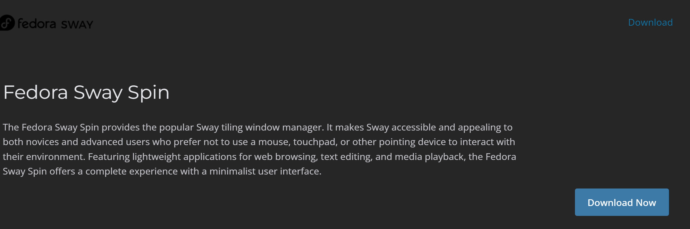{#fig:001 width=70%}

## Установка хост клавишы.

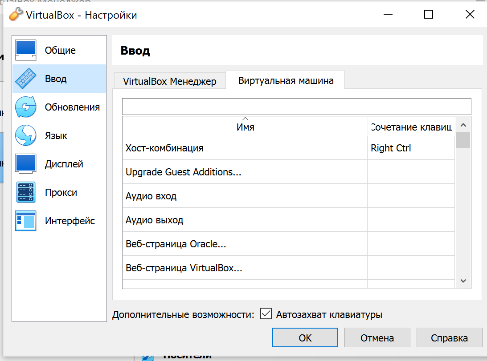{#fig:001 width=70%}

## Настройка раскладку, пароля, жесткого диска, часового пояса, имя узла и учетной записи root

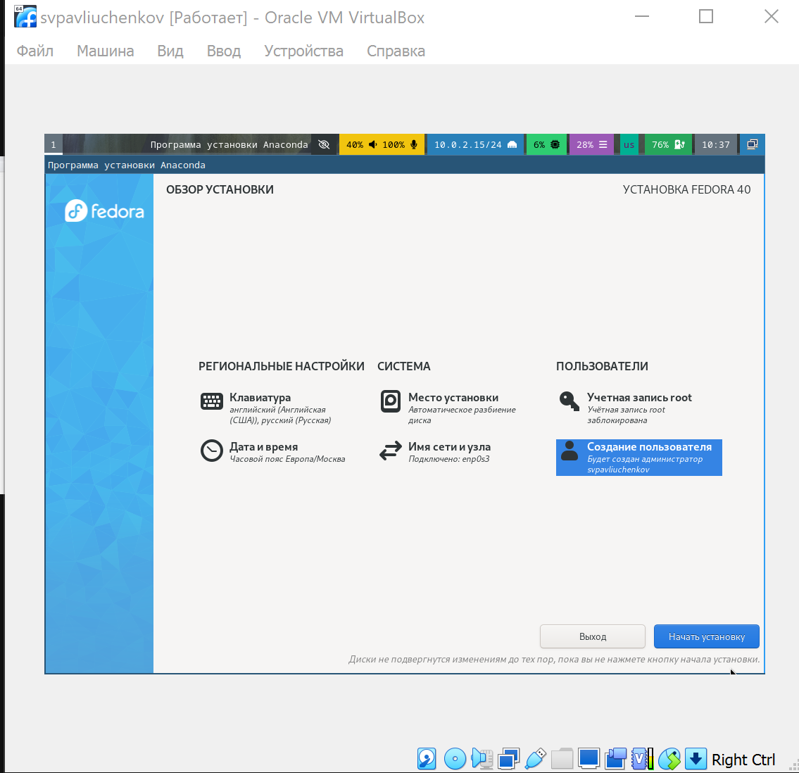{#fig:001 width=70%}

## Устанавливаю дистрибутив.

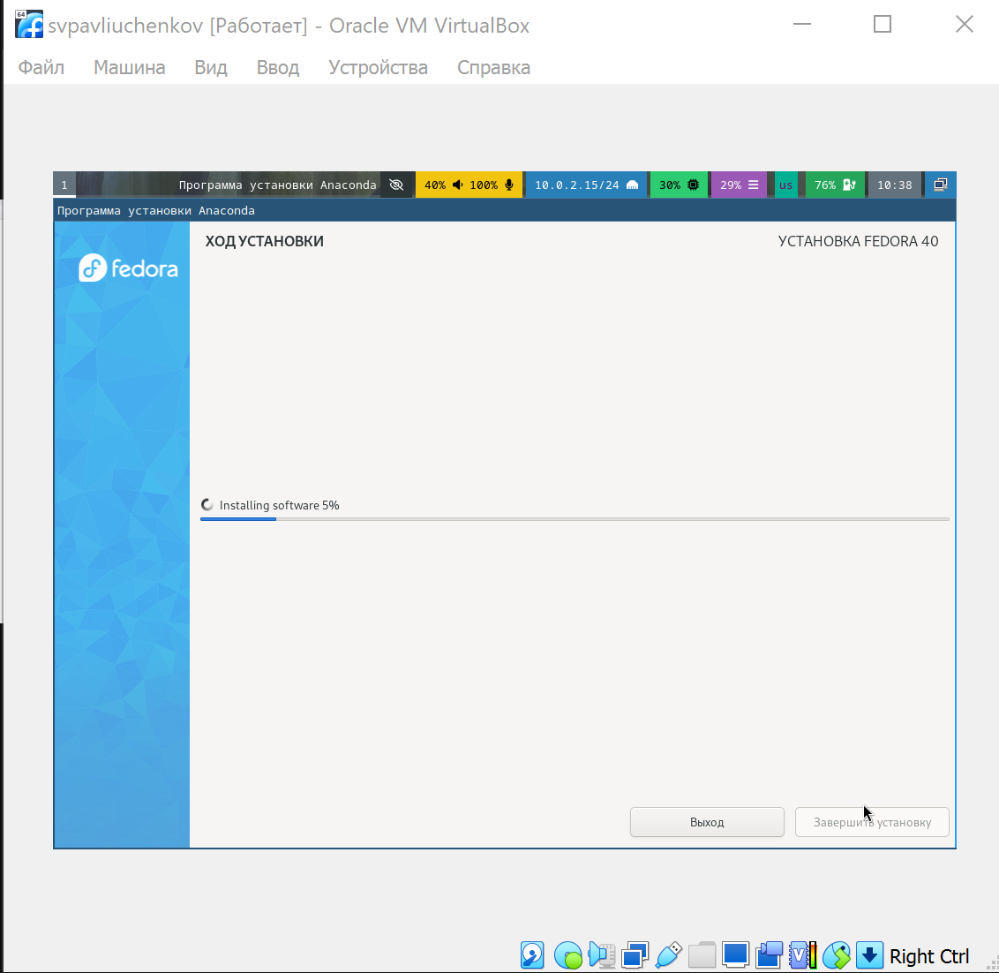{#fig:001 width=70%}

## Отключение вторичного устройство IDE.

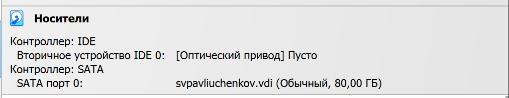{#fig:001 width=70%}

## Обновление всех пакетов командой dnf -y update в режим супер-пользователя.

Также устанавливаю все нужное мне ПО.

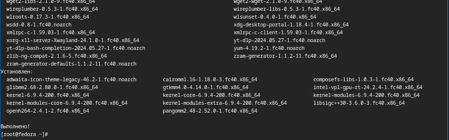{#fig:001 width=70%}

## Запускаю таймер автообновления.

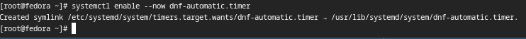{#fig:001 width=70%}

## Заменa значения SELinux с enforcing на permissive.

Перехожу в директорию SELinux используя mc и открываю config.

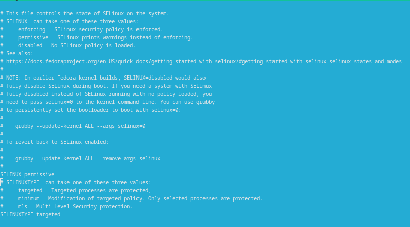{#fig:001 width=70%}

## Подключаю образ диска доп гостевой ОС

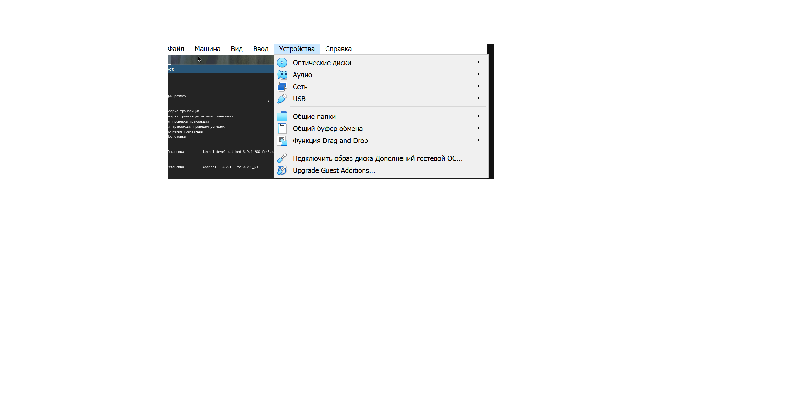{#fig:001 width=70%}

## Проверяю подключение образа.

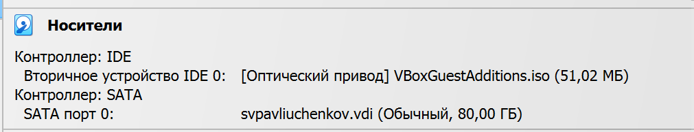{#fig:001 width=70%}

## Подмонтирую диск командой mount /dev/sr0 /media.

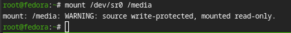{#fig:001 width=70%}

## Устанавливаю драйвера.

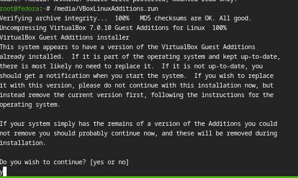{#fig:001 width=70%}

## Создаю конфигурационный файл раскладки и редактирую его.

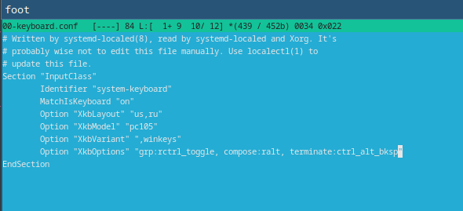{#fig:001 width=70%}

## Внутри виртуальной машины добавляю своего пользователя в группу vboxsf. 

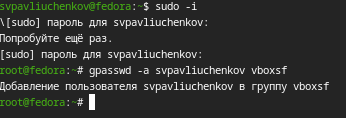{#fig:001 width=70%}

## Домашние задание

Использую dmesg | grep -i "то, что ищем"  во всех случаях.

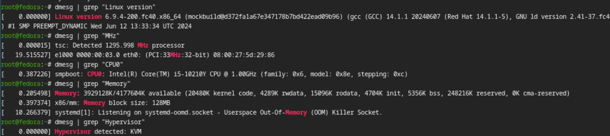{#fig:001 width=70%}

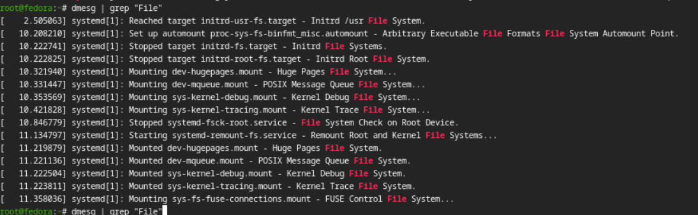{#fig:001 width=70%}

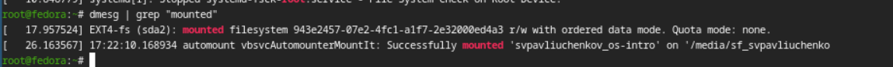{#fig:001 width=70%}

## Выводы

Я установил дистрибутив Linux Fedora Sway на свой компьютер вместе с основным ПО, что я буду использовать по мере прохождения этого курса.
