---
## Front matter
lang: ru-RU
title: Выполнение 2 лабораторной работы
subtitle: Первоначальна настройка git.
author:
  - Павлюченков С.В.
institute:
  - Российский университет дружбы народов, Москва, Россия
date: 07 сентября 2024

## i18n babel
babel-lang: russian
babel-otherlangs: english

## Formatting pdf
toc: false
toc-title: Содержание
slide_level: 2
aspectratio: 169
section-titles: true
theme: metropolis
header-includes:
 - \metroset{progressbar=frametitle,sectionpage=progressbar,numbering=fraction}
---

## Докладчик

:::::::::::::: {.columns align=center}
::: {.column width="70%"}

  * Павлюченков Сергей Витальевич
  * Студент ФФМиЕН
  * Российский университет дружбы народов
  * [1132237372@pfur.ru](mailto:1132237372@pfur.ru)
  * <https://serapshi.github.io/svpavliuchenkov.github.io/>

:::
::: {.column width="30%"}

:::
::::::::::::::

## Цель работы

Изучить идеологию и применение средств контроля версий.

Освоить умения по работе с git.

## Задание

Создать базовую конфигурацию для работы с git.

Создать ключ SSH.

Создать ключ PGP.

Настроить подписи git.

Зарегистрироваться на Github.

Создать локальный каталог для выполнения заданий по предмету.

# Выполнение лабораторной работы

## Установка git.

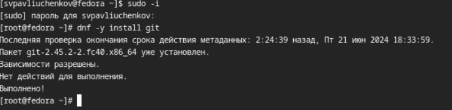{#fig:001 width=70%}

## Установка gh.

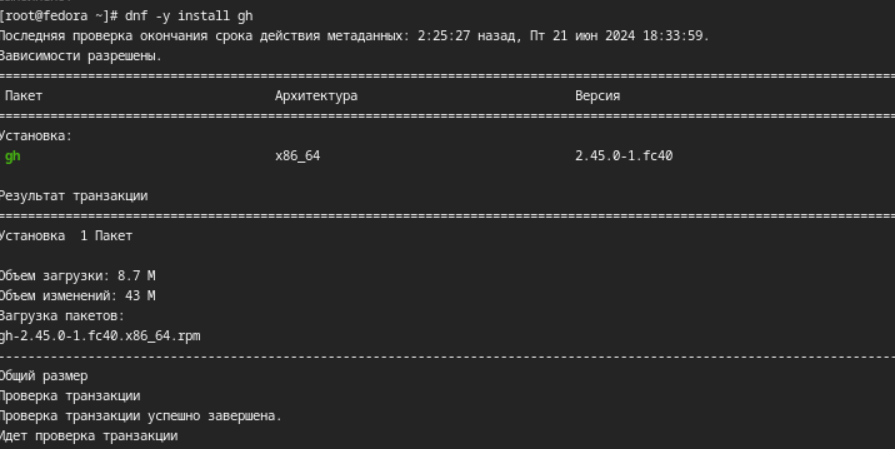{#fig:002 width=70%}

## Настройка git

Задаю имя и email владельца репозитория, настраиваю utf-8 в выводе сообщений git, задаю имя начальной ветки и меняю параметры autocrlf и safecrlf.

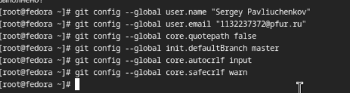{#fig:003 width=70%}

## Создание ключей ssh по алгоритму rsa с ключём размером 4096 бит и по алгоритму ed25519.

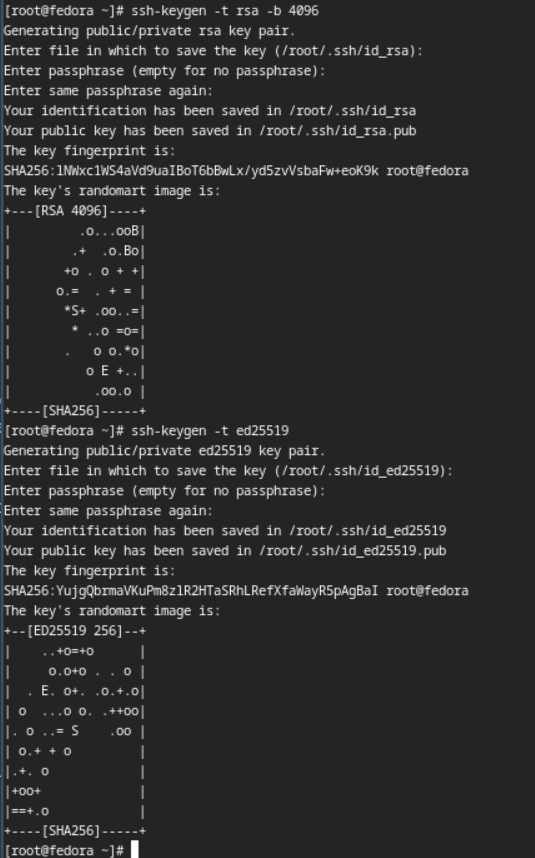{#fig:004 width=70%}

## Генерация pgp ключей

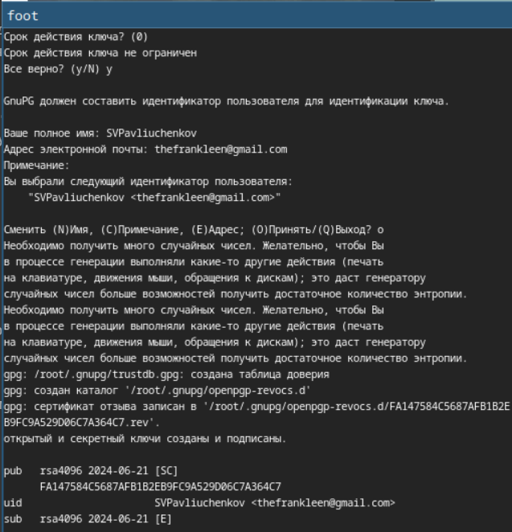{#fig:005 width=70%}

## Генерация pgp ключей 
Выбираю опции, а именно: тип RSA and RSA;
размер 4096;срок действия не истекает никогда
И получаю такие ключи.

{#fig:001 width=70%}

## Добавление ключа на github.

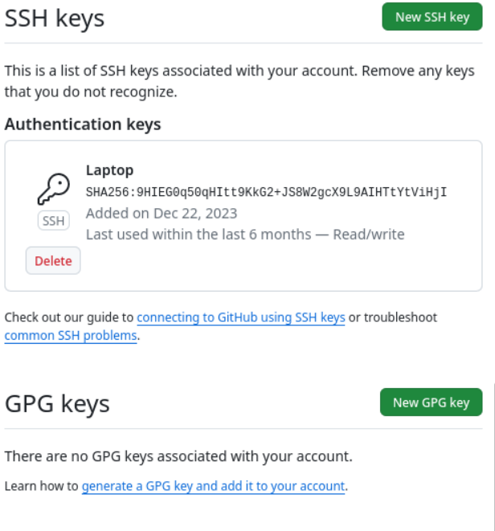{#fig:007 width=70%}

## Добавление ключа на github.

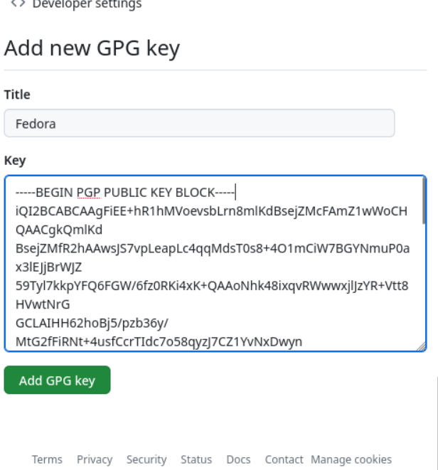{#fig:008 width=70%}

## Добавление ключа на github.

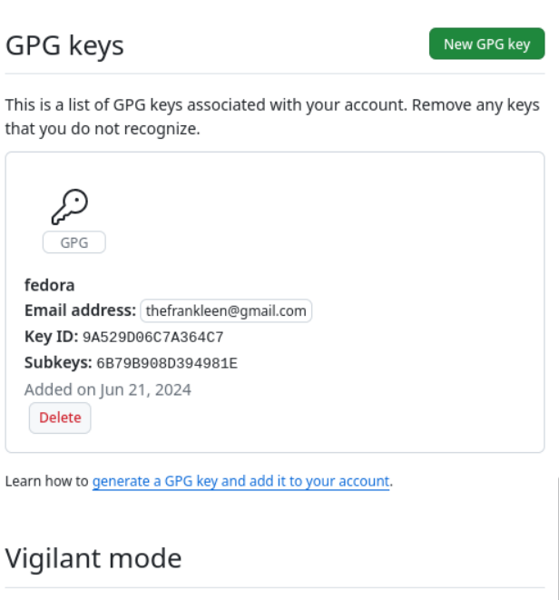{#fig:009 width=70%}

## Настройка подписи коммитов

Указываю Git применять введенную почту при подписи коммитов.

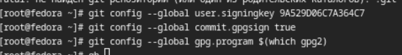{#fig:010 width=70%}

## Авторизация gh auth login

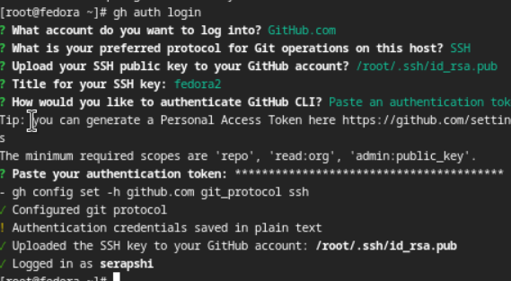{#fig:011 width=70%}

## Создание репозитория курса на основе шаблона

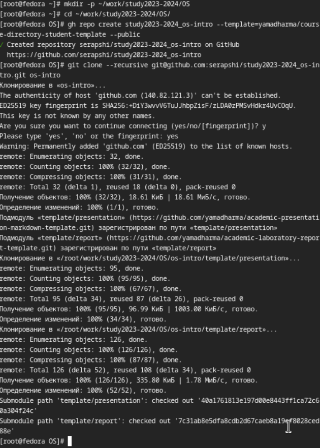{#fig:012 width=70%}

## Создание необходимых каталогов.

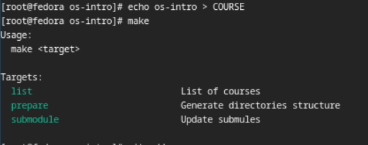{#fig:014 width=70%}

## Синхронизация данных с гитхабом

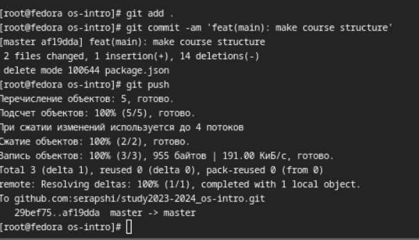{#fig:015 width=70%}

## Выводы

Я подготовил git репозиторий для последующей работы по этому курсу и освежил навыки работы по работе с git.