---
## Front matter
title: "Oтчёт по лабораторной работе № 2"
subtitle: "Первоначальна настройка git."
author: "Сергей Витальевич Павлюченков"

## Generic otions
lang: ru-RU
toc-title: "Содержание"

## Bibliography
bibliography: bib/cite.bib
csl: pandoc/csl/gost-r-7-0-5-2008-numeric.csl

## Pdf output format
toc: true # Table of contents
toc-depth: 2
lof: true # List of figures
lot: true # List of tables
fontsize: 12pt
linestretch: 1.5
papersize: a4
documentclass: scrreprt
## I18n polyglossia
polyglossia-lang:
  name: russian
  options:
	- spelling=modern
	- babelshorthands=true
polyglossia-otherlangs:
  name: english
## I18n babel
babel-lang: russian
babel-otherlangs: english
## Fonts
mainfont: PT Serif
romanfont: PT Serif
sansfont: PT Sans
monofont: PT Mono
mainfontoptions: Ligatures=TeX
romanfontoptions: Ligatures=TeX
sansfontoptions: Ligatures=TeX,Scale=MatchLowercase
monofontoptions: Scale=MatchLowercase,Scale=0.9
## Biblatex
biblatex: true
biblio-style: "gost-numeric"
biblatexoptions:
  - parentracker=true
  - backend=biber
  - hyperref=auto
  - language=auto
  - autolang=other*
  - citestyle=gost-numeric
## Pandoc-crossref LaTeX customization
figureTitle: "Рис."
tableTitle: "Таблица"
listingTitle: "Листинг"
lofTitle: "Список иллюстраций"
lotTitle: "Список таблиц"
lolTitle: "Листинги"
## Misc options
indent: true
header-includes:
  - \usepackage{indentfirst}
  - \usepackage{float} # keep figures where there are in the text
  - \floatplacement{figure}{H} # keep figures where there are in the text
---

# Цель работы

Изучить идеологию и применение средств контроля версий.

Освоить умения по работе с git.

# Задание

Создать базовую конфигурацию для работы с git.

Создать ключ SSH.

Создать ключ PGP.

Настроить подписи git.

Зарегистрироваться на Github.

Создать локальный каталог для выполнения заданий по предмету.

# Выполнение лабораторной работы

Устанавливаю git командой dnf install git.

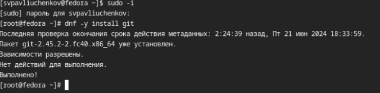{#fig:001 width=70%}

Устанавливаю gh командой dnf install gh.

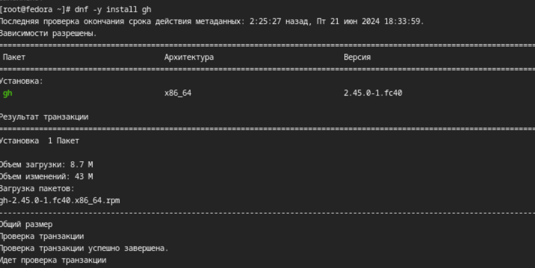{#fig:002 width=70%}

Задаю имя и email владельца репозитория, настраиваю utf-8 в выводе сообщений git, задаю имя начальной ветки и меняю параметры autocrlf и safecrlf.(рис. [-@fig:001]).

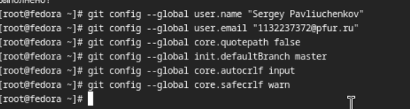{#fig:003 width=70%}

Создаю ключи ssh по двум алгоритмам - по алгоритму rsa с ключём размером 4096 бит и по алгоритму ed25519(рис. [-@fig:004]).

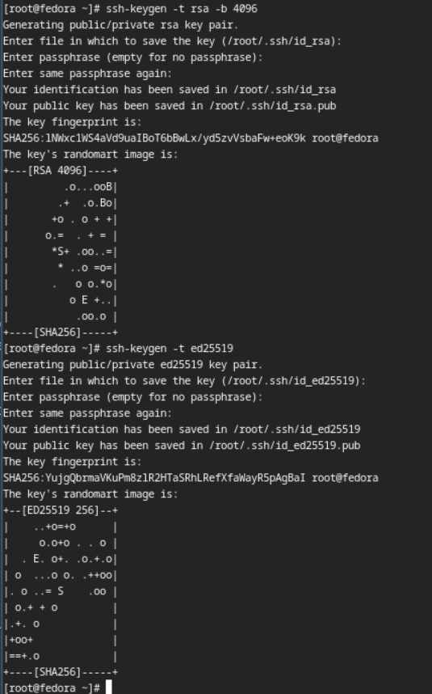{#fig:004 width=70%}

Генерирую pgp ключи, используя команду gpg --full-generate-key (рис. [-@fig:005]).

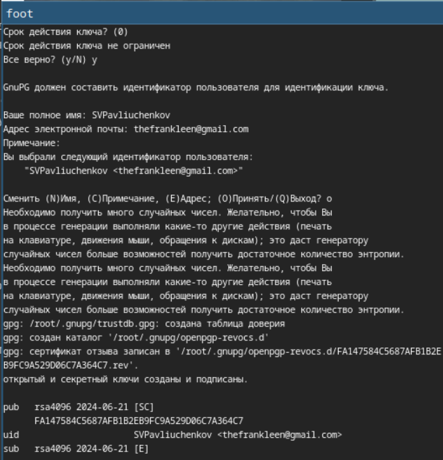{#fig:005 width=70%}

Также выбираю опции, а именно: тип RSA and RSA;
размер 4096;срок действия не истекает никогда

Получаю такие ключи.

{#fig:001 width=70%}

Копирую отпечаток ключа, и захожу на github, чтобы добавить новый ключ.

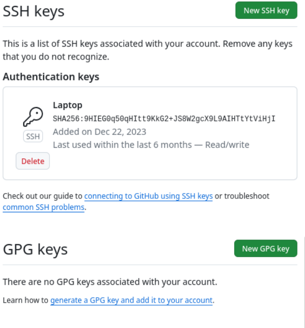{#fig:007 width=70%}

Вношу отпечаток своего ключа на сайт.

{#fig:008 width=70%}

У меня получилось добавить новый ключ.

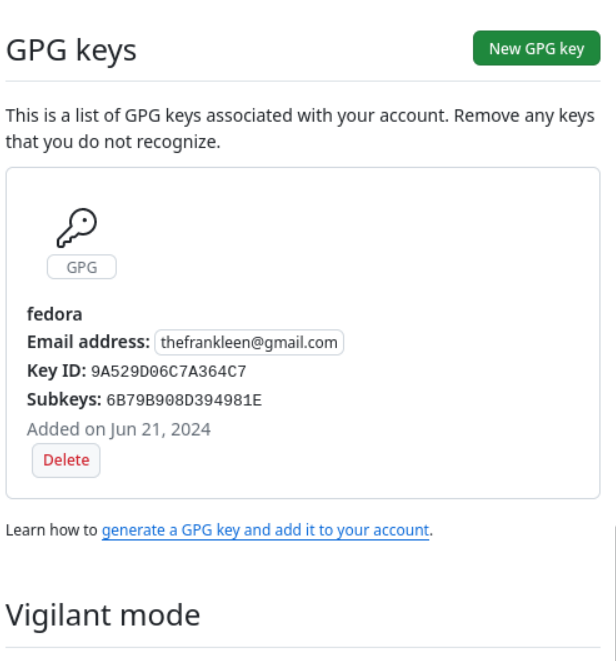{#fig:009 width=70%}

Указываю Git применять введенную почту при подписи коммитов.

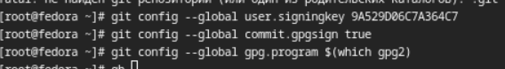{#fig:010 width=70%}

Авторизуюсь используя  gh auth login

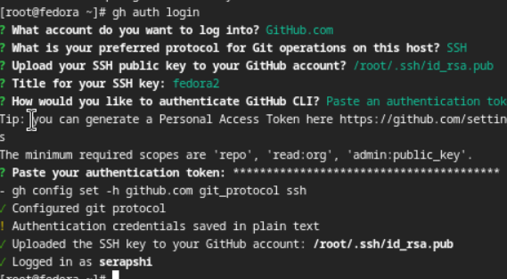{#fig:011 width=70%}

Создаю репозиторий курса на основе шаблона

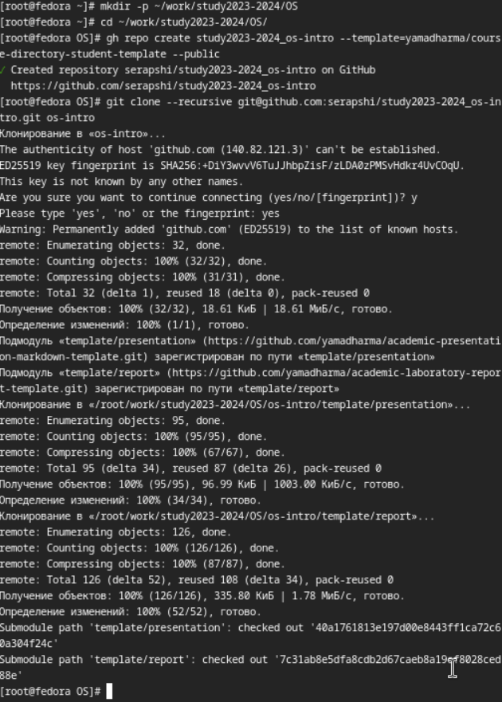{#fig:012 width=70%}

Удаляю лишние файлы(рис. [-@fig:013]).

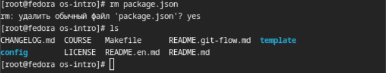{#fig:013 width=70%}

Создаю необходимые каталоги.

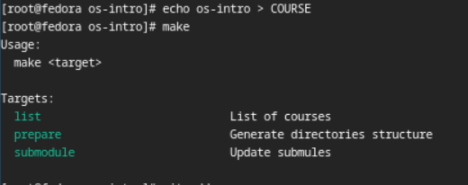{#fig:014 width=70%}

Отправляю файлы на сервер.

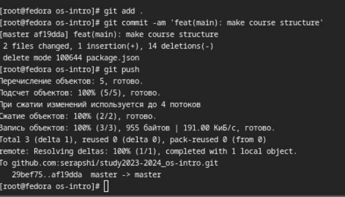{#fig:015 width=70%}

# Выводы

Я подготовил git репозиторий для последующей работы по этому курсу и освежил навыки работы по работе с git.

# Контрольные вопросы

Что такое системы контроля версий (VCS) и для решения каких задач они предназначаются?

Это ПО для отслеживания изменений в файлах.
Оно может быть использовано, как в разработке больших систем, так и небольших программ.
Объясните следующие понятия VCS и их отношения: хранилище, commit, история, рабочая копия.

Что представляют собой и чем отличаются централизованные и децентрализованные VCS? Приведите примеры VCS каждого вида.

Централизованные хранят все данные на одном сервере, как Яндекс. А децентрализованные такие, как git хранят часть данных на сервере, а другие у самих разработчиков.

Опишите действия с VCS при единоличной работе с хранилищем.

После внесения изменений, пользователь размещает новую версию в хранилище.

Опишите порядок работы с общим хранилищем VCS.

Системы контроля версий также могут обеспечивать дополнительные, более гибкие функциональные возможности. Например, они могут поддерживать работу с несколькими версиями одного файла, сохраняя общую историю изменений до точки ветвления версий и собственные истории изменений каждой ветви. Кроме того, обычно доступна информация о том, кто из участников, когда и какие изменения вносил. 

Каковы основные задачи, решаемые инструментальным средством git?

Ветвление, слияние и управление репозиторием.

Назовите и дайте краткую характеристику командам git.

git add - направляет элемент к загрузке на сервер, git push - загружает элементы на сервер

Приведите примеры использования при работе с локальным и удалённым репозиториями.

При работе с локальным: git add .; git commit 'feat(main): commit'; git push. При работе с удаленным: 
git clone --reversive (URL).

Что такое и зачем могут быть нужны ветви (branches)?

Branch(ветка) - это ответвление, от целого репозитория, где можно заниматься разработкой отпределенных функций.
Для удобства разработки и/или исправения ошибок.

Как и зачем можно игнорировать некоторые файлы при commit?

Во время работы над проектом так или иначе могут создаваться файлы, которые не требуется добавлять в последствии в репозиторий. Например, временные файлы, создаваемые редакторами, или объектные файлы, создаваемые компиляторами. Можно прописать шаблоны игнорируемых при добавлении в репозиторий типов файлов в файл .gitignore с помощью сервисов

# Список литературы{.unnumbered}

::: {#refs}
:::
