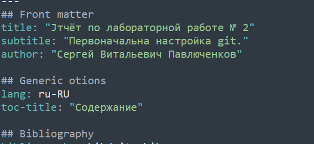
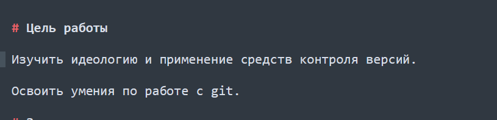
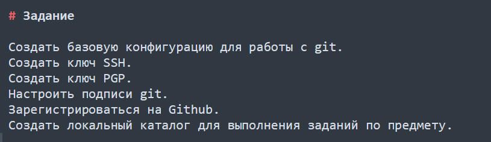
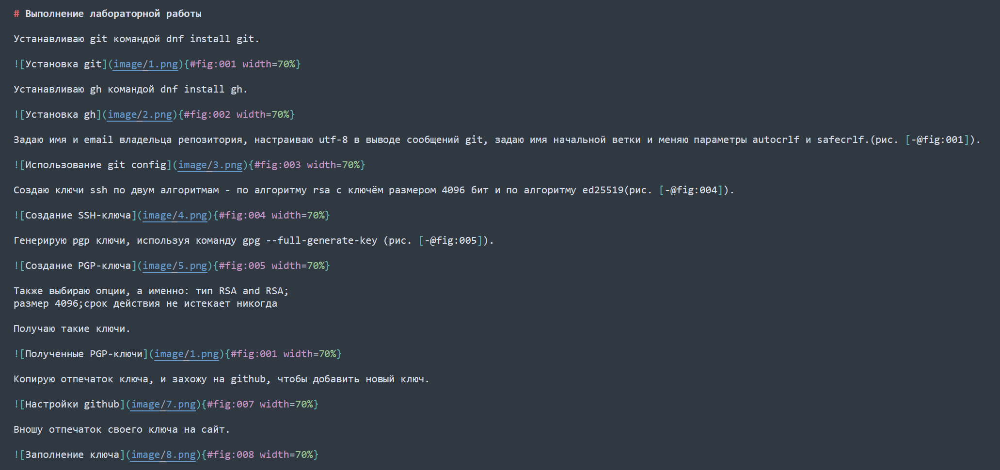
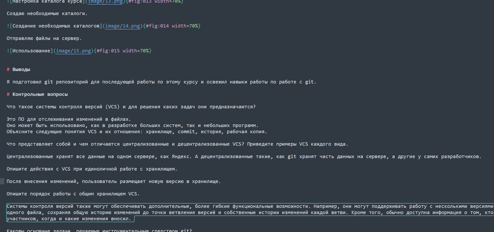
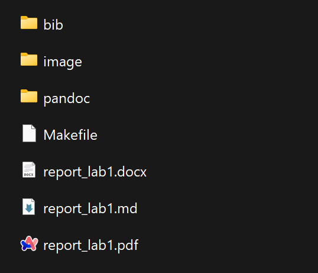

---
## Front matter
lang: ru-RU
title: Выполнение лабораторной работы 3.
subtitle: Markdown
author:
  - Павлюченков С.В.
institute:
  - Российский университет дружбы народов, Москва, Россия
date: 07 сентября 2024

## i18n babel
babel-lang: russian
babel-otherlangs: english

## Formatting pdf
toc: false
toc-title: Содержание
slide_level: 2
aspectratio: 169
section-titles: true
theme: metropolis
header-includes:
 - \metroset{progressbar=frametitle,sectionpage=progressbar,numbering=fraction}
---

## Докладчик

:::::::::::::: {.columns align=center}
::: {.column width="70%"}

  * Павлюченков Сергей Витальевич
  * Студент ФФМиЕН
  * Российский университет дружбы народов
  * [1132237372@pfur.ru](mailto:1132237372@pfur.ru)
  * <https://serapshi.github.io/svpavliuchenkov.github.io/>

:::
::: {.column width="30%"}

:::
::::::::::::::

## Цель работы

Научиться оформлять отчёты с помощью легковесного языка разметки Markdown.

## Задание

– Сделайте отчёт по предыдущей лабораторной работе в формате Markdown.
– В качестве отчёта просьба предоставить отчёты в 3 форматах: pdf, docx и md (в архиве,
поскольку он должен содержать скриншоты, Makefile и т.д.)

# Выполнение лабораторной работы

## Редактирование загаловка отчета

{#fig:001 width=70%}

## Добавление цели задачи

{#fig:002 width=70%}

## Добавление списка задач

{#fig:003 width=70%}

## Заполнение тела отчета.

{#fig:004 width=70%}

## Заполнение конца отчета

{#fig:005 width=70%}

## Создание отчета make файлом

{#fig:006 width=70%}

## Выводы

Выполнив эту лабораторную работу я научился составлять отчеты с помощью языка markdown.

