---
## Front matter
lang: ru-RU
title: Выполнение 4 лабораторной работы
subtitle: Продвинутое использование git
author:
  - Павлюченков С.В.
institute:
  - Российский университет дружбы народов, Москва, Россия
date: 07 сентября 2024

## i18n babel
babel-lang: russian
babel-otherlangs: english

## Formatting pdf
toc: false
toc-title: Содержание
slide_level: 2
aspectratio: 169
section-titles: true
theme: metropolis
header-includes:
 - \metroset{progressbar=frametitle,sectionpage=progressbar,numbering=fraction}
---

## Докладчик

:::::::::::::: {.columns align=center}
::: {.column width="70%"}

  * Павлюченков Сергей Витальевич
  * Студент ФФМиЕН
  * Российский университет дружбы народов
  * [1132237372@pfur.ru](mailto:1132237372@pfur.ru)
  * <https://serapshi.github.io/svpavliuchenkov.github.io/>

:::
::: {.column width="30%"}

:::
::::::::::::::

## Цель работы

Получение навыков правильной работы с репозиториями git.

## Задание

Выполнить работу для тестового репозитория.
Преобразовать рабочий репозиторий в репозиторий с git-flow и conventional commits.

# Выполнение лабораторной работы

## Установка git-flow из коллекции репозиториев Copr.

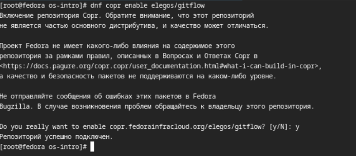{#fig:001 width=70%}

После установил nodejs, pnpm.

## Настройка pnpm 

Для работы с Node.js добавил каталог с исполняемыми файлами, устанавливаемыми yarn, в переменную PATH.

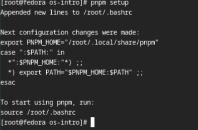{#fig:001 width=70%}

## Добавление программы для помощи в форматировании коммитов.

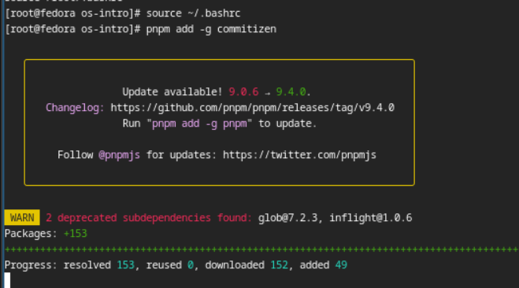{#fig:001 width=70%}

## Добавление программы для помощи в создании логов.

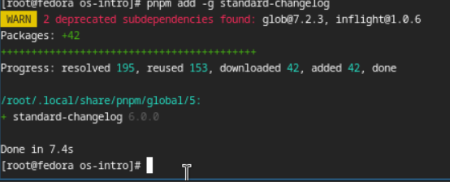{#fig:001 width=70%}

## Создание первого коммита и выкладывание на github.

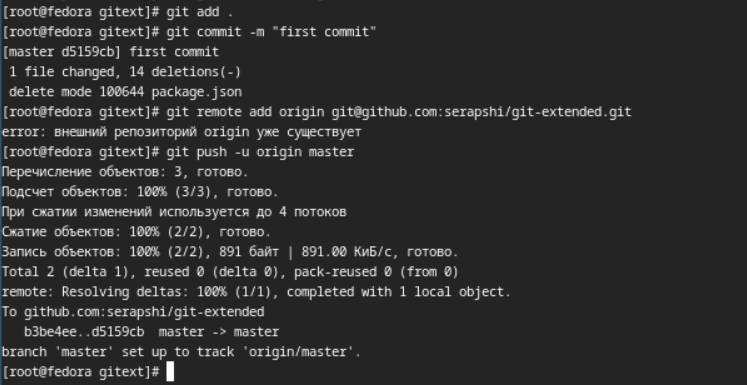{#fig:001 width=70%}

## Открываю конфигурация для пакетов Node.js

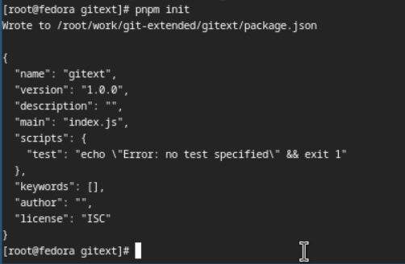{#fig:001 width=70%}

## Заполнение нескольких параметров пакета.

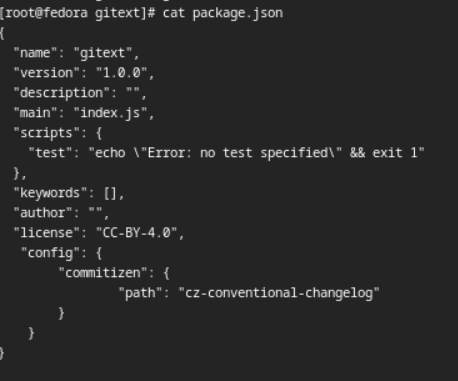{#fig:001 width=70%}

## Выполнение коммита (git cz).

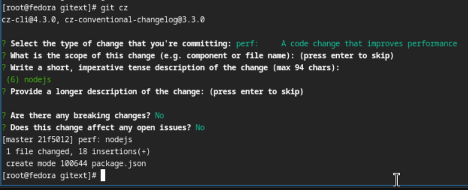{#fig:001 width=70%}

После чего отправляю на github.

## Инициализация git-flow.

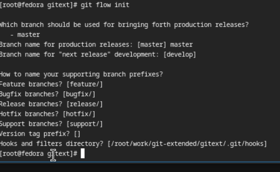{#fig:001 width=70%}

## Проверка, что я на ветке develop

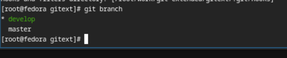{#fig:001 width=70%}

## Загружаю репозиторий в хранилище.

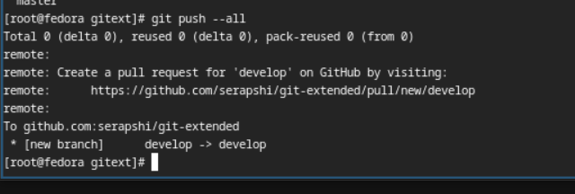{#fig:001 width=70%}

## Установка внешней ветки как вышестоящей для этой ветки.

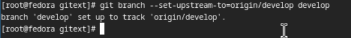{#fig:001 width=70%}

## Создание релиз с версией 1.0.0.

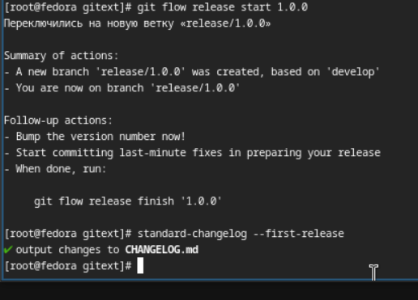{#fig:001 width=70%}

## Создание журнала изменений. Добавление журнала изменений в индекс.

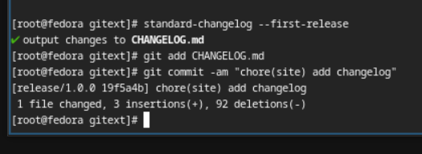{#fig:001 width=70%}

## Заливаю релизную ветку в основную ветку

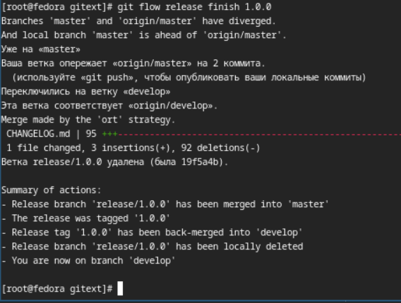{#fig:001 width=70%}

## Отправляю данные на github.

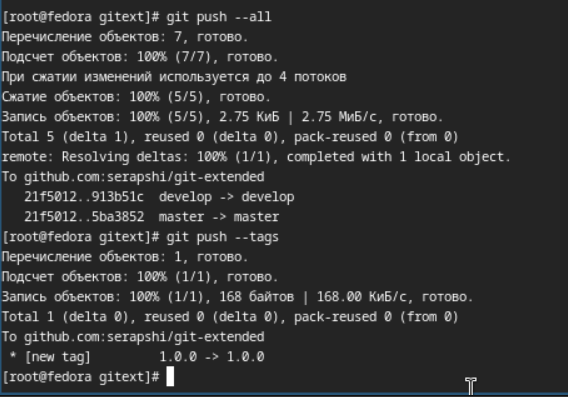{#fig:001 width=70%}

## Создание релиза на github.

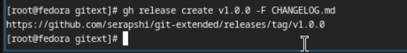{#fig:001 width=70%}

## Создание ветки для новой функциональности.

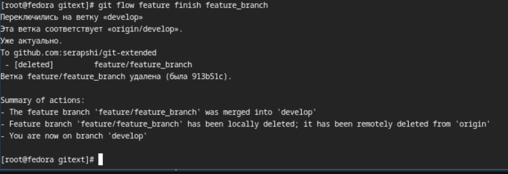{#fig:001 width=70%}

## Создание релиза с версией 1.2.3.

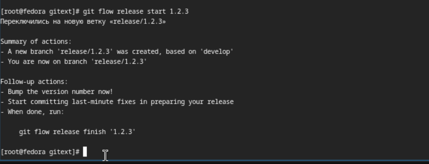{#fig:001 width=70%}

## Обновление номера версии в файле package.json. 

Установка её в 1.2.3.

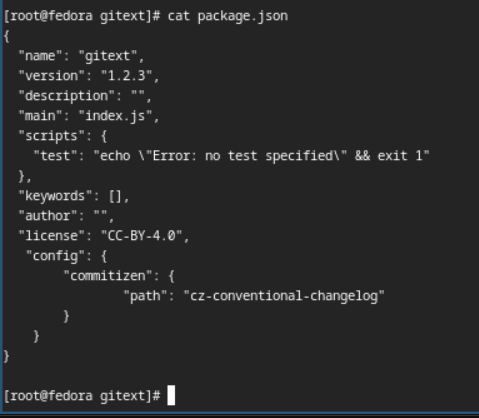{#fig:001 width=70%}

## Добавление журнала изменений в индекс.

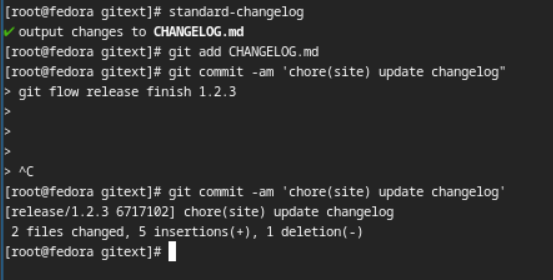{#fig:001 width=70%}

## Заливание релизной ветки в основную ветку

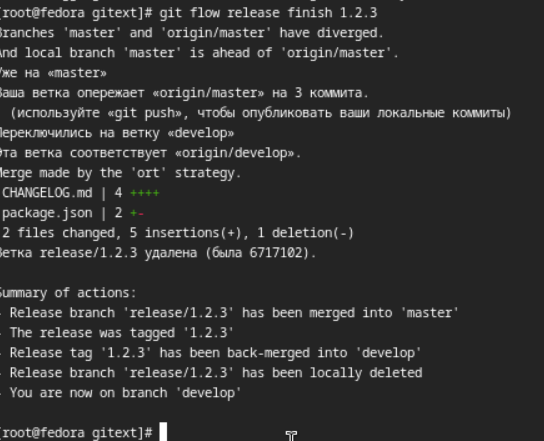{#fig:001 width=70%}

## Отправление данных на github.

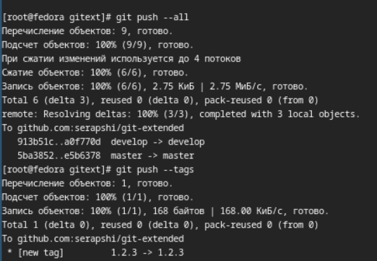{#fig:001 width=70%}

## Создание релиза на github с комментарием из журнала изменений.

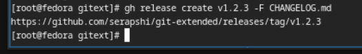{#fig:001 width=70%}

## Выводы

Я научился использовать продвинутые функции git, ознакомился со способами создания и changelog'a и добавления комитов с комментариями из него. 
