---
## Front matter
title: "Отчёт по лабораторной работе № 4"
subtitle: "Продвинутое использование git"
author: "Сергей Витальевич Павлюченков"

## Generic otions
lang: ru-RU
toc-title: "Содержание"

## Bibliography
bibliography: bib/cite.bib
csl: pandoc/csl/gost-r-7-0-5-2008-numeric.csl

## Pdf output format
toc: true # Table of contents
toc-depth: 2
lof: true # List of figures
lot: true # List of tables
fontsize: 12pt
linestretch: 1.5
papersize: a4
documentclass: scrreprt
## I18n polyglossia
polyglossia-lang:
  name: russian
  options:
	- spelling=modern
	- babelshorthands=true
polyglossia-otherlangs:
  name: english
## I18n babel
babel-lang: russian
babel-otherlangs: english
## Fonts
mainfont: PT Serif
romanfont: PT Serif
sansfont: PT Sans
monofont: PT Mono
mainfontoptions: Ligatures=TeX
romanfontoptions: Ligatures=TeX
sansfontoptions: Ligatures=TeX,Scale=MatchLowercase
monofontoptions: Scale=MatchLowercase,Scale=0.9
## Biblatex
biblatex: true
biblio-style: "gost-numeric"
biblatexoptions:
  - parentracker=true
  - backend=biber
  - hyperref=auto
  - language=auto
  - autolang=other*
  - citestyle=gost-numeric
## Pandoc-crossref LaTeX customization
figureTitle: "Рис."
tableTitle: "Таблица"
listingTitle: "Листинг"
lofTitle: "Список иллюстраций"
lotTitle: "Список таблиц"
lolTitle: "Листинги"
## Misc options
indent: true
header-includes:
  - \usepackage{indentfirst}
  - \usepackage{float} # keep figures where there are in the text
  - \floatplacement{figure}{H} # keep figures where there are in the text
---

# Цель работы

Получение навыков правильной работы с репозиториями git.

# Задание

Выполнить работу для тестового репозитория.
Преобразовать рабочий репозиторий в репозиторий с git-flow и conventional commits.

# Выполнение лабораторной работы

Устанавливаю git-flow из коллекции репозиториев Copr.

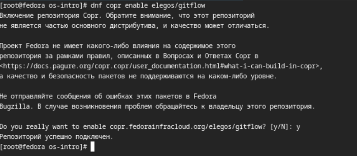{#fig:001 width=70%}

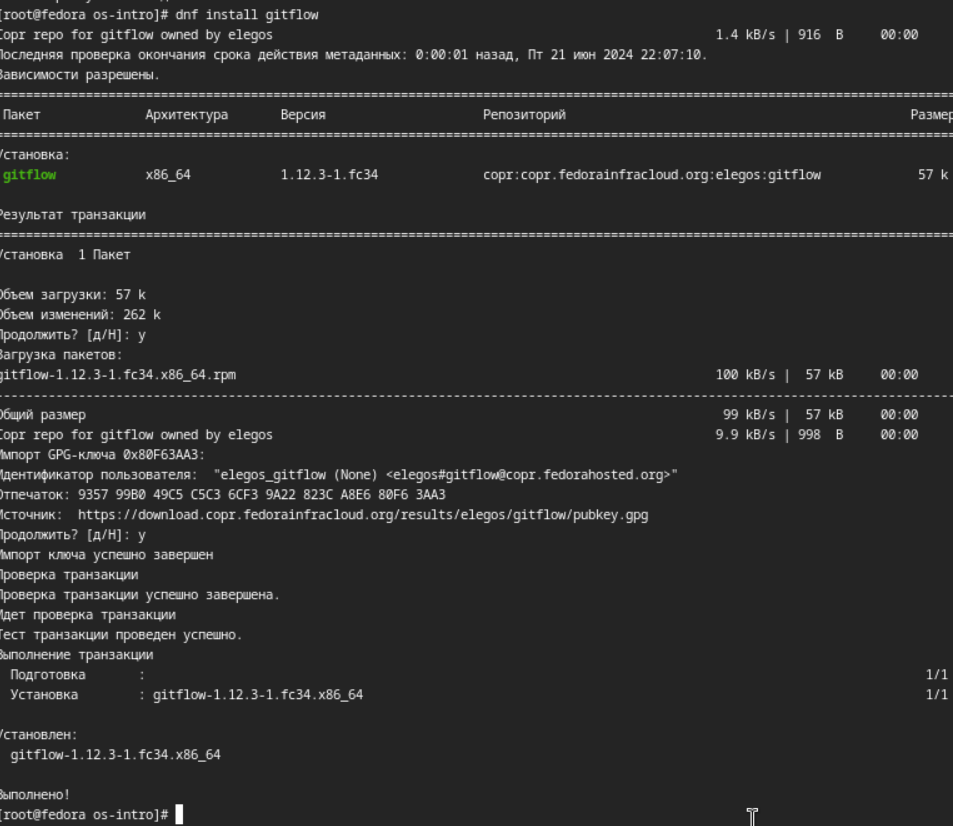{#fig:002 width=70%}

Устанавливаю Node.js.

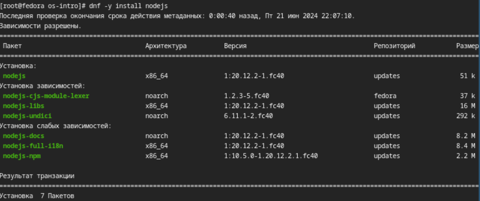{#fig:003 width=70%}

Устанавливаю pnpm.

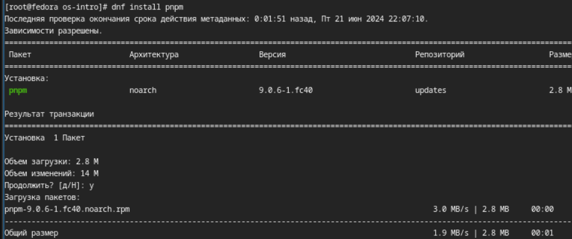{#fig:004 width=70%}

Для работы с Node.js добавил каталог с исполняемыми файлами, устанавливаемыми yarn, в переменную PATH.

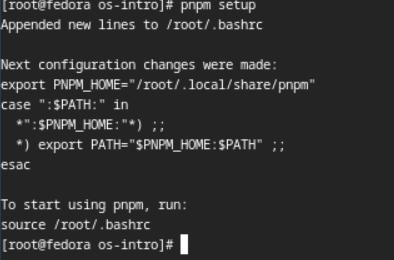{#fig:005 width=70%}

Добавляю программу для помощи в форматировании коммитов.

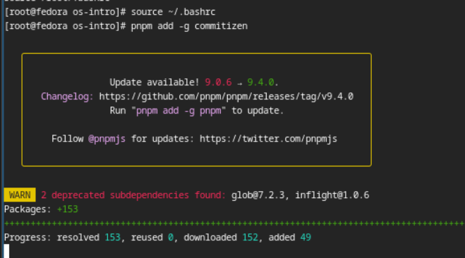{#fig:006 width=70%}

Добавляю программу для помощи в создании логов.

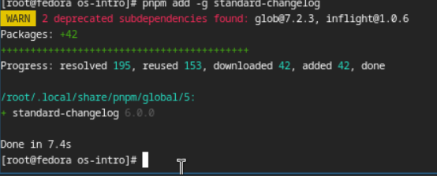{#fig:007 width=70%}

Делаю первый коммит и выкладываем на github.

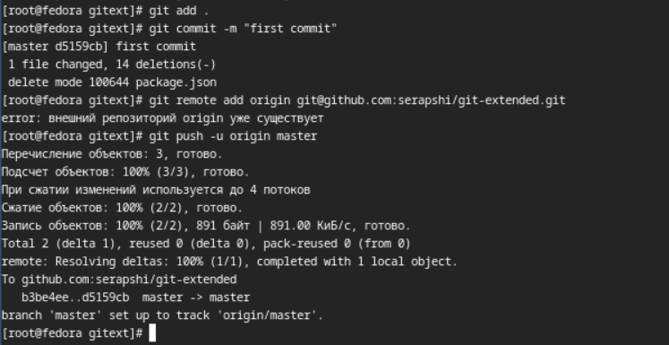{#fig:008 width=70%}

Открываю конфигурация для пакетов Node.js

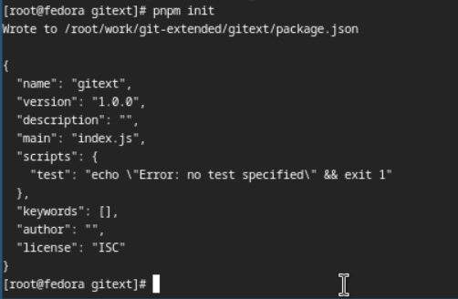{#fig:009 width=70%}

Заполняю несколько параметров пакета. Таким образом, файл package.json приобретает такой вид:

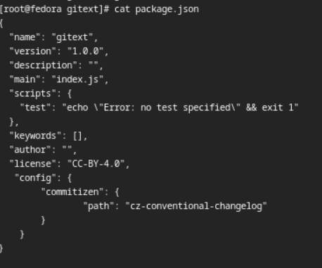{#fig:010 width=70%}

Выполняю коммит (git cz).

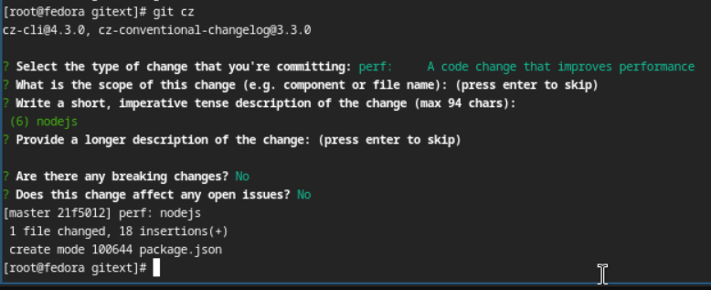{#fig:011 width=70%}

Отправляю на github.

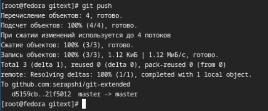{#fig:012 width=70%}

Инициализирую git-flow.

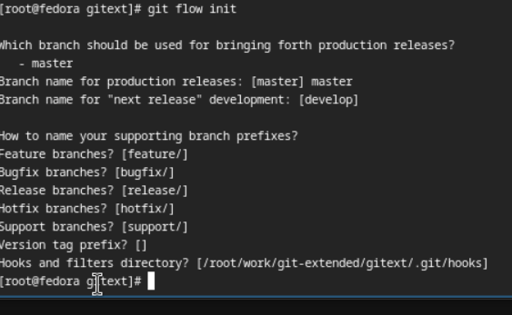{#fig:013 width=70%}

Проверяю, что я на ветке develop

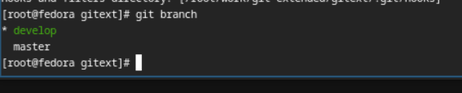{#fig:014 width=70%}

Загружаю весь репозиторий в хранилище.

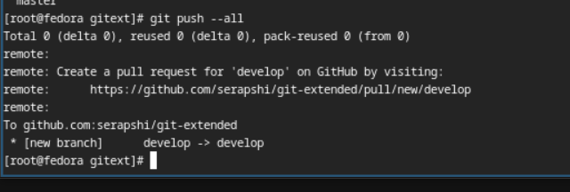{#fig:015 width=70%}

Установите внешнюю ветку как вышестоящую для этой ветки.

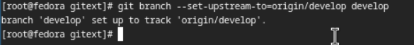{#fig:016 width=70%}

Создаю релиз с версией 1.0.0.

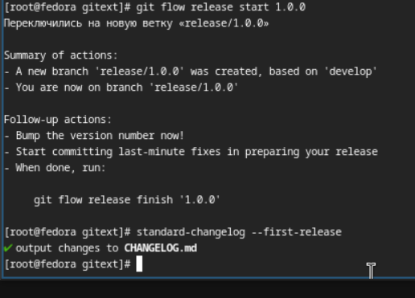{#fig:017 width=70%}

Создаю журнал изменений. Добавляю журнал изменений в индекс.

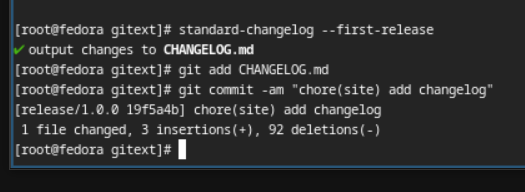{#fig:018 width=70%}

Заливаю релизную ветку в основную ветку

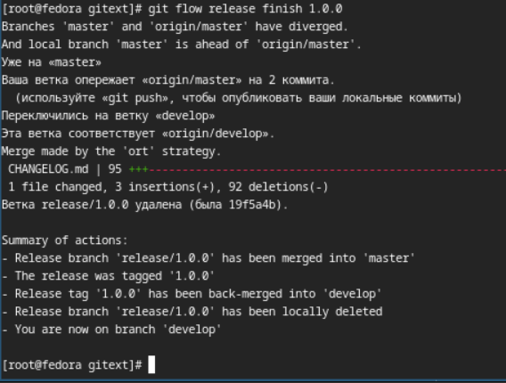{#fig:019 width=70%}

Отправляю данные на github.

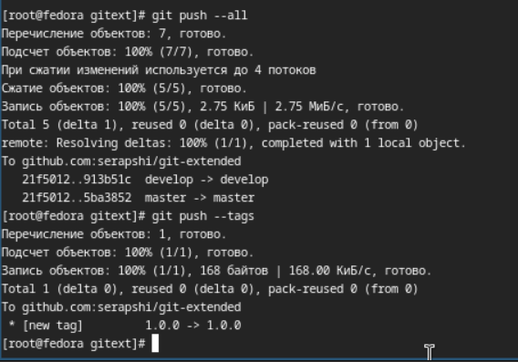{#fig:020 width=70%}

Создаю релиз на github. Для этого использую утилиты работы с github:

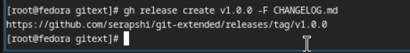{#fig:021 width=70%}

Создаю ветку для новой функциональности.

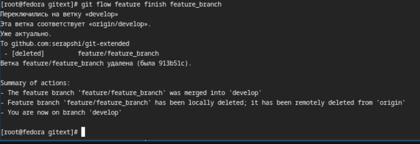{#fig:022 width=70%}

Создадим релиз с версией 1.2.3.

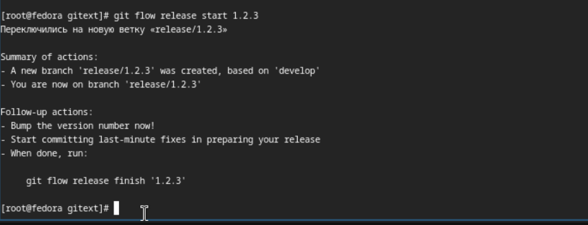{#fig:023 width=70%}

Обновляю номер версии в файле package.json. Ставлю её в 1.2.3.

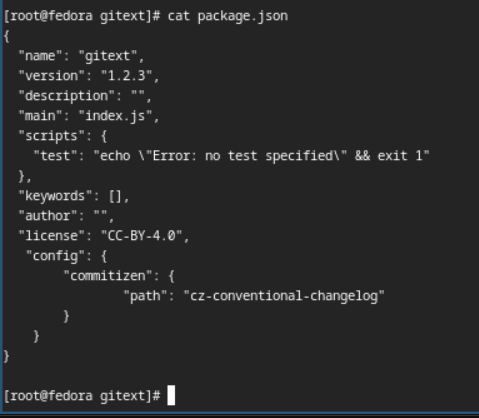{#fig:024 width=70%}

Добавляю журнал изменений в индекс.

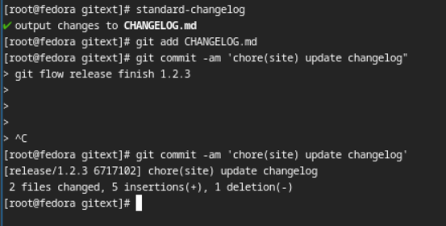{#fig:025 width=70%}

Заливаю релизную ветку в основную ветку

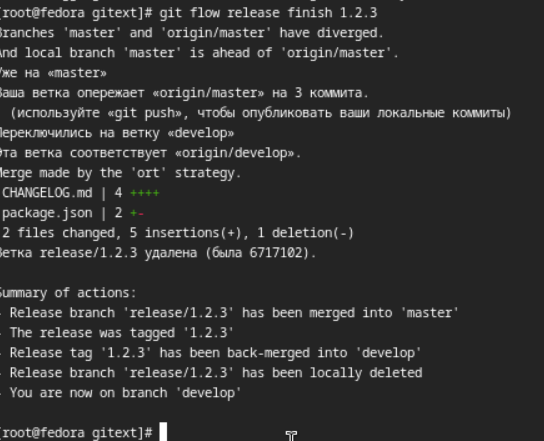{#fig:026 width=70%}

Отправляю данные на github.

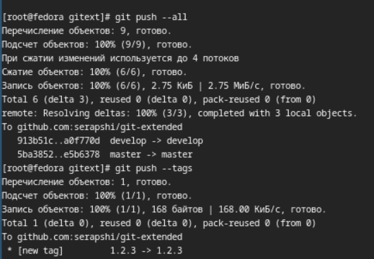{#fig:027 width=70%}

Создаю релиз на github с комментарием из журнала изменений.

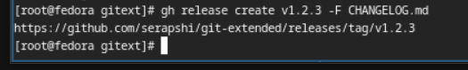{#fig:028 width=70%}

# Выводы

Я научился использовать продвинутые функции git, ознакомился со способами создания и changelog'a и добавления комитов с комментариями из него. 

# Список литературы{.unnumbered}

Лабораторная работа № 4
