---
## Front matter
lang: ru-RU
title: Выполнение 5 лабораторной работы
subtitle: Настройка рабочей среды
author:
  - Павлюченков С.В.
institute:
  - Российский университет дружбы народов, Москва, Россия
date: 07 сентября 2024

## i18n babel
babel-lang: russian
babel-otherlangs: english

## Formatting pdf
toc: false
toc-title: Содержание
slide_level: 2
aspectratio: 169
section-titles: true
theme: metropolis
header-includes:
 - \metroset{progressbar=frametitle,sectionpage=progressbar,numbering=fraction}
---

## Докладчик

:::::::::::::: {.columns align=center}
::: {.column width="70%"}

  * Павлюченков Сергей Витальевич
  * Студент ФФМиЕН
  * Российский университет дружбы народов
  * [1132237372@pfur.ru](mailto:1132237372@pfur.ru)
  * <https://serapshi.github.io/svpavliuchenkov.github.io/>

:::
::: {.column width="30%"}

:::
::::::::::::::

## Цель работы

Улучшить качество взаимодествия с ОС.
Повысить безопасность эксплуатации ОС.

## Задание

Установка менеджера паролей pass
Создать собственный репозитория с помощью утилит.

# Выполнение лабораторной работы

## Инициализирую хранилище:

После установки pass и gopass, инициализирую хранилище.

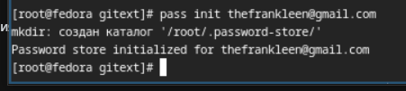{#fig:001 width=70%}

## Создание структуры git

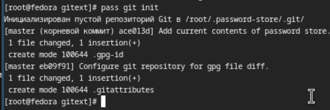{#fig:001 width=70%}

## Добавление нового пароля.

После устанавки программы, обеспечивающую интерфейс native messaging 
добавляю новый пароль и заменяю его на сгенерированный.

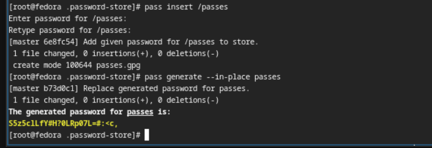{#fig:001 width=70%}

## Устанавка дополнительного ПО.

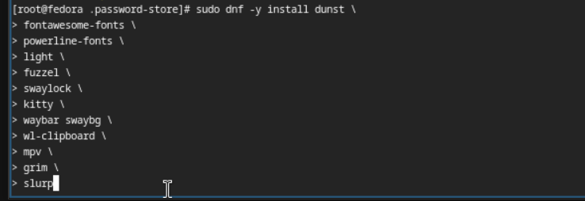{#fig:001 width=70%}

## Устанавка шрифты.

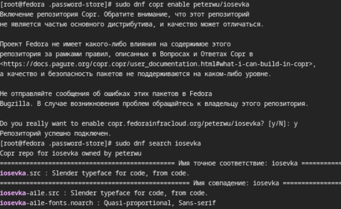{#fig:001 width=70%}
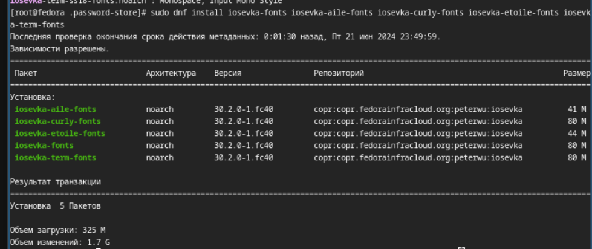{#fig:001 width=70%}
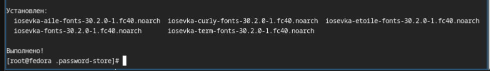{#fig:001 width=70%}

## Устанавка chezmoi с помощью wget:

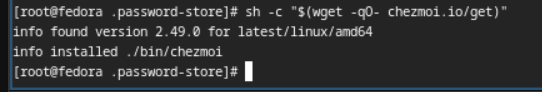{#fig:001 width=70%}

## Создание репозитория для конфигурационных файлов на основе шаблона

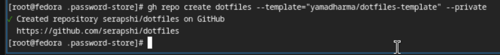{#fig:001 width=70%}

## Подключение репозитория к системе.

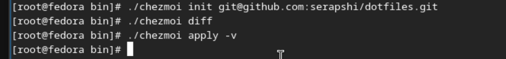{#fig:001 width=70%}

## Установка chezmoi на второй машине.

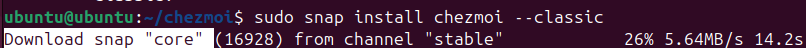{#fig:001 width=70%}

## Инициализация chezmoi с репозиторием dotfiles на второй машине.

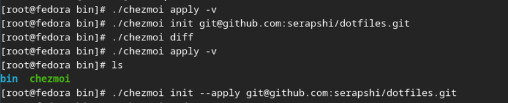{#fig:001 width=70%}

## Извлечение последних изменений из своего репозитория

Добавляю в файл конфигурации ~/.config/chezmoi/chezmoi.toml следующее, чтобы автоматически фиксировать и отправлять изменения в исходный каталог в репозиторий.

{#fig:001 width=70%}
{#fig:001 width=70%}
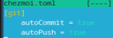{#fig:001 width=70%}

## Выводы

Я научился применять chezmoi, использовал и подключил репозиторий на разных машинах и создал свой собственный репохиторий с помощью утилит. 