---
## Front matter
title: "Отчёт по лабораторной работе №" 5
subtitle: "Настройка рабочей среды"
author: "Сергей Витальевич Павлюченков"

## Generic otions
lang: ru-RU
toc-title: "Содержание"

## Bibliography
bibliography: bib/cite.bib
csl: pandoc/csl/gost-r-7-0-5-2008-numeric.csl

## Pdf output format
toc: true # Table of contents
toc-depth: 2
lof: true # List of figures
lot: true # List of tables
fontsize: 12pt
linestretch: 1.5
papersize: a4
documentclass: scrreprt
## I18n polyglossia
polyglossia-lang:
  name: russian
  options:
	- spelling=modern
	- babelshorthands=true
polyglossia-otherlangs:
  name: english
## I18n babel
babel-lang: russian
babel-otherlangs: english
## Fonts
mainfont: PT Serif
romanfont: PT Serif
sansfont: PT Sans
monofont: PT Mono
mainfontoptions: Ligatures=TeX
romanfontoptions: Ligatures=TeX
sansfontoptions: Ligatures=TeX,Scale=MatchLowercase
monofontoptions: Scale=MatchLowercase,Scale=0.9
## Biblatex
biblatex: true
biblio-style: "gost-numeric"
biblatexoptions:
  - parentracker=true
  - backend=biber
  - hyperref=auto
  - language=auto
  - autolang=other*
  - citestyle=gost-numeric
## Pandoc-crossref LaTeX customization
figureTitle: "Рис."
tableTitle: "Таблица"
listingTitle: "Листинг"
lofTitle: "Список иллюстраций"
lotTitle: "Список таблиц"
lolTitle: "Листинги"
## Misc options
indent: true
header-includes:
  - \usepackage{indentfirst}
  - \usepackage{float} # keep figures where there are in the text
  - \floatplacement{figure}{H} # keep figures where there are in the text
---

# Цель работы

Улучшить качество взаимодествия с ОС.

Повысить безопасность эксплуатации ОС.

# Задание

Установка менеджера паролей pass

Создать собственный репозитория с помощью утилит.

# Выполнение лабораторной работы

Установка pass - dnf install pass pass-otp.

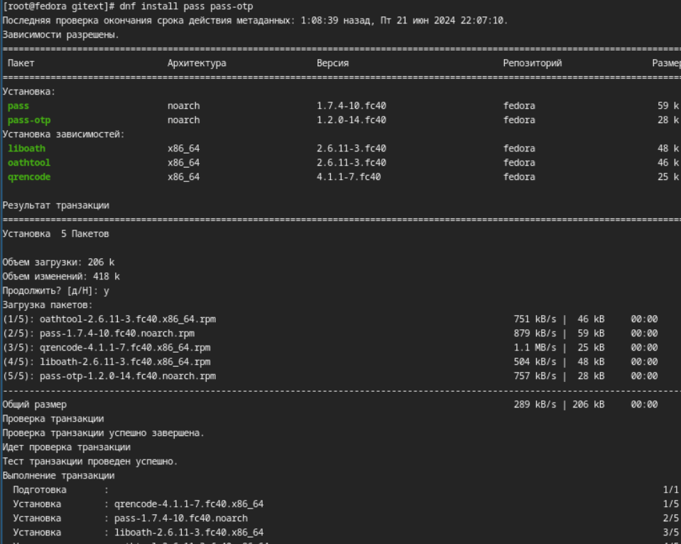{#fig:001 width=70%}

Установка gopass - dnf install gopass.

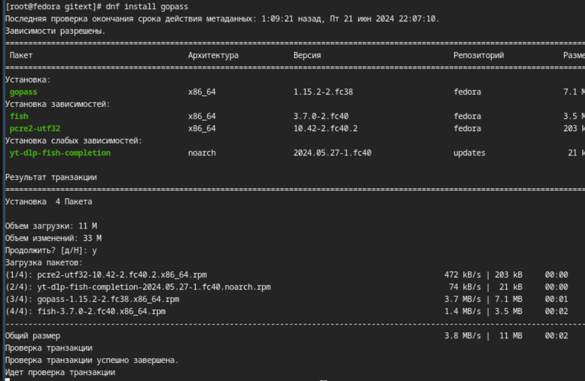{#fig:001 width=70%}

Инициализирую хранилище:

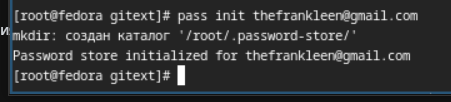{#fig:001 width=70%}

Создадим структуру git

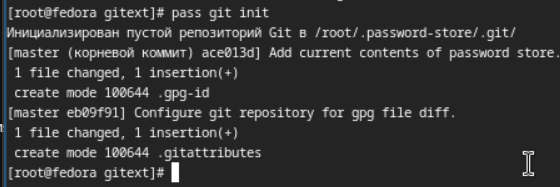{#fig:001 width=70%}

Устанавливю программу, обеспечивающую интерфейс native messaging.

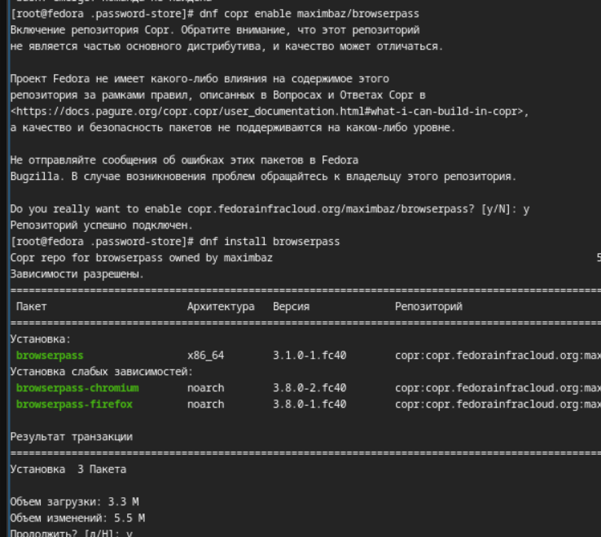{#fig:001 width=70%}

Добавляю новый пароль и заменяю его на сгенерированный.

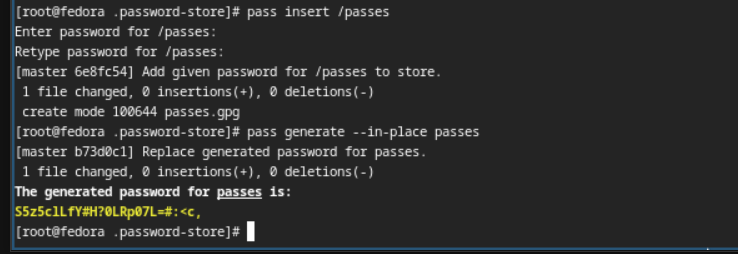{#fig:001 width=70%}

Устанавливаю дополнительное программное обеспечение.

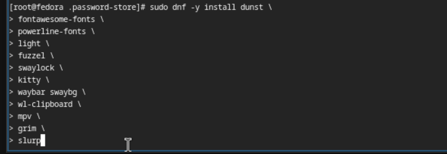{#fig:001 width=70%}

Устанавливаю шрифты.

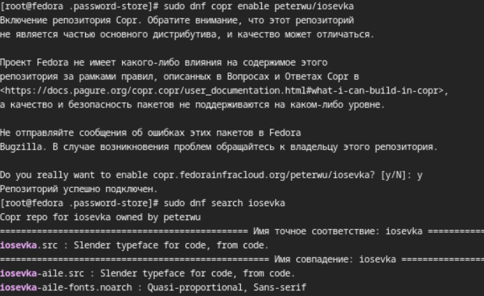{#fig:001 width=70%}

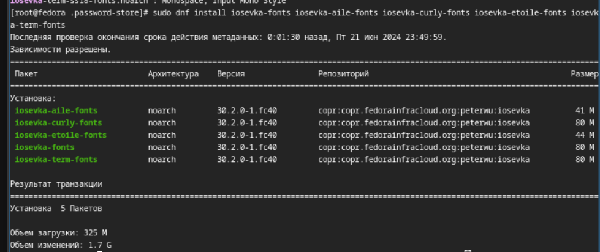{#fig:001 width=70%}

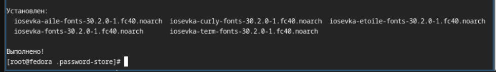{#fig:001 width=70%}

Устанавливаю chezmoi с помощью wget:

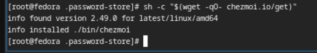{#fig:001 width=70%}

Создаю свой репозиторий для конфигурационных файлов на основе шаблона

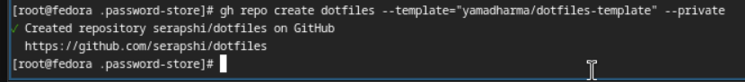{#fig:001 width=70%}

Подключаю репозитория к своей системе.

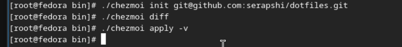{#fig:001 width=70%}

Устанавливаю chezmoi на второй машине.

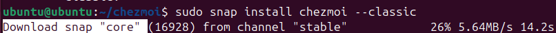{#fig:001 width=70%}

На второй машине инициализируйте chezmoi с вашим репозиторием dotfiles (на Ubuntu).

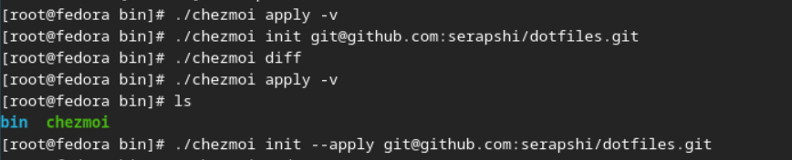{#fig:001 width=70%}

Извлекаю последние изменения из своего репозитория

{#fig:001 width=70%}

Меня утсраивают изменения, и  я их применяю

{#fig:001 width=70%}

Добавляю в файл конфигурации ~/.config/chezmoi/chezmoi.toml следующее, чтобы автоматически фиксировать и отправлять изменения в исходный каталог в репозиторий.

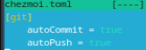{#fig:001 width=70%}

# Выводы

Я научился применять chezmoi, использовал и подключил репозиторий на разных машинах и создал свой собственный репохиторий с помощью утилит. 
# Список литературы{.unnumbered}

Лабораторная работа № 5