---
## Front matter
lang: ru-RU
title: Выполнение 6 лабораторной работы
subtitle: Основы интерфейса взаимодействия пользователя с системой Unix на уровне командной строки
author:
  - Павлюченков С.В.
institute:
  - Российский университет дружбы народов, Москва, Россия
date: 07 сентября 2024

## i18n babel
babel-lang: russian
babel-otherlangs: english

## Formatting pdf
toc: false
toc-title: Содержание
slide_level: 2
aspectratio: 169
section-titles: true
theme: metropolis
header-includes:
 - \metroset{progressbar=frametitle,sectionpage=progressbar,numbering=fraction}
---

## Докладчик

:::::::::::::: {.columns align=center}
::: {.column width="70%"}

  * Павлюченков Сергей Витальевич
  * Студент ФФМиЕН
  * Российский университет дружбы народов
  * [1132237372@pfur.ru](mailto:1132237372@pfur.ru)
  * <https://serapshi.github.io/svpavliuchenkov.github.io/>

:::
::: {.column width="30%"}

:::
::::::::::::::

## Цель работы

Приобретение практических навыков взаимодействия пользователя с системой посредством командной строки.

## Задание

1. Определите полное имя вашего домашнего каталога. Далее относительно этого каталога будут выполняться последующие упражнения.
2. Выполните следующие действия:
2.1. Перейдите в каталог /tmp.
2.2. Выведите на экран содержимое каталога /tmp. Для этого используйте команду ls
с различными опциями. Поясните разницу в выводимой на экран информации.
2.3. Определите, есть ли в каталоге /var/spool подкаталог с именем cron?
2.4. Перейдите в Ваш домашний каталог и выведите на экран его содержимое. Определите, кто является владельцем файлов и подкаталогов?
3. Выполните следующие действия:
3.1. В домашнем каталоге создайте новый каталог с именем newdir.
3.2. В каталоге ~/newdir создайте новый каталог с именем morefun.
3.3. В домашнем каталоге создайте одной командой три новых каталога с именами
letters, memos, misk. Затем удалите эти каталоги одной командой.
3.4. Попробуйте удалить ранее созданный каталог ~/newdir командой rm. Проверьте,
был ли каталог удалён.
3.5. Удалите каталог ~/newdir/morefun из домашнего каталога. Проверьте, был ли
каталог удалён.
4. С помощью команды man определите, какую опцию команды ls нужно использовать для просмотра содержимое не только указанного каталога, но и подкаталогов,
входящих в него.
5. С помощью команды man определите набор опций команды ls, позволяющий отсортировать по времени последнего изменения выводимый список содержимого каталога
с развёрнутым описанием файлов.
6. Используйте команду man для просмотра описания следующих команд: cd, pwd, mkdir,
rmdir, rm. Поясните основные опции этих команд.
7. Используя информацию, полученную при помощи команды history, выполните модификацию и исполнение нескольких команд из буфера команд.

# Выполнение лабораторной работы

## Определение полного имени домашнего каталога. 

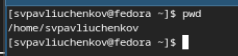{#fig:001 width=70%}

## Вывод информации о файлах

После перехода в каталог /tmp. Вывожу содержимое каталога /tmp на экран 4 способами:

ls и ls -a. Отличие первого от второго в том, что ls -а выводит секретные файлы, а просто ls - нет. 

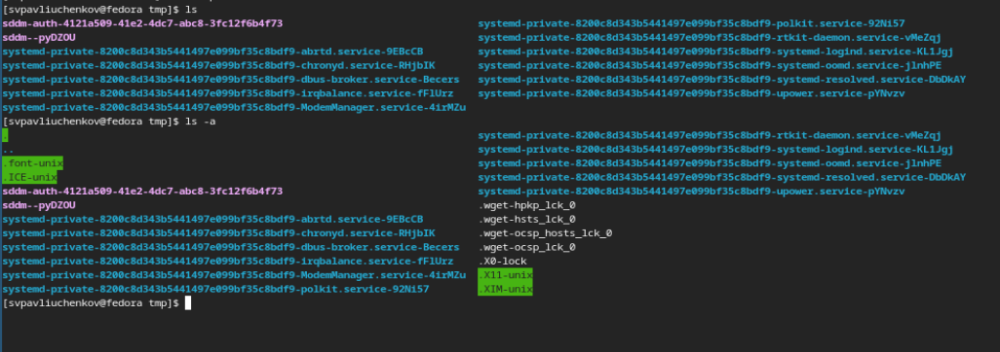{#fig:001 width=70%}

## Вывод информации о файлах

ls -l. Выводит информацию о файлах и директориях в виде списков, и пишет много полезной информации, например, хозяин файла, права доступа.

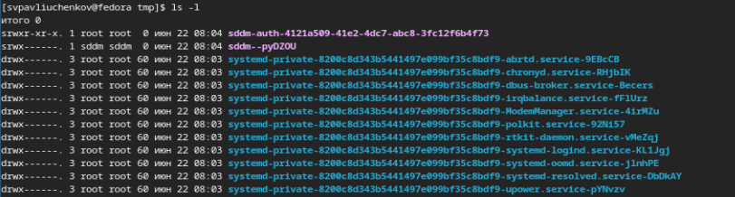{#fig:001 width=70%}

## Работа с командой ls
Определяю, есть ли в каталоге /var/spool подкаталог с именем cron - он там есть.

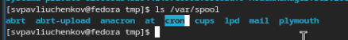{#fig:001 width=70%}

## Работа с командой ls
Устанавливаю, что мой пользователь является хозяином каталогов и подкаталогов.

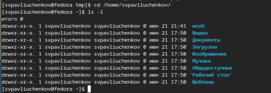{#fig:001 width=70%}

## Работа с mkdir

После создания каталога newdir, создаю новый каталог с именем morefun.

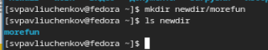{#fig:001 width=70%}

## Работа с mkdir
В домашнем каталоге создаю одной командой три новых каталога с именами
letters, memos, misk

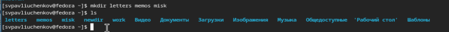{#fig:001 width=70%}

## Работа с rm 
Затем удаляю эти каталоги одной командой.

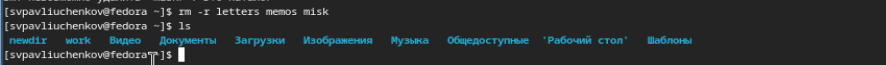{#fig:001 width=70%}

## Работа с rm

Пробую удалить ранее созданный каталог ~/newdir командой rm - не получается.

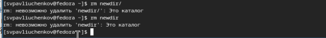{#fig:001 width=70%}

## Работа с rm 
Удаляю каталог ~/newdir/morefun из домашнего каталога

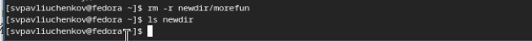{#fig:001 width=70%}

## Работа с man 

С помощью команды man определяю, какую опцию команды ls нужно использовать для просмотра содержимое не только указанного каталога, но и подкаталогов,
входящих в него - -f. После чего используя man определяю набор опций команды ls, позволяющий отсортировать по времени последнего изменения выводимый список содержимого каталога с развёрнутым описанием файлов - -flc

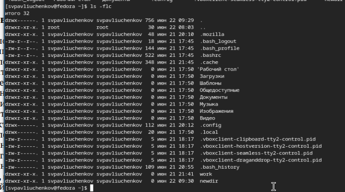{#fig:001 width=70%}

## Работа с man

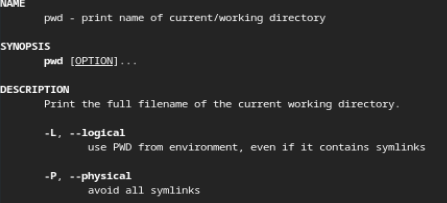{#fig:001 width=70%}

## Работа с man

Ее основная опция заключается в создании директорий.  -p   Создать все отсутствующие директории между начальной и конечным компонентом.

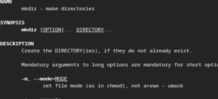{#fig:001 width=70%}

## Работа с man

Ее основная опция заключается в удаление директорий. -p = удалить все каталоги в пути к файлу

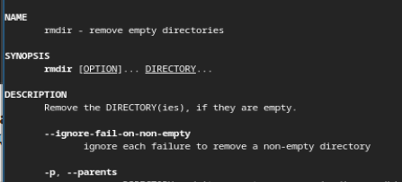{#fig:001 width=70%}

## Работа с man

Ее основная опция заключается в удаление файлов. -r = рекурсивно удалить содержимое директорий и директории, -f = игнорировать не существующие файлы 

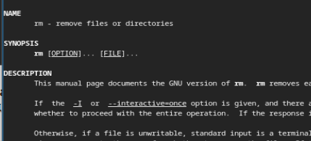{#fig:001 width=70%}

## Работа с командой history.

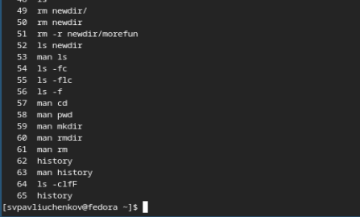{#fig:001 width=70%}

## Работа с командой history.

Вношу изменение в 64 строку и переписываю clfF на l 

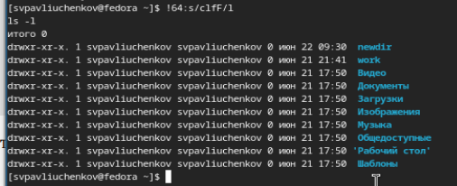{#fig:001 width=70%}

## Выводы

В этой лабораторной работе я освежил все знания создания, удаления, копирования и перемещения директорий и файлов. Также я научился взаимодействовать с командами из буфера обмена. 