---
## Front matter
title: "Отчёт по лабораторной работе № 6"
subtitle: " Основы интерфейса взаимодействия пользователя с системой Unix на уровне командной строки"
author: "Сергей Витальевич Павлюченков"

## Generic otions
lang: ru-RU
toc-title: "Содержание"

## Bibliography
bibliography: bib/cite.bib
csl: pandoc/csl/gost-r-7-0-5-2008-numeric.csl

## Pdf output format
toc: true # Table of contents
toc-depth: 2
lof: true # List of figures
lot: true # List of tables
fontsize: 12pt
linestretch: 1.5
papersize: a4
documentclass: scrreprt
## I18n polyglossia
polyglossia-lang:
  name: russian
  options:
	- spelling=modern
	- babelshorthands=true
polyglossia-otherlangs:
  name: english
## I18n babel
babel-lang: russian
babel-otherlangs: english
## Fonts
mainfont: PT Serif
romanfont: PT Serif
sansfont: PT Sans
monofont: PT Mono
mainfontoptions: Ligatures=TeX
romanfontoptions: Ligatures=TeX
sansfontoptions: Ligatures=TeX,Scale=MatchLowercase
monofontoptions: Scale=MatchLowercase,Scale=0.9
## Biblatex
biblatex: true
biblio-style: "gost-numeric"
biblatexoptions:
  - parentracker=true
  - backend=biber
  - hyperref=auto
  - language=auto
  - autolang=other*
  - citestyle=gost-numeric
## Pandoc-crossref LaTeX customization
figureTitle: "Рис."
tableTitle: "Таблица"
listingTitle: "Листинг"
lofTitle: "Список иллюстраций"
lotTitle: "Список таблиц"
lolTitle: "Листинги"
## Misc options
indent: true
header-includes:
  - \usepackage{indentfirst}
  - \usepackage{float} # keep figures where there are in the text
  - \floatplacement{figure}{H} # keep figures where there are in the text
---

# Цель работы

Приобретение практических навыков взаимодействия пользователя с системой посредством командной строки.

# Задание

1. Определите полное имя вашего домашнего каталога. Далее относительно этого каталога будут выполняться последующие упражнения.
2. Выполните следующие действия:
2.1. Перейдите в каталог /tmp.
2.2. Выведите на экран содержимое каталога /tmp. Для этого используйте команду ls
с различными опциями. Поясните разницу в выводимой на экран информации.
2.3. Определите, есть ли в каталоге /var/spool подкаталог с именем cron?
2.4. Перейдите в Ваш домашний каталог и выведите на экран его содержимое. Определите, кто является владельцем файлов и подкаталогов?
3. Выполните следующие действия:
3.1. В домашнем каталоге создайте новый каталог с именем newdir.
3.2. В каталоге ~/newdir создайте новый каталог с именем morefun.
3.3. В домашнем каталоге создайте одной командой три новых каталога с именами
letters, memos, misk. Затем удалите эти каталоги одной командой.
3.4. Попробуйте удалить ранее созданный каталог ~/newdir командой rm. Проверьте,
был ли каталог удалён.
3.5. Удалите каталог ~/newdir/morefun из домашнего каталога. Проверьте, был ли
каталог удалён.
4. С помощью команды man определите, какую опцию команды ls нужно использовать для просмотра содержимое не только указанного каталога, но и подкаталогов,
входящих в него.
5. С помощью команды man определите набор опций команды ls, позволяющий отсортировать по времени последнего изменения выводимый список содержимого каталога
с развёрнутым описанием файлов.
6. Используйте команду man для просмотра описания следующих команд: cd, pwd, mkdir,
rmdir, rm. Поясните основные опции этих команд.
7. Используя информацию, полученную при помощи команды history, выполните модификацию и исполнение нескольких команд из буфера команд.

# Выполнение лабораторной работы

Определяю полное имя домашнего каталога. 

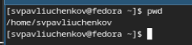{#fig:001 width=70%}

Перехожу в каталог /tmp.

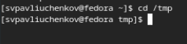{#fig:002 width=70%}

Вывожу содержимое каталога /tmp на экран 4 способами:

ls и ls -a. Отличие первого от второго в том, что ls -а выводит секретные файлы, а просто ls - нет. 

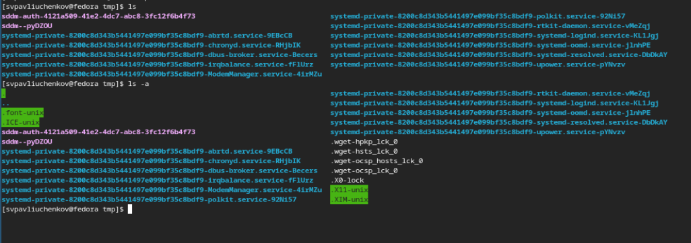{#fig:003 width=70%}

ls -l. Выводит информацию о файлах и директориях в виде списков, и пишет много полезной информации, например, хозяин файла, права доступа.

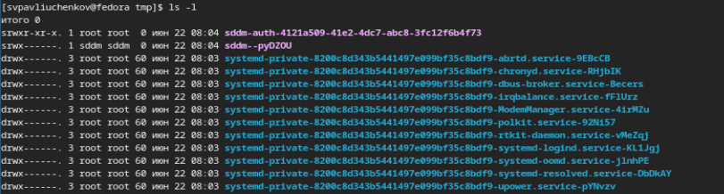{#fig:004 width=70%}

Определяю, есть ли в каталоге /var/spool подкаталог с именем cron - он там есть.

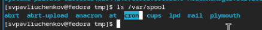{#fig:005 width=70%}

Перехожу в домашний каталог и вывожу на экран его содержимое. 
Мой пользователь является хозяином каталогов и подкаталогов.

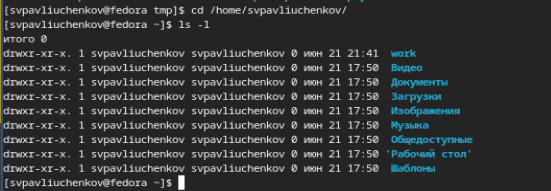{#fig:006 width=70%}

В домашнем каталоге создаю новый каталог с именем newdir

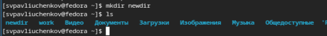{#fig:007 width=70%}

В каталоге ~/newdir создаю новый каталог с именем morefun

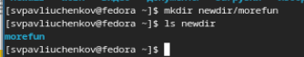{#fig:008 width=70%}

В домашнем каталоге создаю одной командой три новых каталога с именами
letters, memos, misk

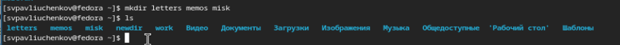{#fig:009 width=70%}

Затем удаляю эти каталоги одной командой.

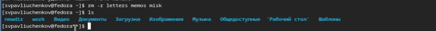{#fig:011 width=70%}

Пробую удалить ранее созданный каталог ~/newdir командой rm - не получается.

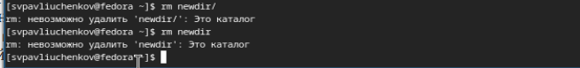{#fig:012 width=70%}

Удаляю каталог ~/newdir/morefun из домашнего каталога

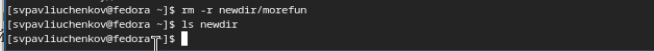{#fig:013 width=70%}

С помощью команды man определяю, какую опцию команды ls нужно использовать для просмотра содержимое не только указанного каталога, но и подкаталогов,
входящих в него - -f

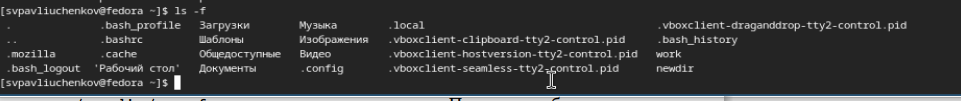{#fig:014 width=70%}

. С помощью команды man определяю набор опций команды ls, позволяющий отсортировать по времени последнего изменения выводимый список содержимого каталога
с развёрнутым описанием файлов - -flc

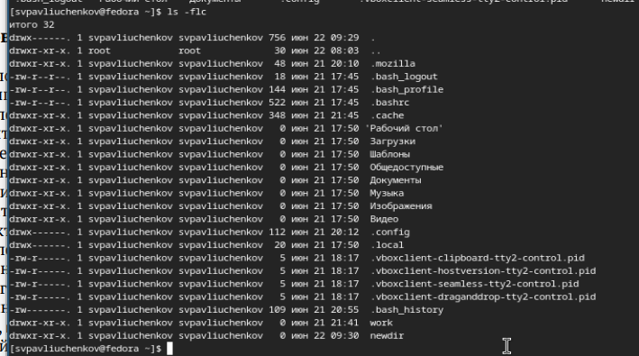{#fig:015 width=70%}

Использую команду man для просмотра информации о функции pwd.
Ее основная опция заключается в создании директорий. -p - избегание всех символических ссылок, -l = использовать pwd из среды, даже если пресутствуют сиволические ссылки.
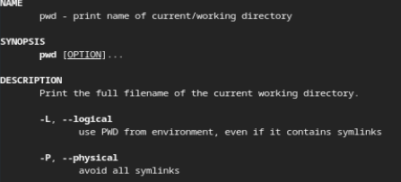{#fig:016 width=70%}

Использую команду man для просмотра информации о функции mkdir.
Ее основная опция заключается в создании директорий.  -p   Создать все отсутствующие директории между начальной и конечным компонентом.

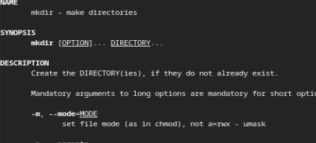{#fig:017 width=70%}

Использую команду man для просмотра информации о функции rmdir.
Ее основная опция заключается в удаление директорий. -p = удалить все каталоги в пути к файлу

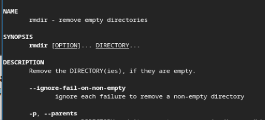{#fig:018 width=70%}

Использую команду man для просмотра информации о функции rm.
Ее основная опция заключается в удаление файлов. -r = рекурсивно удалить содержимое директорий и директории, -f = игнорировать не существующие файлы 

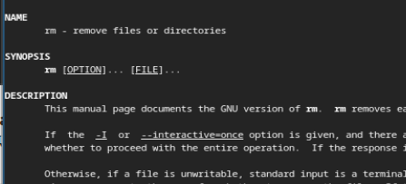{#fig:019 width=70%}

Применяю команду history.

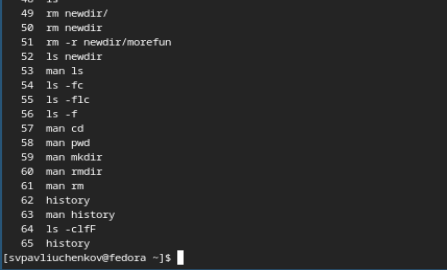{#fig:020 width=70%}

Вношу изменение в 64 строку и переписываю clfF на l 

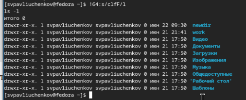{#fig:021 width=70%}

# Выводы

В этой лабораторной работе я освежил все знания создания, удаления, копирования и перемещения директорий и файлов. Также я научился взаимодействовать с командами из буфера обмена. 

# Контрольные вопросы
1. Что такое командная строка?
- Это среда из которой можн взаимодействовать с файловой системой, железом и самой ОС. 

2. При помощи какой команды можно определить абсолютный путь текущего каталога?
- С помощью команды pwd.

3. При помощи какой команды и каких опций можно определить только тип файлов
и их имена в текущем каталоге? Приведите примеры.
- ls -l. Выводит информацию о файлах и директориях в виде списков, и пишет много полезной информации, например, хозяин файла, права доступа.
4. Каким образом отобразить информацию о скрытых файлах? Приведите примеры.
- ls -al
5. При помощи каких команд можно удалить файл и каталог? Можно ли это сделать
одной и той же командой? Приведите примеры.
- rm -r file / directory
6. Каким образом можно вывести информацию о последних выполненных пользователем командах? работы?
- history

7. Как воспользоваться историей команд для их модифицированного выполнения? Приведите примеры.
- Нужно нажать ! и внести изменения, после чего запустить команду

{#fig:010 width=70%}

8. Приведите примеры запуска нескольких команд в одной строке.
- man ls | grep "-l"
9. Дайте определение и приведите примера символов экранирования.
-  Экранирование символов — замена в тексте управляющих (служебных) символов на соответствующие им последовательности символов \\n - символ переноса строки, \\t - табуляция.

10. Охарактеризуйте вывод информации на экран после выполнения команды ls с опцией l. 
 - 
11. Что такое относительный путь к файлу? Приведите примеры использования относительного и абсолютного пути при выполнении какой-либо команды.
- Находять в директории А можно написать  cd B, а можно cd A/B в этом случае, В - относительный путь, а A/B - абсолютный. Абсолютный путь идет от начала ветвления файловой системы, а относительный - нет.
12. Как получить информацию об интересующей вас команде?
- man command

13. Какая клавиша или комбинация клавиш служит для автоматического дополнения
вводимых команд?
- tab
