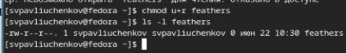

---
## Front matter
lang: ru-RU
title: Выполнение 7 лабораторной работы
subtitle: Анализ файловой структуры UNIX. Команды для работы с файлами и каталогами
author:
  - Павлюченков С.В.
institute:
  - Российский университет дружбы народов, Москва, Россия
date: 07 сентября 2024

## i18n babel
babel-lang: russian
babel-otherlangs: english

## Formatting pdf
toc: false
toc-title: Содержание
slide_level: 2
aspectratio: 169
section-titles: true
theme: metropolis
header-includes:
 - \metroset{progressbar=frametitle,sectionpage=progressbar,numbering=fraction}
---

## Докладчик

:::::::::::::: {.columns align=center}
::: {.column width="70%"}

  * Павлюченков Сергей Витальевич
  * Студент ФФМиЕН
  * Российский университет дружбы народов
  * [1132237372@pfur.ru](mailto:1132237372@pfur.ru)
  * <https://serapshi.github.io/svpavliuchenkov.github.io/>

:::
::: {.column width="30%"}

:::
::::::::::::::

## Цель работы

Ознакомление с файловой системой Linux, её структурой, именами и содержанием
каталогов. Приобретение практических навыков по применению команд для работы
с файлами и каталогами, по управлению процессами (и работами), по проверке использования диска и обслуживанию файловой системы.

## Задание

1. Выполните все примеры, приведённые в первой части описания лабораторной работы.
2. Выполните следующие действия, зафиксировав в отчёте по лабораторной работе
используемые при этом команды и результаты их выполнения:
2.1. Скопируйте файл /usr/include/sys/io.h в домашний каталог и назовите его
equipment. Если файла io.h нет, то используйте любой другой файл в каталоге
/usr/include/sys/ вместо него.
2.2. В домашнем каталоге создайте директорию ~/ski.plases.
2.3. Переместите файл equipment в каталог ~/ski.plases.
2.4. Переименуйте файл ~/ski.plases/equipment в ~/ski.plases/equiplist.
2.5. Создайте в домашнем каталоге файл abc1 и скопируйте его в каталог
~/ski.plases, назовите его equiplist2.
2.6. Создайте каталог с именем equipment в каталоге ~/ski.plases.
2.7. Переместите файлы ~/ski.plases/equiplist и equiplist2 в каталог
~/ski.plases/equipment.
2.8. Создайте и переместите каталог ~/newdir в каталог ~/ski.plases и назовите
его plans.
Кулябов Д. С. и др. Операционные системы 53

## Задание
3. Определите опции команды chmod, необходимые для того, чтобы присвоить перечисленным ниже файлам выделенные права доступа, считая, что в начале таких прав
нет:
3.1. drwxr--r-- ... australia
3.2. drwx--x--x ... play
3.3. -r-xr--r-- ... my_os
3.4. -rw-rw-r-- ... feathers
При необходимости создайте нужные файлы.
4. Проделайте приведённые ниже упражнения, записывая в отчёт по лабораторной
работе используемые при этом команды:
4.1. Просмотрите содержимое файла /etc/password.
4.2. Скопируйте файл ~/feathers в файл ~/file.old.
4.3. Переместите файл ~/file.old в каталог ~/play.
4.4. Скопируйте каталог ~/play в каталог ~/fun.
4.5. Переместите каталог ~/fun в каталог ~/play и назовите его games.
4.6. Лишите владельца файла ~/feathers права на чтение.
4.7. Что произойдёт, если вы попытаетесь просмотреть файл ~/feathers командой
cat?
4.8. Что произойдёт, если вы попытаетесь скопировать файл ~/feathers?
4.9. Дайте владельцу файла ~/feathers право на чтение.
4.10. Лишите владельца каталога ~/play права на выполнение.
4.11. Перейдите в каталог ~/play. Что произошло?
4.12. Дайте владельцу каталога ~/play право на выполнение.
5. Прочитайте man по командам mount, fsck, mkfs, kill и кратко их охарактеризуйте,
приведя примеры.

# Выполнение лабораторной работы

## Работа с командой cp

Скопировал файл ~/abc1 в файл april и в файл may:

{#fig:001 width=70%}

## Работа с командой cp -r

Скопировал каталог monthly в каталог monthly.00:

{#fig:001 width=70%}

##  Работа с командой mv
Изменил название файла april на july в домашнем каталоге

{#fig:003 width=70%}

## Работа с командой cp -r 
Переместил файл july в каталог monthly.00:

{#fig:001 width=70%}

## Создание файла ~/may с правом выполнения для владельца

{#fig:001 width=70%}

## Работа с командой chmod 

Лишаю владельца файла ~/may права на выполнение

{#fig:002 width=70%}

## Просмотр используемых в операционной системе файловых систем командой mount 

{#fig:002 width=70%}

## Просмотр файла/etc/fstab.

Определяю смонтированные в операционной системе файловых систем 

{#fig:003 width=70%}

## Работа с df

Определяю объёма свободного пространства на файловой системе

{#fig:001 width=70%}

## Повторная работа с базовыми командами

Копирую файл /usr/include/sys/uio.h в домашний каталог и называю его equipment

В домашнем каталоге создаю директорию ~/ski.plases. и перемещаю в каталог ~/ski.plases.

Переименовываю файл ~/ski.plases/equipment в ~/ski.plases/equiplist

Создаю в домашнем каталоге файл abc1 и копирую его в каталог ~/ski.plases, называю его equiplist2.

Создаю каталог с именем equipment в каталоге ~/ski.plases и перемещаю файлы ~/ski.plases/equiplist и equiplist2 в каталог ~/ski.plases/equipment.

{#fig:003 width=70%}

## Повторная работа с базовыми командами

Создаю и перемещаю каталог ~/newdir в каталог ~/ski.plases и называю его plans.

{#fig:001 width=70%}

## Работа с chmod

Определил опции команды chmod, необходимые для того, чтобы присвоить перечисленным ниже файлам выделенные права доступа для (play)=+x rw+u; (my_os)=+r g+x;(feather)=+r ug+w

{#fig:002 width=70%}

##  Работа с cat

{#fig:003 width=70%}

Скопировал файл ~/feathers в файл ~/file.old

Переместил файл ~/file.old в каталог ~/play.

Скопировал каталог ~/play в каталог ~/fun и переместил каталог ~/fun в каталог ~/play и назвал его games

{#fig:003 width=70%}

## Работа с chmod

Лишил владельца файла ~/feathers права на чтение.
Из-за чего Файл не считался и не открылся

{#fig:001 width=70%}

## Работа с chmod

Дал право на чтение

{#fig:003 width=70%}

## Работа с chmod 

Забрал право на выполнение директории у владельца. Не удалость получить доступ и Не удалость перейти в каталог

{#fig:001 width=70%}

 

## Выводы

Я научился лучше работать с файловой структорой UNIX. Значительно улучшил навык использование команд для взаимодействия с файлами и каталогами.