---
## Front matter
title: "Отчёт по лабораторной работе №7"
subtitle: "Анализ файловой структуры UNIX. Команды для работы с файлами и каталогами"
author: "Сергей Витальевич Павлюченков"

## Generic otions
lang: ru-RU
toc-title: "Содержание"

## Bibliography
bibliography: bib/cite.bib
csl: pandoc/csl/gost-r-7-0-5-2008-numeric.csl

## Pdf output format
toc: true # Table of contents
toc-depth: 2
lof: true # List of figures
lot: true # List of tables
fontsize: 12pt
linestretch: 1.5
papersize: a4
documentclass: scrreprt
## I18n polyglossia
polyglossia-lang:
  name: russian
  options:
	- spelling=modern
	- babelshorthands=true
polyglossia-otherlangs:
  name: english
## I18n babel
babel-lang: russian
babel-otherlangs: english
## Fonts
mainfont: PT Serif
romanfont: PT Serif
sansfont: PT Sans
monofont: PT Mono
mainfontoptions: Ligatures=TeX
romanfontoptions: Ligatures=TeX
sansfontoptions: Ligatures=TeX,Scale=MatchLowercase
monofontoptions: Scale=MatchLowercase,Scale=0.9
## Biblatex
biblatex: true
biblio-style: "gost-numeric"
biblatexoptions:
  - parentracker=true
  - backend=biber
  - hyperref=auto
  - language=auto
  - autolang=other*
  - citestyle=gost-numeric
## Pandoc-crossref LaTeX customization
figureTitle: "Рис."
tableTitle: "Таблица"
listingTitle: "Листинг"
lofTitle: "Список иллюстраций"
lotTitle: "Список таблиц"
lolTitle: "Листинги"
## Misc options
indent: true
header-includes:
  - \usepackage{indentfirst}
  - \usepackage{float} # keep figures where there are in the text
  - \floatplacement{figure}{H} # keep figures where there are in the text
---

# Цель работы

Ознакомление с файловой системой Linux, её структурой, именами и содержанием
каталогов. Приобретение практических навыков по применению команд для работы
с файлами и каталогами, по управлению процессами (и работами), по проверке использования диска и обслуживанию файловой системы.

# Задание

1. Выполните все примеры, приведённые в первой части описания лабораторной работы.
2. Выполните следующие действия, зафиксировав в отчёте по лабораторной работе
используемые при этом команды и результаты их выполнения:
2.1. Скопируйте файл /usr/include/sys/io.h в домашний каталог и назовите его
equipment. Если файла io.h нет, то используйте любой другой файл в каталоге
/usr/include/sys/ вместо него.
2.2. В домашнем каталоге создайте директорию ~/ski.plases.
2.3. Переместите файл equipment в каталог ~/ski.plases.
2.4. Переименуйте файл ~/ski.plases/equipment в ~/ski.plases/equiplist.
2.5. Создайте в домашнем каталоге файл abc1 и скопируйте его в каталог
~/ski.plases, назовите его equiplist2.
2.6. Создайте каталог с именем equipment в каталоге ~/ski.plases.
2.7. Переместите файлы ~/ski.plases/equiplist и equiplist2 в каталог
~/ski.plases/equipment.
2.8. Создайте и переместите каталог ~/newdir в каталог ~/ski.plases и назовите
его plans.
Кулябов Д. С. и др. Операционные системы 53
3. Определите опции команды chmod, необходимые для того, чтобы присвоить перечисленным ниже файлам выделенные права доступа, считая, что в начале таких прав
нет:
3.1. drwxr--r-- ... australia
3.2. drwx--x--x ... play
3.3. -r-xr--r-- ... my_os
3.4. -rw-rw-r-- ... feathers
При необходимости создайте нужные файлы.
4. Проделайте приведённые ниже упражнения, записывая в отчёт по лабораторной
работе используемые при этом команды:
4.1. Просмотрите содержимое файла /etc/password.
4.2. Скопируйте файл ~/feathers в файл ~/file.old.
4.3. Переместите файл ~/file.old в каталог ~/play.
4.4. Скопируйте каталог ~/play в каталог ~/fun.
4.5. Переместите каталог ~/fun в каталог ~/play и назовите его games.
4.6. Лишите владельца файла ~/feathers права на чтение.
4.7. Что произойдёт, если вы попытаетесь просмотреть файл ~/feathers командой
cat?
4.8. Что произойдёт, если вы попытаетесь скопировать файл ~/feathers?
4.9. Дайте владельцу файла ~/feathers право на чтение.
4.10. Лишите владельца каталога ~/play права на выполнение.
4.11. Перейдите в каталог ~/play. Что произошло?
4.12. Дайте владельцу каталога ~/play право на выполнение.
5. Прочитайте man по командам mount, fsck, mkfs, kill и кратко их охарактеризуйте,
приведя примеры.

# Выполнение лабораторной работы

Скопировал файл ~/abc1 в файл april и в файл may:

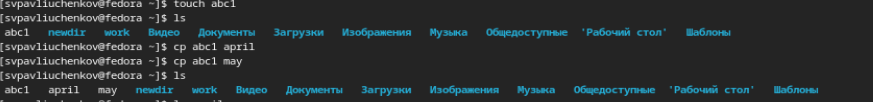{#fig:001 width=70%}

Скопировал файлы april и may в каталог monthly:

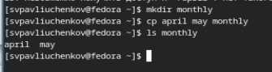{#fig:002 width=70%}

Скопировал файл monthly/may в файл с именем june:

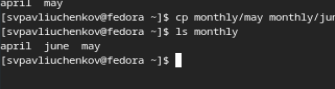{#fig:003 width=70%}

Скопировал каталог monthly в каталог monthly.00:

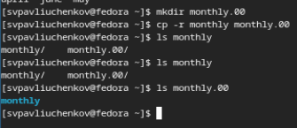{#fig:001 width=70%}

Скопировал каталог monthly.00
в каталог /tmp

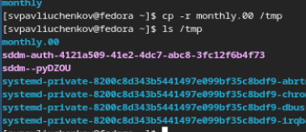{#fig:002 width=70%}

Изменил название файла april на
july в домашнем каталоге

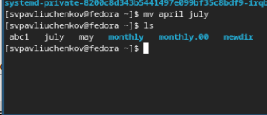{#fig:003 width=70%}

Переместил файл july в каталог monthly.00:

{#fig:001 width=70%}

Переименовал каталог monthly.00
в monthly.01

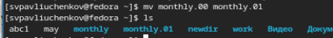{#fig:002 width=70%}

Переместил каталог monthly.01в каталог
reports

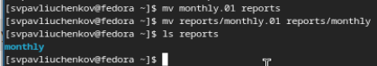{#fig:003 width=70%}

Создание файла ~/may с правом выполнения для владельца

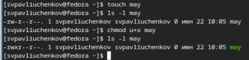{#fig:001 width=70%}

Лишаю владельца файла ~/may права на выполнение

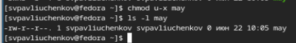{#fig:002 width=70%}

Создаю каталог monthly с запретом на чтение для членов группы и всех
остальных пользователей

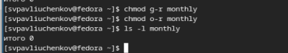{#fig:003 width=70%}

Создаю файл ~/abc1 с правом записи для членов группы:

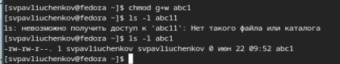{#fig:001 width=70%}

Просматриваю используемые в операционной системе файловых систем командой mount 

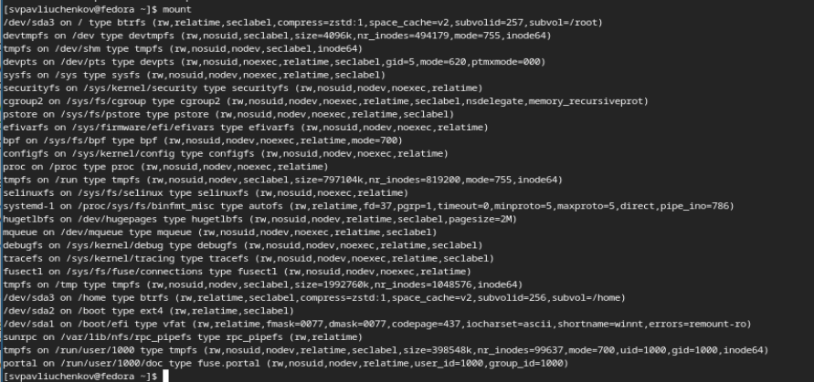{#fig:002 width=70%}

Определяю смонтированные в операционной системе файловых систем — просмотр файла/etc/fstab.

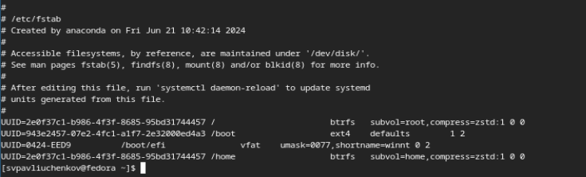{#fig:003 width=70%}

Определяю объёма свободного пространства на файловой системе - df

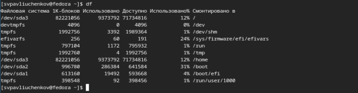{#fig:001 width=70%}

Копирую файл /usr/include/sys/uio.h в домашний каталог и называю его
equipment

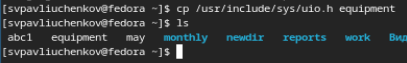{#fig:002 width=70%}

В домашнем каталоге создаю директорию ~/ski.plases.
и перемещаю в каталог ~/ski.plases.

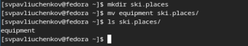{#fig:003 width=70%}

Переименовываю файл ~/ski.plases/equipment в ~/ski.plases/equiplist

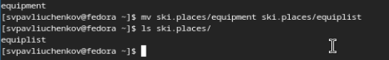{#fig:001 width=70%}

Создаю в домашнем каталоге файл abc1 и копирую его в каталог
~/ski.plases, называю его equiplist2.

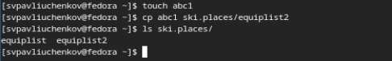{#fig:002 width=70%}

Создаю каталог с именем equipment в каталоге ~/ski.plases и перемещаю файлы ~/ski.plases/equiplist и equiplist2 в каталог
~/ski.plases/equipment.

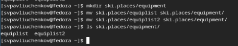{#fig:003 width=70%}

Создаю и перемещаю каталог ~/newdir в каталог ~/ski.plases и называю
его plans.

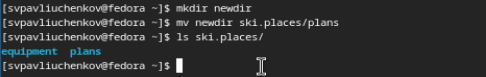{#fig:001 width=70%}

Определите опции команды chmod, необходимые для того, чтобы присвоить перечисленным ниже файлам выделенные права доступа, считая, что в начале таких прав
нет: chmod (file/dir) = ?U ?G ? O: для (play)=+x rw+u; (my_os)=+r g+x;(feather)=+r ug+w

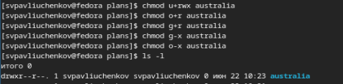{#fig:002 width=70%}

Просматриваю содержимое файла /etc/password

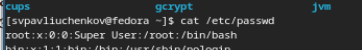{#fig:003 width=70%}

Скопировал файл ~/feathers в файл ~/file.old

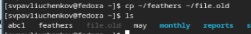{#fig:001 width=70%}

Переместил файл ~/file.old в каталог ~/play.

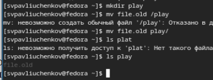{#fig:002 width=70%}

. Скопировал каталог ~/play в каталог ~/fun и переместил каталог ~/fun в каталог ~/play и назвал его games

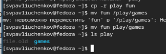{#fig:003 width=70%}

Лишил владельца файла ~/feathers права на чтение.

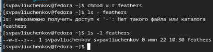{#fig:001 width=70%}

Файл не считался и не открылся

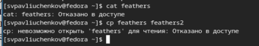{#fig:002 width=70%}

Дал право на чтение

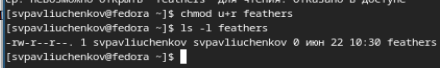{#fig:003 width=70%}

Забрал право на выполнение директории у владельца. Не удалость получить доступ

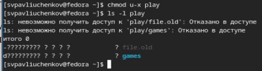{#fig:001 width=70%}

Не удалость перейти в каталог

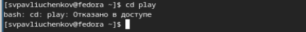{#fig:002 width=70%}

Mount: показывает используемые файловые системы

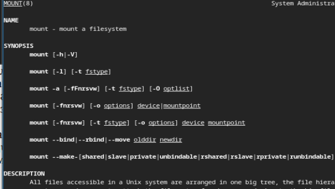{#fig:003 width=70%}

fsck: проверяет и чинит файловую систему Linux - fsck /dev/sda1

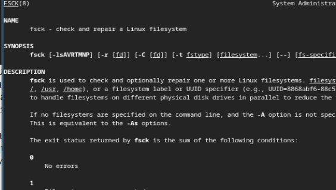{#fig:003 width=70%}

mkfs: Создает файловую систему Linux - mkfs -c /dev/sda1

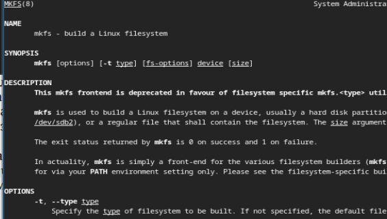{#fig:003 width=70%}

kill: Завершает процесс  - kill 495495

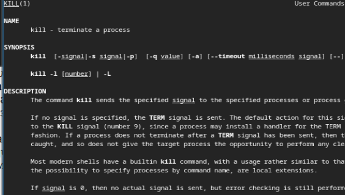{#fig:003 width=70%}

# Выводы

Я научился лучше работать с файловой структорой UNIX. Значительно улучшил навык использование команд для взаимодействия с файлами и каталогами.
# Контрольные вопросы

1. Дайте характеристику каждой файловой системе, существующей на жёстком диске
компьютера, на котором вы выполняли лабораторную работу.
- ext4, btrfs, vfat
2. Приведите общую структуру файловой системы и дайте характеристику каждой директории первого уровня этой структуры.
- У корня лежит 19 директорий 1 уровня, а общая структура представляет дерево. Например, Директория /bin содержит исполняемые бинарные файлы различных служб, и /boot
содержит — файлы загрузчика и ядра, /dev содержит файлы устройств, подключенных к серверу, /etc содержит все конфигурационные файлы служб, /home - домашний каталог, /lib и /lib64 в /lib хранятся библиотеки, /lib64 включает в себя библиотеки для всех остальных служб сервера, /media операционная система автоматически монтирует внешние устройства, /mnt аналог /media, но временно, /opt  - пользовательское ПО, /proc хранятся процессы и системная информация ОС, /root Домашняя папка для корневого пользователя root, /run включает в себя данные, обрабатываемые и хранимые в оперативной памяти, /sbin
Как и /bin, содержит исполняемые бинарные файлы системных служб, /srv
Эта папка предназначена для сервисных нужд, /sys
Ещё одна директория, содержащая виртуальную файловую систему, /tmp
Эта папка используется операционной системой и различными внутренними службами для хранения временных файлов, /usr
В этом каталоге хранятся исполняемые файлы, библиотеки и файлы документации, /var
Директория /var содержит часто изменяемые данные.
  3. Какая операция должна быть выполнена, чтобы содержимое некоторой файловой
  системы было доступно операционной системе?
- должна быть выполнена операция монтирования тома
4. Назовите основные причины нарушения целостности файловой системы. Как устранить повреждения файловой системы?
- внезапное отключения питания во время работы с файлами, проблемы с программным обеспечением, 
5. Как создаётся файловая система?
- 1.Форматирование гибких дисков. 2. Создание файловой системы с использованием меню OA&M или команды mkfs. 3. Установка файловой системы.
6. Дайте характеристику командам для просмотра текстовых файлов.
- cat - выводит содержимое файлов, 
7. Приведите основные возможности команды cp в Linux.
- Копирование и переименование файлов или каталогов
8. Приведите основные возможности команды mv в Linux.
- Перемещение и переименование файлов или каталогов
9. Что такое права доступа? Как они могут быть изменены?
- Право доступа это право выполнять определенные операции с объектом. Их можно менять командой chmod, например, chmod u-r file

