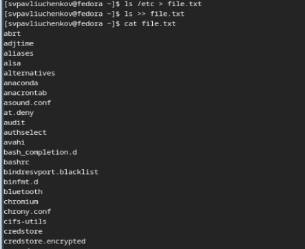
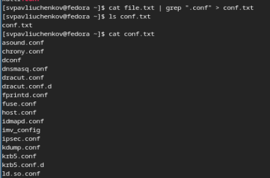
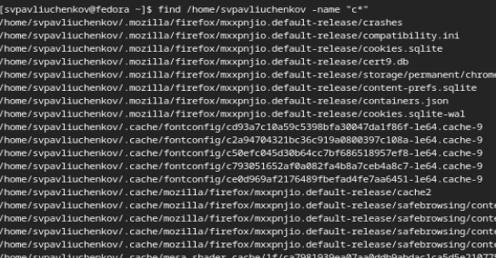
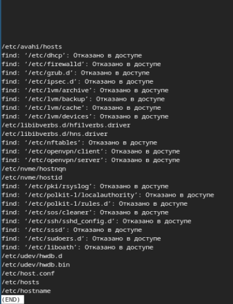
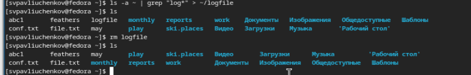
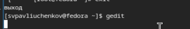
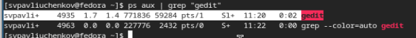
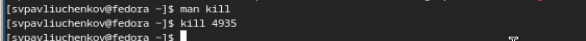
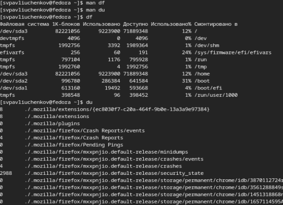
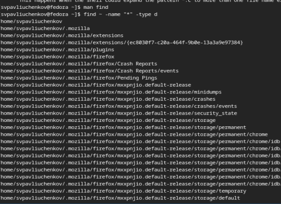

---
## Front matter
lang: ru-RU
title: Выполнение 8 лабораторной работы
subtitle: Поиск файлов. Перенаправление ввода-вывода. Просмотр запущенных процессов
author:
  - Павлюченков С.В.
institute:
  - Российский университет дружбы народов, Москва, Россия
date: 07 сентября 2024

## i18n babel
babel-lang: russian
babel-otherlangs: english

## Formatting pdf
toc: false
toc-title: Содержание
slide_level: 2
aspectratio: 169
section-titles: true
theme: metropolis
header-includes:
 - \metroset{progressbar=frametitle,sectionpage=progressbar,numbering=fraction}
---

## Докладчик

:::::::::::::: {.columns align=center}
::: {.column width="50%"}

  * Павлюченков Сергей Витальевич
  * Студент ФФМиЕН
  * Российский университет дружбы народов
  * [1132237372@pfur.ru](mailto:1132237372@pfur.ru)
  * <https://serapshi.github.io/svpavliuchenkov.github.io/>

:::
::: {.column width="30%"}

:::
::::::::::::::

## Цель работы

Ознакомление с инструментами поиска файлов и фильтрации текстовых данных.
Приобретение практических навыков: по управлению процессами (и заданиями), по
проверке использования диска и обслуживанию файловых систем.

## Задание

1. Осуществите вход в систему, используя соответствующее имя пользователя.
2. Запишите в файл file.txt названия файлов, содержащихся в каталоге /etc. Допишите в этот же файл названия файлов, содержащихся в вашем домашнем каталоге.
3. Выведите имена всех файлов из file.txt, имеющих расширение .conf, после чего
запишите их в новый текстовой файл conf.txt.
Кулябов Д. С. и др. Операционные системы 59
4. Определите, какие файлы в вашем домашнем каталоге имеют имена, начинавшиеся
с символа c? Предложите несколько вариантов, как это сделать.
5. Выведите на экран (по странично) имена файлов из каталога /etc, начинающиеся
с символа h.
6. Запустите в фоновом режиме процесс, который будет записывать в файл ~/logfile
файлы, имена которых начинаются с log.
7. Удалите файл ~/logfile.

## Задание

8. Запустите из консоли в фоновом режиме редактор gedit.
9. Определите идентификатор процесса gedit, используя команду ps, конвейер и фильтр
grep. Как ещё можно определить идентификатор процесса?
10. Прочтите справку (man) команды kill, после чего используйте её для завершения
процесса gedit.
11. Выполните команды df и du, предварительно получив более подробную информацию
об этих командах, с помощью команды man.
12. Воспользовавшись справкой команды find, выведите имена всех директорий, имеющихся в вашем домашнем каталоге.

# Выполнение лабораторной работы

## Перенаправленние вывода 

Записал в файл file.txt названия файлов, содержащихся в каталоге /etc. Дописал в этот же файл названия файлов, содержащихся в вашем домашнем каталоге.

{#fig:001 width=50%}

## Перенаправление вывода 

Вывел имена всех файлов из file.txt, имеющих расширение .conf, после чего записал их в новый текстовой файл conf.txt.

{#fig:001 width=50%}

## Работа с find 

Определил, какие файлы в домашнем каталоге имеют имена, начинавшиеся с символа c. Это можно сделать с помощтю grep, а можно с помощью find

{#fig:001 width=50%}

## Работа с find и less 

Вывел на экран (по странично) имена файлов из каталога /etc, начинающиеся с символа h.

{#fig:001 width=40%}

## Запустил в фоновом режиме процесс, который записывал в файл ~/logfile файлы, имена которых начинаются с log. И удалил этот файл

{#fig:001 width=50%}

## Работа с gedit и kill 

Запустил из консоли в фоновом режиме редактор gedit

{#fig:001 width=50%}

Определил идентификатор процесса gedit, используя команду ps, конвейер и фильтр grep.

{#fig:001 width=50%}

Прочитал справку (man) команды kill, после чего использовал её для завершения процесса gedit.

{#fig:001 width=50%}

## Запуск df и du

{#fig:001 width=50%}

## Работа с find

Воспользовавшись справкой команды find, выведил имена всех директорий, имеющихся в домашнем каталоге.

{#fig:001 width=50%}

## Выводы

Выполнив данную лабораторную работу, я узнал много новых встроенных команд оболочки UNIX, научился пользоваться такими командами, как: kill, man, less и find.