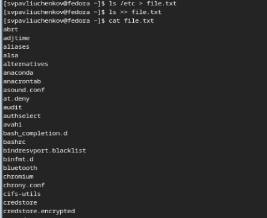
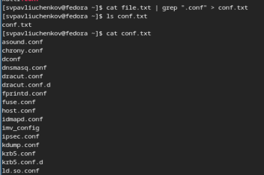
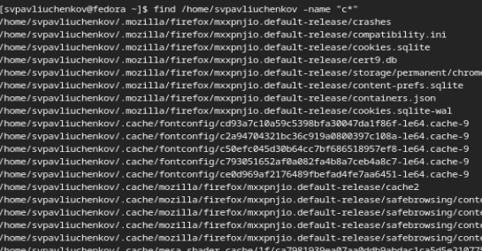
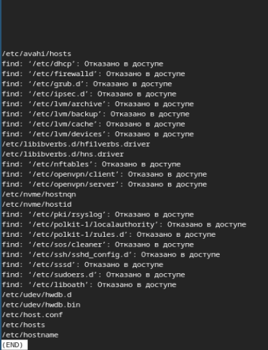
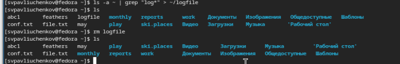
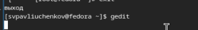
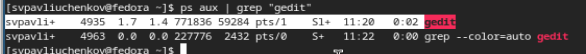
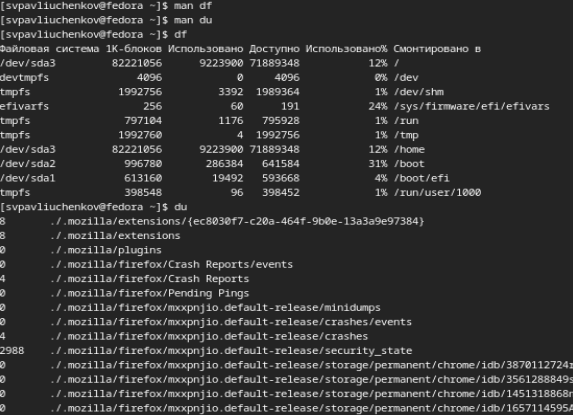
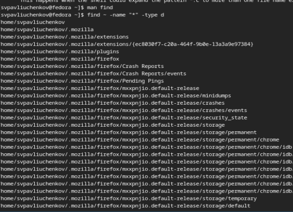

---
## Front matter
title: "Отчёт по лабораторной работе №8"
subtitle: "Поиск файлов. Перенаправление ввода-вывода. Просмотр запущенных процессов"
author: "Сергей Витальевич Павлюченков"

## Generic otions
lang: ru-RU
toc-title: "Содержание"

## Bibliography
bibliography: bib/cite.bib
csl: pandoc/csl/gost-r-7-0-5-2008-numeric.csl

## Pdf output format
toc: true # Table of contents
toc-depth: 2
lof: true # List of figures
lot: true # List of tables
fontsize: 12pt
linestretch: 1.5
papersize: a4
documentclass: scrreprt
## I18n polyglossia
polyglossia-lang:
  name: russian
  options:
	- spelling=modern
	- babelshorthands=true
polyglossia-otherlangs:
  name: english
## I18n babel
babel-lang: russian
babel-otherlangs: english
## Fonts
mainfont: PT Serif
romanfont: PT Serif
sansfont: PT Sans
monofont: PT Mono
mainfontoptions: Ligatures=TeX
romanfontoptions: Ligatures=TeX
sansfontoptions: Ligatures=TeX,Scale=MatchLowercase
monofontoptions: Scale=MatchLowercase,Scale=0.9
## Biblatex
biblatex: true
biblio-style: "gost-numeric"
biblatexoptions:
  - parentracker=true
  - backend=biber
  - hyperref=auto
  - language=auto
  - autolang=other*
  - citestyle=gost-numeric
## Pandoc-crossref LaTeX customization
figureTitle: "Рис."
tableTitle: "Таблица"
listingTitle: "Листинг"
lofTitle: "Список иллюстраций"
lotTitle: "Список таблиц"
lolTitle: "Листинги"
## Misc options
indent: true
header-includes:
  - \usepackage{indentfirst}
  - \usepackage{float} # keep figures where there are in the text
  - \floatplacement{figure}{H} # keep figures where there are in the text
---

# Цель работы

Ознакомление с инструментами поиска файлов и фильтрации текстовых данных.
Приобретение практических навыков: по управлению процессами (и заданиями), по
проверке использования диска и обслуживанию файловых систем.

# Задание

1. Осуществите вход в систему, используя соответствующее имя пользователя.
2. Запишите в файл file.txt названия файлов, содержащихся в каталоге /etc. Допишите в этот же файл названия файлов, содержащихся в вашем домашнем каталоге.
3. Выведите имена всех файлов из file.txt, имеющих расширение .conf, после чего
запишите их в новый текстовой файл conf.txt.
Кулябов Д. С. и др. Операционные системы 59
4. Определите, какие файлы в вашем домашнем каталоге имеют имена, начинавшиеся
с символа c? Предложите несколько вариантов, как это сделать.
5. Выведите на экран (по странично) имена файлов из каталога /etc, начинающиеся
с символа h.
6. Запустите в фоновом режиме процесс, который будет записывать в файл ~/logfile
файлы, имена которых начинаются с log.
7. Удалите файл ~/logfile.
8. Запустите из консоли в фоновом режиме редактор gedit.
9. Определите идентификатор процесса gedit, используя команду ps, конвейер и фильтр
grep. Как ещё можно определить идентификатор процесса?
10. Прочтите справку (man) команды kill, после чего используйте её для завершения
процесса gedit.
11. Выполните команды df и du, предварительно получив более подробную информацию
об этих командах, с помощью команды man.
12. Воспользовавшись справкой команды find, выведите имена всех директорий, имеющихся в вашем домашнем каталоге.

# Выполнение лабораторной работы

Записал в файл file.txt названия файлов, содержащихся в каталоге /etc. Дописал в этот же файл названия файлов, содержащихся в вашем домашнем каталоге.

{#fig:001 width=70%}

Вывел имена всех файлов из file.txt, имеющих расширение .conf, после чего
записал их в новый текстовой файл conf.txt.

{#fig:001 width=70%}

Определил, какие файлы в домашнем каталоге имеют имена, начинавшиеся
с символа c. Это можно сделать с помощтю grep, а можно с помощью find

{#fig:001 width=70%}

Вывеk на экран (по странично) имена файлов из каталога /etc, начинающиеся
с символа h.

{#fig:001 width=70%}

Запустил в фоновом режиме процесс, который записывал в файл ~/logfile
файлы, имена которых начинаются с log. И удалил этот файл

{#fig:001 width=70%}

Запустил из консоли в фоновом режиме редактор gedit

{#fig:001 width=70%}

Определил идентификатор процесса gedit, используя команду ps, конвейер и фильтр
grep.

{#fig:001 width=70%}

Прочтитал справку (man) команды kill, после чего использовал её для завершения
процесса gedit.

{#fig:001 width=70%}

Выполнил команды df и du, предварительно получив более подробную информацию
об этих командах, с помощью команды man

{#fig:001 width=70%}

Воспользовавшись справкой команды find, выведил имена всех директорий, имеющихся в домашнем каталоге.

{#fig:001 width=70%}

# Выводы

Здесь кратко описываются итоги проделанной работы.

# Контрольные вопросы

1. Какие потоки ввода вывода вы знаете?
- В системе по умолчанию открыто три специальных потока:
– stdin — стандартный поток ввода (по умолчанию: клавиатура), файловый дескриптор
0;
– stdout — стандартный поток вывода (по умолчанию: консоль), файловый дескриптор
1;
– stderr — стандартный поток вывод сообщений об ошибках (по умолчанию: консоль),
файловый дескриптор 2
2. Объясните разницу между операцией > и >>.
- Перенаправление вывода происходит в двух случаях, но только во втором в формате добавления.
3. Что такое конвейер?
- Конвейер (pipe) служит для объединения простых команд или утилит в цепочки, в которых результат работы предыдущей команды передаётся последующей.
4. Что такое процесс? Чем это понятие отличается от программы?
- Любой команде, выполняемой в системе, присваивается идентификатор процесса
(process ID
5. Что такое PID и GID?
6. Что такое задачи и какая команда позволяет ими управлять?
- Запущенные фоном программы называются задачами (jobs). Ими можно управлять
с помощью команды jobs, которая выводит список запущенных в данный момент задач
7. Найдите информацию об утилитах top и htop. Каковы их функции?
-  Команды, которая позволяет пользователям отслеживать процессы и использование системных ресурсов в Linux
8. Назовите и дайте характеристику команде поиска файлов. Приведите примеры использования этой команды.
- Команда find используется для поиска и отображения на экран имён файлов, соответствующих заданной строке символов. find ~ -name "f*" -print
9. Можно ли по контексту (содержанию) найти файл? Если да, то как?
10. Как определить объем свободной памяти на жёстком диске?
- df -h
11. Как определить объем вашего домашнего каталога?
- Команда du показывает число килобайт, используемое каждым файлом или каталогом
12. Как удалить зависший процесс?
- kill proccess
