---
## Front matter
lang: ru-RU
title: Выполнение 9 лабораторной работы
subtitle: Командная оболочка Midnight Commander
author:
  - Павлюченков С.В.
institute:
  - Российский университет дружбы народов, Москва, Россия
date: 07 сентября 2024

## i18n babel
babel-lang: russian
babel-otherlangs: english

## Formatting pdf
toc: false
toc-title: Содержание
slide_level: 2
aspectratio: 169
section-titles: true
theme: metropolis
header-includes:
 - \metroset{progressbar=frametitle,sectionpage=progressbar,numbering=fraction}
---

## Докладчик

:::::::::::::: {.columns align=center}
::: {.column width="70%"}

  * Павлюченков Сергей Витальевич
  * Студент ФФМиЕН
  * Российский университет дружбы народов
  * [1132237372@pfur.ru](mailto:1132237372@pfur.ru)
  * <https://serapshi.github.io/svpavliuchenkov.github.io/>

:::
::: {.column width="30%"}

:::
::::::::::::::

## Цель работы

Освоение основных возможностей командной оболочки Midnight Commander. Приобретение навыков практической работы по просмотру каталогов и файлов; манипуляций
с ними.

## Задание

1. Изучите информацию о mc, вызвав в командной строке man mc.
2. Запустите из командной строки mc, изучите его структуру и меню
3. Выполните несколько операций в mc, используя управляющие клавиши (операции
с панелями; выделение/отмена выделения файлов, копирование/перемещение файлов, получение информации о размере и правах доступа на файлы и/или каталоги
и т.п.)
4. Выполните основные команды меню левой (или правой) панели. Оцените степень
подробности вывода информации о файлах.
5. Используя возможности подменю Файл , выполните:
– просмотр содержимого текстового файла;
– редактирование содержимого текстового файла (без сохранения результатов
редактирования);
– создание каталога;
– копирование в файлов в созданный каталог.

## Задание

6. С помощью соответствующих средств подменю Команда осуществите:
– поиск в файловой системе файла с заданными условиями (например, файла
с расширением .c или .cpp, содержащего строку main);
– выбор и повторение одной из предыдущих команд;
– переход в домашний каталог;
– анализ файла меню и файла расширений.
7. Вызовите подменю Настройки . Освойте операции, определяющие структуру экрана mc
(Full screen, Double Width, Show Hidden Files и т.д.).

# Выполнение лабораторной работы

## Запуск mc

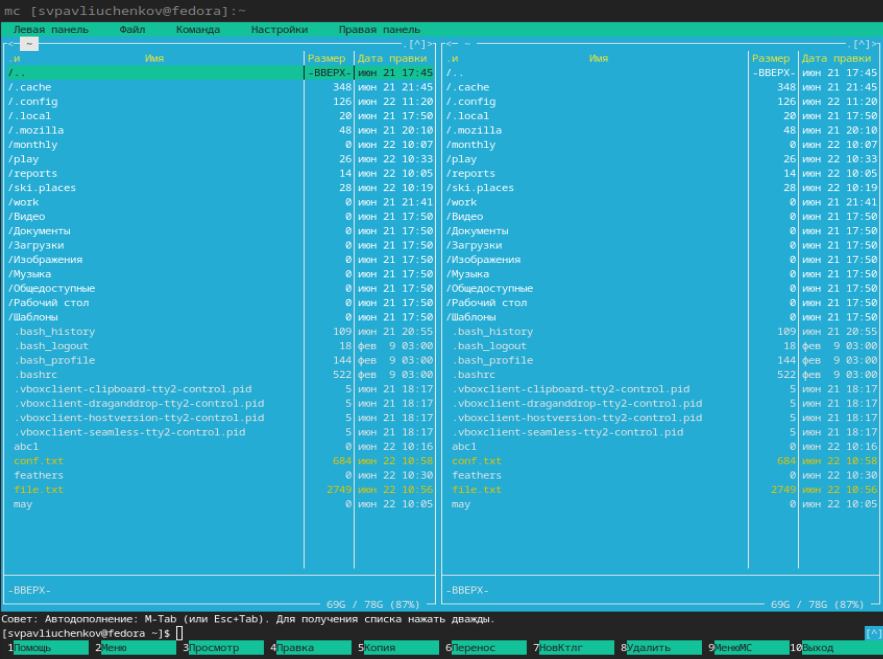{#fig:002 width=70%}

## Операцию получения информации о правах доступа на файлы

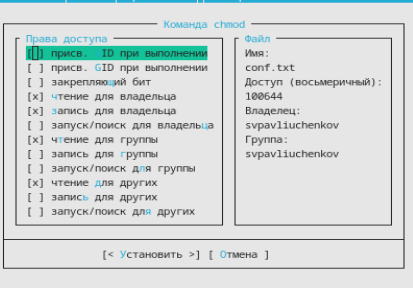{#fig:003 width=70%}

## Операцию копирования файлов

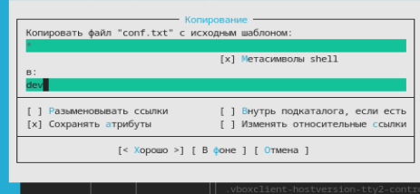{#fig:004 width=70%}

## Операцию получение информации о размере и правах доступа на файлы.

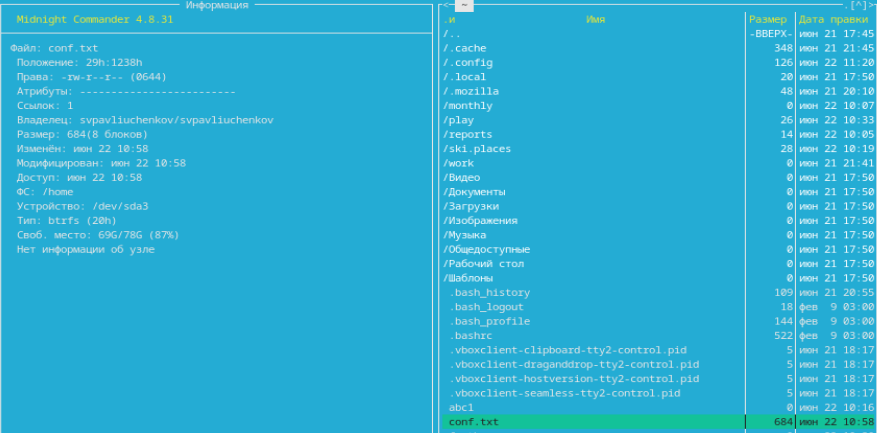{#fig:005 width=70%}

## Быстрый просмотр из левой панели

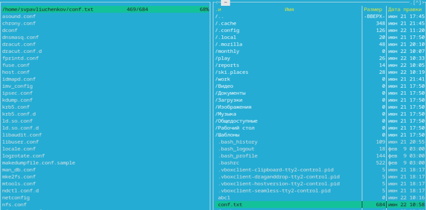{#fig:006 width=70%}

## Дерево каталога с помощью левой панели

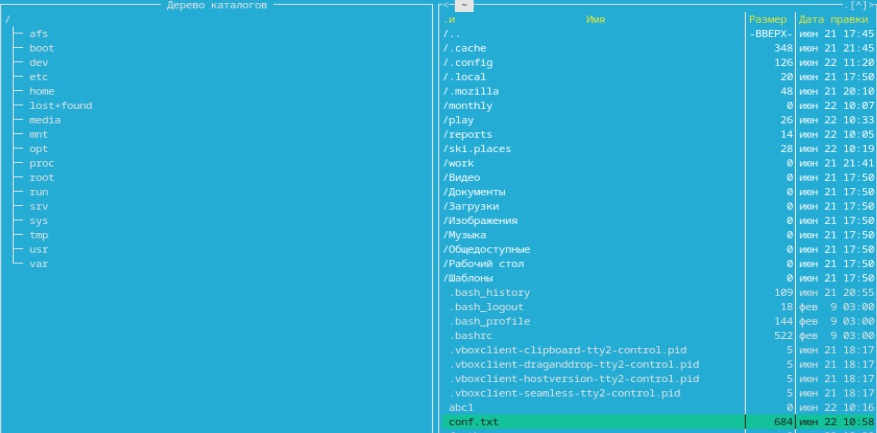{#fig:007 width=70%}

## Открытие файла для редактирования

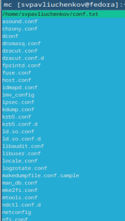{#fig:008 width=70%}

## Создаю каталог conf2.txt

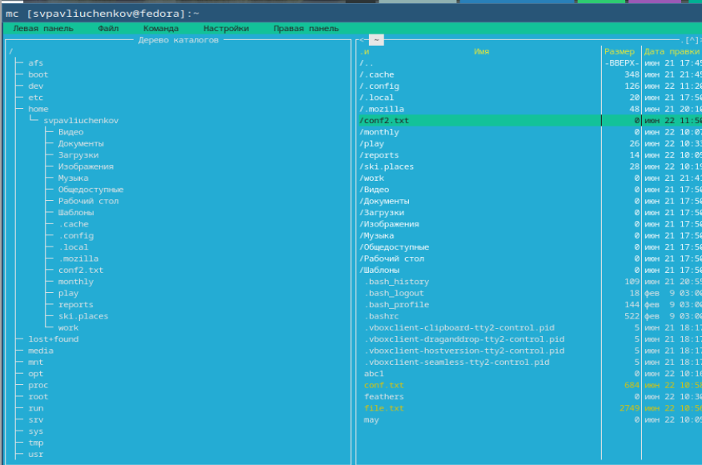{#fig:010 width=70%}

## Копирование файла в созданный каталог

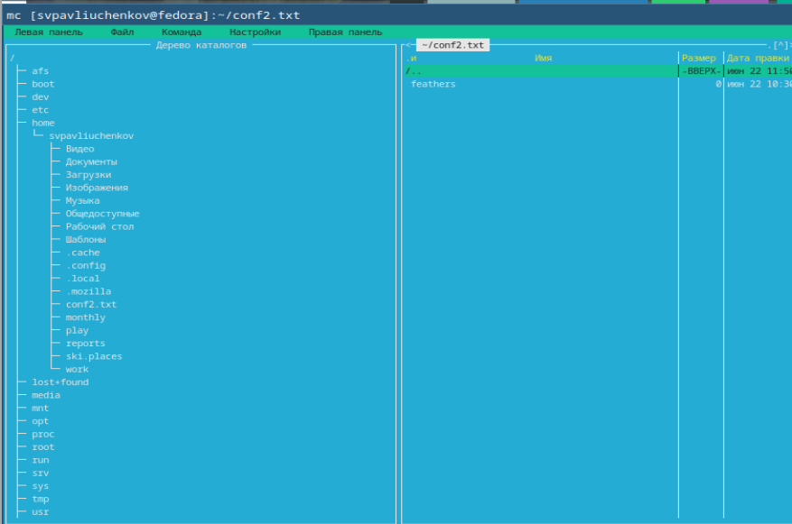{#fig:011 width=70%}

## Утилита поиск файла из меню команда

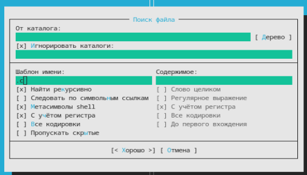{#fig:012 width=70%}

Нахожу файлы оканчивающиеся на .txt

[Поиск файла](image/13.png){#fig:013 width=70%}

## Вывод истории команд утилитой история командной строки

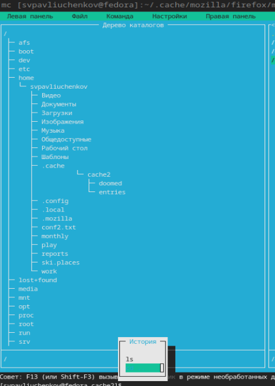{#fig:014 width=70%}

## Создание быстрого перехода в домашний каталог

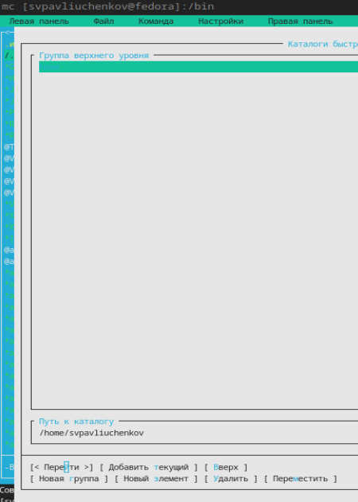{#fig:015 width=70%}

## Анализ файла меню и файла расширений.

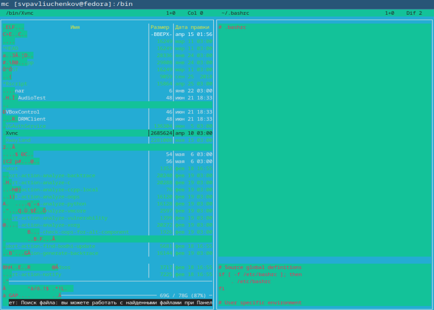{#fig:016 width=70%}

## Подменю Настройки. Операции, определяющие структуру экрана mc

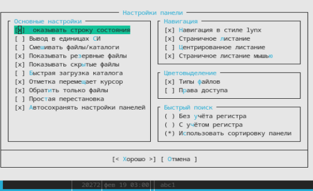{#fig:017 width=70%}

## Создаю text.txt и вставляю в него текст.

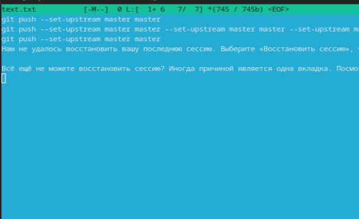{#fig:018 width=70%}

## Удаляю строку из файла.

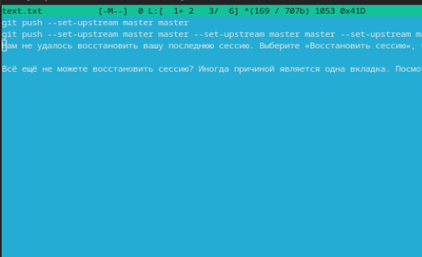{#fig:019 width=70%}

## Копирование и вставка фрагмента текста

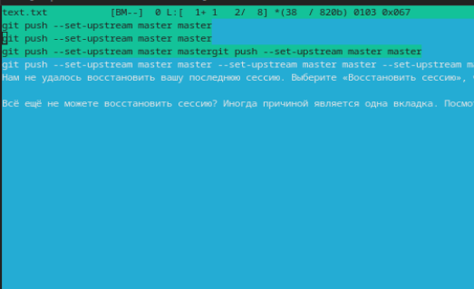{#fig:020 width=70%}

## Выделение фрагмента текста и его перенос

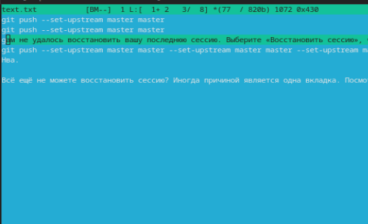{#fig:021 width=70%}

## Сохранение файл

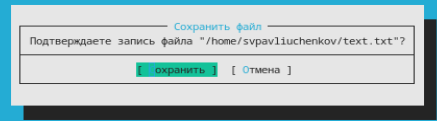{#fig:022 width=70%}

## Отмена последнего действия

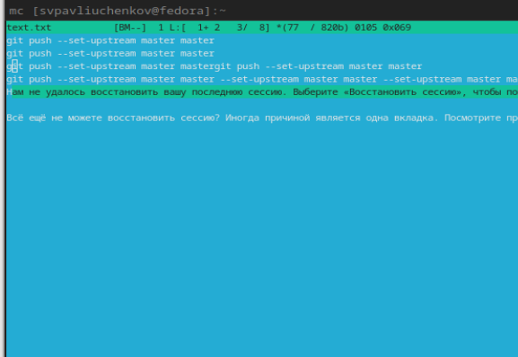{#fig:023 width=70%}

## Переход в начало и конец файла.

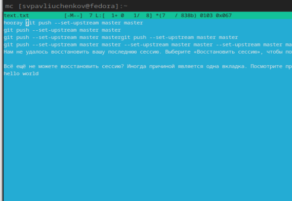{#fig:024 width=70%}

## json-файл и включенная подсветка.

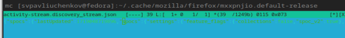{#fig:025 width=70%}

## Выводы

Я научился работать с файлами и директориями в midnight commander, также ознакомился с широким функционалом программы.