---
## Front matter
title: "Отчёт по лабораторной работе №9"
subtitle: "Командная оболочка Midnight Commander"
author: "Сергей Витальевич Павлюченков"

## Generic otions
lang: ru-RU
toc-title: "Содержание"

## Bibliography
bibliography: bib/cite.bib
csl: pandoc/csl/gost-r-7-0-5-2008-numeric.csl

## Pdf output format
toc: true # Table of contents
toc-depth: 2
lof: true # List of figures
lot: true # List of tables
fontsize: 12pt
linestretch: 1.5
papersize: a4
documentclass: scrreprt
## I18n polyglossia
polyglossia-lang:
  name: russian
  options:
	- spelling=modern
	- babelshorthands=true
polyglossia-otherlangs:
  name: english
## I18n babel
babel-lang: russian
babel-otherlangs: english
## Fonts
mainfont: PT Serif
romanfont: PT Serif
sansfont: PT Sans
monofont: PT Mono
mainfontoptions: Ligatures=TeX
romanfontoptions: Ligatures=TeX
sansfontoptions: Ligatures=TeX,Scale=MatchLowercase
monofontoptions: Scale=MatchLowercase,Scale=0.9
## Biblatex
biblatex: true
biblio-style: "gost-numeric"
biblatexoptions:
  - parentracker=true
  - backend=biber
  - hyperref=auto
  - language=auto
  - autolang=other*
  - citestyle=gost-numeric
## Pandoc-crossref LaTeX customization
figureTitle: "Рис."
tableTitle: "Таблица"
listingTitle: "Листинг"
lofTitle: "Список иллюстраций"
lotTitle: "Список таблиц"
lolTitle: "Листинги"
## Misc options
indent: true
header-includes:
  - \usepackage{indentfirst}
  - \usepackage{float} # keep figures where there are in the text
  - \floatplacement{figure}{H} # keep figures where there are in the text
---

# Цель работы

Освоение основных возможностей командной оболочки Midnight Commander. Приобретение навыков практической работы по просмотру каталогов и файлов; манипуляций
с ними.

# Задание

1. Изучите информацию о mc, вызвав в командной строке man mc.
2. Запустите из командной строки mc, изучите его структуру и меню
3. Выполните несколько операций в mc, используя управляющие клавиши (операции
с панелями; выделение/отмена выделения файлов, копирование/перемещение файлов, получение информации о размере и правах доступа на файлы и/или каталоги
и т.п.)
4. Выполните основные команды меню левой (или правой) панели. Оцените степень
подробности вывода информации о файлах.
5. Используя возможности подменю Файл , выполните:
– просмотр содержимого текстового файла;
– редактирование содержимого текстового файла (без сохранения результатов
редактирования);
– создание каталога;
– копирование в файлов в созданный каталог.
6. С помощью соответствующих средств подменю Команда осуществите:
– поиск в файловой системе файла с заданными условиями (например, файла
с расширением .c или .cpp, содержащего строку main);
– выбор и повторение одной из предыдущих команд;
– переход в домашний каталог;
– анализ файла меню и файла расширений.
7. Вызовите подменю Настройки . Освойте операции, определяющие структуру экрана mc
(Full screen, Double Width, Show Hidden Files и т.д.).

# Выполнение лабораторной работы

Изучаю информацию о mc, вызвав в командной строке man mc.

[Информация о mc](image/1.png){#fig:003 width=70%}

 Запустил из командной строки mc

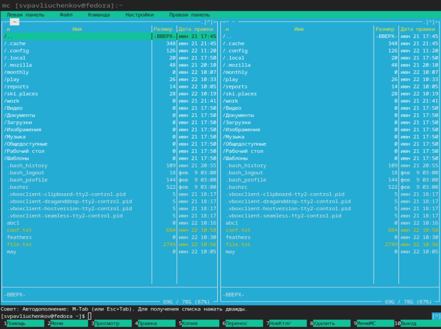{#fig:002 width=70%}

Выполняю операцию получения информации о правах доступа на файлы

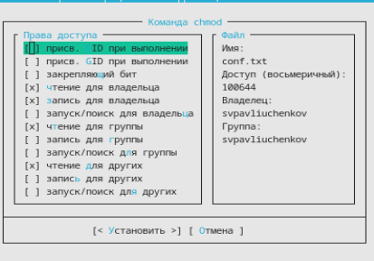{#fig:003 width=70%}

Выполняю операцию копирования файлов

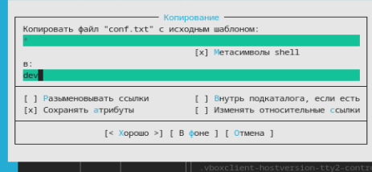{#fig:004 width=70%}

Выполняю операцию получение информации о размере и правах доступа на файлы.

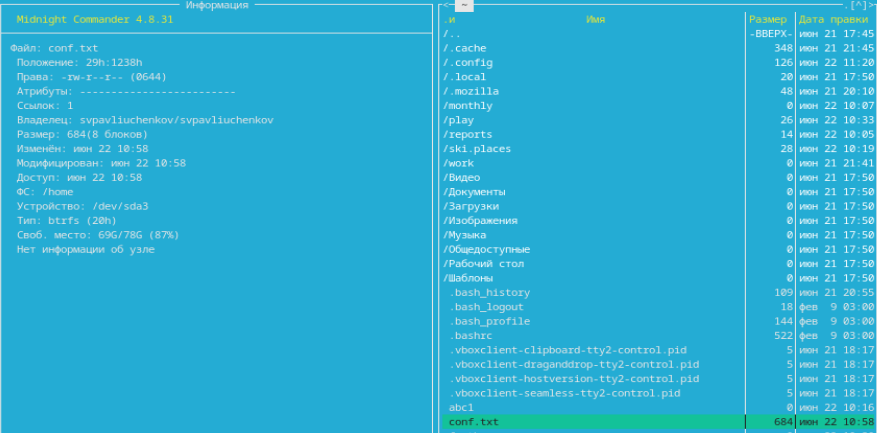{#fig:005 width=70%}

Выполняю быстрый просмотр из левой панели

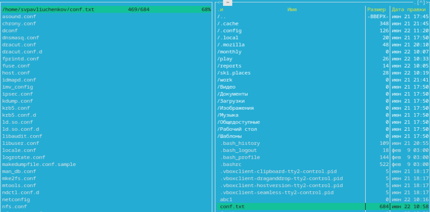{#fig:006 width=70%}

Вывожу дерево каталога с помощью левой панели

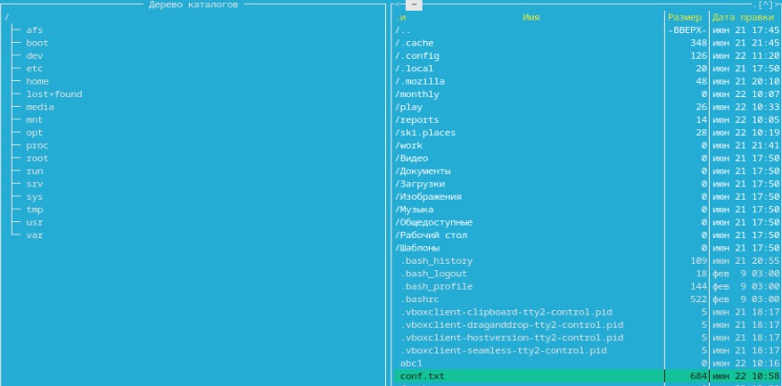{#fig:007 width=70%}

Открываю файл для редактирования

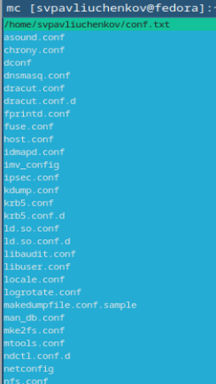{#fig:008 width=70%}

Редактирую содержимое файла и выхожу без сохранения.

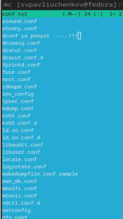{#fig:009 width=70%}

Создаю каталог conf2.txt

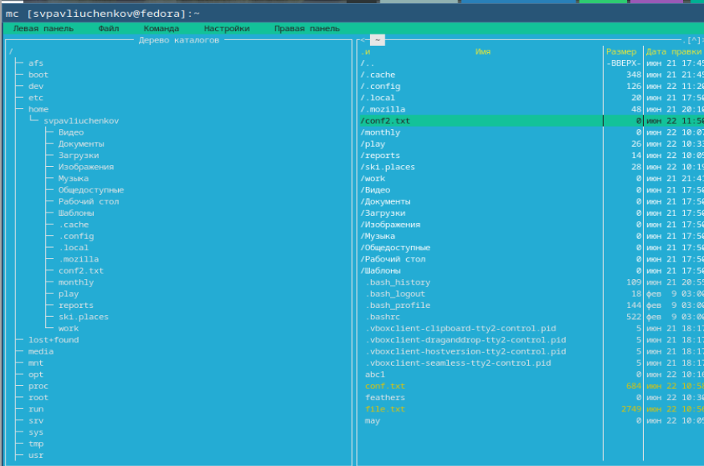{#fig:010 width=70%}

Копирую файл в созданный каталог

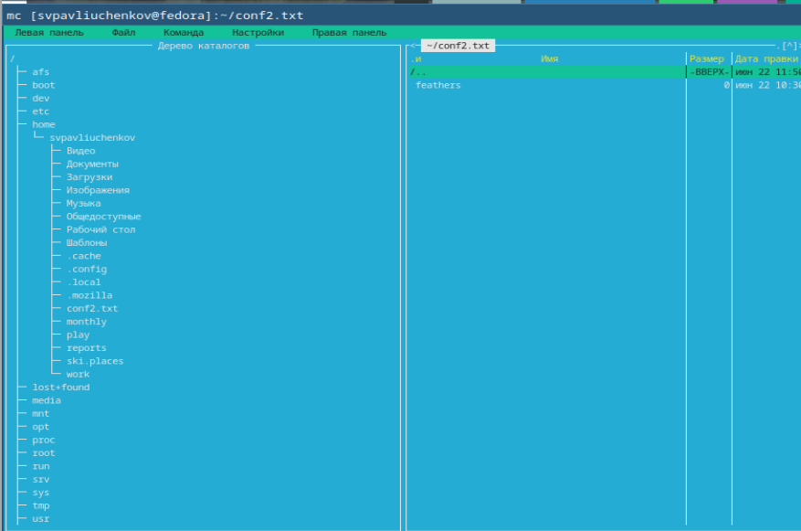{#fig:011 width=70%}

Открываю утилиту поиск файла из меню команда

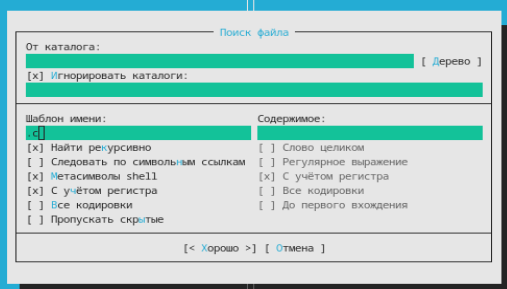{#fig:012 width=70%}

Нахожу файлы оканчивающиеся на .txt

[Поиск файла](image/13.png){#fig:013 width=70%}

Вывожу историю команд утилитой история командной строки

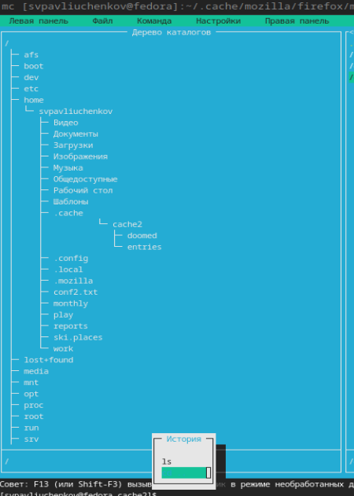{#fig:014 width=70%}

Создаю быстрый переход в домашний каталог

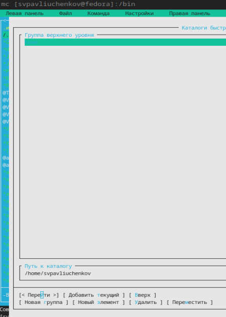{#fig:015 width=70%}

Запускаю анализ файла меню и файла расширений.

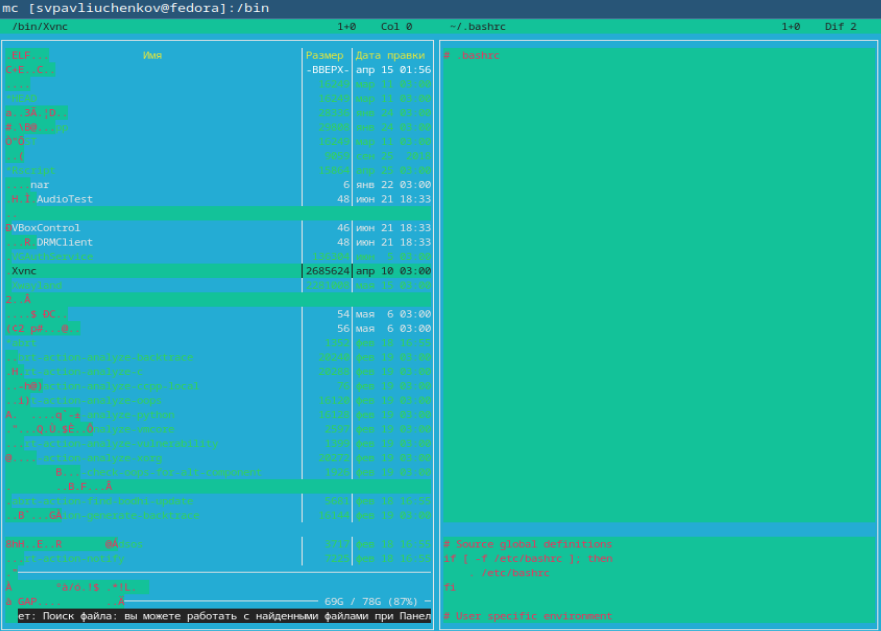{#fig:016 width=70%}

Вывожу подменю Настройки. Нахожу операции, определяющие структуру экрана mc

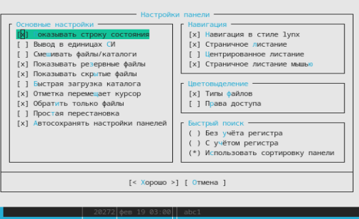{#fig:017 width=70%}

Создаю text.txt и вставляю в него текст.

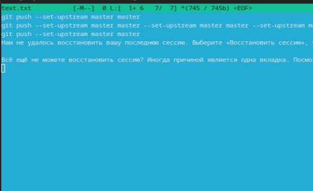{#fig:018 width=70%}

Удаляю строку из файла.

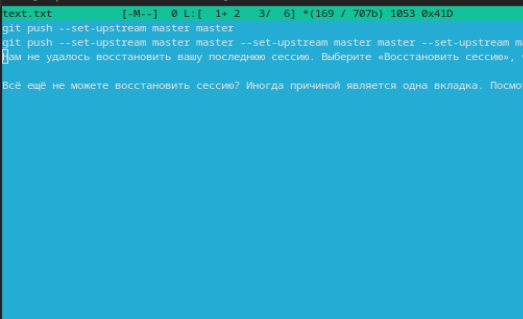{#fig:019 width=70%}

Копирую и вставляю фрагмент текста

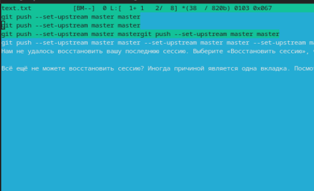{#fig:020 width=70%}

Выделяю фрагмент текста и переношу его его

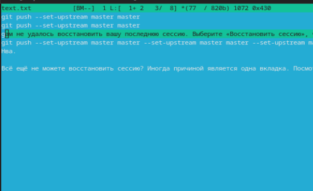{#fig:021 width=70%}

Сохраняю файл

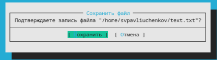{#fig:022 width=70%}

Отменяю последнее действие

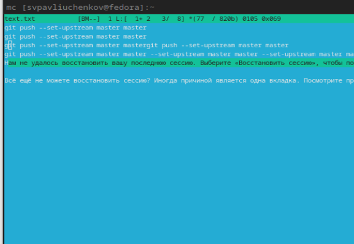{#fig:023 width=70%}

Перехожу в начало и конец файла, и дописываю текст.

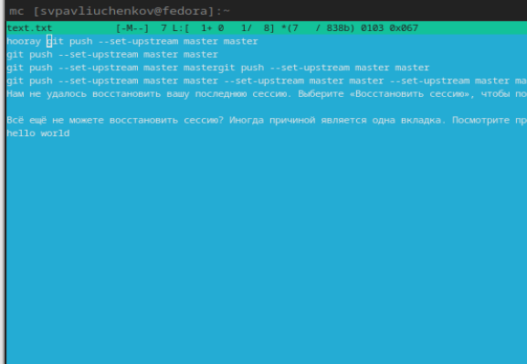{#fig:024 width=70%}

Открываю json-файл и включаю подсветку.

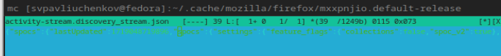{#fig:025 width=70%}

# Выводы

Я научился работать с файлами и директориями в midnight commander, ознакомился с широким функционалом программы.

# Контрольные вопросы

1. Какие режимы работы есть в mc. Охарактеризуйте их.
- Есть 2 режима - Информация и Дерево. В режиме Информация на панель выводятся сведения о файле и текущей файловой системе, расположенных на активной панели. В режиме Дерево на одной из панелей выводится структура дерева каталогов

2. Какие операции с файлами можно выполнить как с помощью команд shell, так и с помощью меню mc? Приведите несколько примеров.
- Копирование, Отметить группу, Выход
3. Опишите структура меню левой (или правой) панели mc, дайте характеристику командам.
- Подпункт меню Быстрый просмотр позволяет выполнить быстрый просмотр содержимого
панели.
-   Подпункт меню Информация позволяет посмотреть информацию о файле или каталоге
- В меню каждой (левой или правой) панели можно выбрать Формат списка :
– стандартный — выводит список файлов и каталогов с указанием размера и времени
правки;
– ускоренный — позволяет задать число столбцов, на которые разбивается панель при
выводе списка имён файлов или каталогов без дополнительной информации;
– расширенный — помимо названия файла или каталога выводит сведения о правах
доступа, владельце, группе, размере, времени правки;
– определённый пользователем — позволяет вывести те сведения о файле или каталоге,
которые задаст сам пользователь.
- Подпункт меню Порядок сортировки позволяет задать критерии сортировки при выводе
списка файлов и каталогов: без сортировки, по имени, расширенный, время правки,
время доступа, время изменения атрибута, размер, узел.x

4. Опишите структура меню Файл mc, дайте характеристику командам.
- Просмотр ( F3 ) — позволяет посмотреть содержимое текущего (или выделенного)
файла без возможности редактирования.
- Просмотр вывода команды ( М + ! ) — функция запроса команды с параметрами
(аргумент к текущему выбранному файлу).
- Правка ( F4 ) — открывает текущий (или выделенный) файл для его редактирования.
- Копирование ( F5 ) — осуществляет копирование одного или нескольких файлов или
каталогов в указанное пользователем во всплывающем окне место.
- Права доступа ( Ctrl-x c ) — позволяет указать (изменить) права доступа к одному
или нескольким файлам или каталогам 
- Жёсткая ссылка ( Ctrl-x l ) — позволяет создать жёсткую ссылку к текущему (или
выделенному) файлу1.
- Символическая ссылка ( Ctrl-x s ) — позволяет создать символическую ссылку к текущему (или выделенному) файлу2.
- Владелец/группа ( Ctrl-x o ) — позволяет задать (изменить) владельца и имя группы
для одного или нескольких файлов или каталогов.
- Права (расширенные) — позволяет изменить права доступа и владения для одного
или нескольких файлов или каталогов.
- Переименование ( F6 ) — позволяет переименовать (или переместить) один или
несколько файлов или каталогов.
- Создание каталога ( F7 ) — позволяет создать каталог.
- Удалить ( F8 ) — позволяет удалить один или несколько файлов или каталогов.
- Выход ( F10 ) — завершает работу mc.

5. Опишите структура меню Команда mc, дайте характеристику командам.
- Дерево каталогов — отображает структуру каталогов системы.
- Поиск файла — выполняет поиск файлов по заданным параметрам. 
- Переставить панели — меняет местами левую и правую панели.
- Сравнить каталоги ( Ctrl-x d ) — сравнивает содержимое двух каталогов.
- Размеры каталогов — отображает размер и время изменения каталога (по умолчанию
в mc размер каталога корректно не отображается).
- История командной строки — выводит на экран список ранее выполненных в оболочке
команд.
- Каталоги быстрого доступа ( Ctrl-\ ) — пр вызове выполняется быстрая смена текущего
каталога на один из заданного списка.
- Восстановление файлов — позволяет восстановить файлы на файловых системах ext2
и ext3.
- Редактировать файл расширений — позволяет задать с помощью определённого синтаксиса действия при запуске файлов с определённым расширением (например, какое
программного обеспечение запускать для открытия или редактирования файлов с расширением doc или docx).
- Редактировать файл меню — позволяет отредактировать контекстное меню пользователя, вызываемое по клавише F2 .
- Редактировать файл расцветки имён — позволяет подобрать оптимальную для пользователя расцветку имён файлов в зависимости от их типа.

6. Опишите структура меню Настройки mc, дайте характеристику командам.
- Конфигурация — позволяет скорректировать настройки работы с панелями
- Внешний вид и Настройки панелей — определяет элементы (строка меню, командная строка, подсказки и прочее), отображаемые при вызове mc, а также геометрию
расположения панелей и цветовыделение.
- Биты символов — задаёт формат обработки информации локальным терминалом.
- Подтверждение — позволяет установить или убрать вывод окна с запросом подтверждения действий при операциях удаления и перезаписи файлов, а также при выходе
из программы.
- Распознание клавиш — диалоговое окно используется для тестирования функциональных клавиш, клавиш управления курсором и прочее.
- Виртуальные ФС –– настройки виртуальной файловой системы: тайм-аут, пароль
и прочее.
7. Назовите и дайте характеристику встроенным командам mc.
- Справка (F1) -
Вызывает встроенный гипертекстовый вьюер помощи. Нажатие клавиши Tab приводит к выбору следующей ссылки, а Enter - к переходу по этой ссылке. Клавиши Space и Backspace позволяют перемещаться вперёд и назад. Для получения справки по используемым клавишам, нажмите F1 ещё раз.
- Меню (F2) -
Вызывает меню пользователя. Оно позволяет создавать и добавлять дополнительные функции.
- Просмотр (F3, Shift-F3) -
Показывает текущий файл. По умолчанию эта команда вызывает внутренний вьюер файлов. Если опция "Use internal view" не установлена, то вызывается внешний вьюер, указанный в переменной PAGER. Если эта переменная не определена, то вызывается команда "view". При нажатии Shift-F3, вьюер будет вызван без форматирования и предварительной обработки файла.
- Редактирование (F4) -
Обычно эта команда вызывает редактор "vi" или любой другой, указанный в переменной оболочки EDITOR.
- Копирование (F5) -
Выдаёт диалоговое окно с каталогом назначения, которым по умолчанию принимается каталог неактивной панели, и копирует выделенный файл или группу помеченных файлов в каталог, указанный в этом окне. 
- Переименование-Перемещение (F6) -
Выдаёт диалоговое окно с каталогом назначения, которым по умолчанию принимается каталог неактивной панели, и перемещает выделенный файл или группу помеченных файлов в каталог, указанный в этом окне. Перемещение можно прервать в любой момент, нажав C-c или Escape. 
- Создать Каталог (F7) -
Выдаёт диалоговое окно с запросом на название каталога и создаёт каталог с указанным именем.
- Удаление (F8) -
Удаляет текущий файл или группу помеченных файлов из активной панели. Удаление можно прервать нажав C-c или Escape.
- Выход (F10, Shift-F10) -
Завершает работу MC. При выходе с помощью Shift-F10 текущим становится каталог, из которого был запущен MC, а не последний рабочий каталог. Отмена - отменяет последнее действие; Записать - сохраняет содержимое файла.

8. Назовите и дайте характеристику командам встроенного редактора mc.
- Поиск- позволяет найти фрагмент текста; Вставить - вставляет текст; Вырезать - вырезает выделенный фрагмент текста; Выход - закрывает текущий файл
9. Дайте характеристику средствам mc, которые позволяют создавать меню, определяемые пользователем.
- Создание горячих клавиш позволяет создать пользовательские команды и индивдуальное меню.
10. Дайте характеристику средствам mc, которые позволяют выполнять действия, определяемые пользователем, над текущим файлом.
- Копирование и перемещение позволяет скопировать или перенести файл в другой каталог.
- редактирование файла позволяет изменять его содержимое.