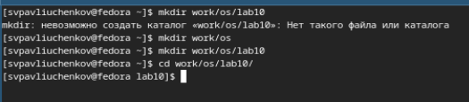
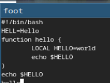
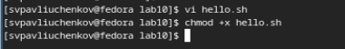
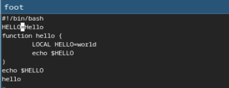
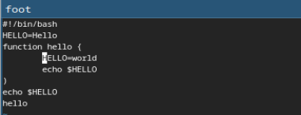
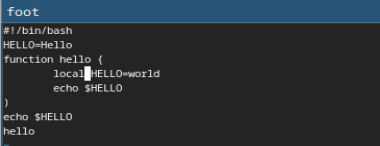
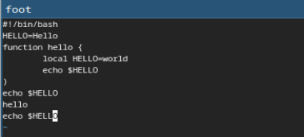
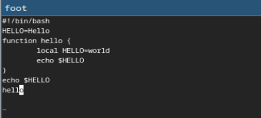
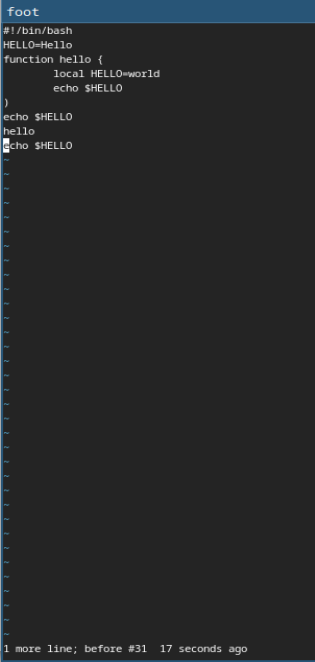

---
## Front matter
lang: ru-RU
title: Выполнение 10 лабораторной работы
subtitle: Текстовой редактор vi
author:
  - Павлюченков С.В.
institute:
  - Российский университет дружбы народов, Москва, Россия
date: 07 сентября 2024

## i18n babel
babel-lang: russian
babel-otherlangs: english

## Formatting pdf
toc: false
toc-title: Содержание
slide_level: 2
aspectratio: 169
section-titles: true
theme: metropolis
header-includes:
 - \metroset{progressbar=frametitle,sectionpage=progressbar,numbering=fraction}
---

## Докладчик

:::::::::::::: {.columns align=center}
::: {.column width="70%"}

  * Павлюченков Сергей Витальевич
  * Студент ФФМиЕН
  * Российский университет дружбы народов
  * [1132237372@pfur.ru](mailto:1132237372@pfur.ru)
  * <https://serapshi.github.io/svpavliuchenkov.github.io/>

:::
::: {.column width="30%"}

:::
::::::::::::::

## Цель работы

Познакомиться с операционной системой Linux. Получить практические навыки работы с редактором vi, установленным по умолчанию практически во всех дистрибутивах.

## Задание

1. Ознакомиться с теоретическим материалом.
2. Ознакомиться с редактором vi.
3. Выполнить упражнения, используя команды vi

# Выполнение лабораторной работы

## Создание рабочей среды

{#fig:001 width=70%}

## Работа с vi 

Вызвал vi и создал файл hello.sh, после чего нажал клавишу i и ввел нужный текст(рис. 2).

{#fig:001 width=70%}

## Работа с vi 

После закрытия vi делаю файл исполняемым.

{#fig:001 width=70%}

## Работа с vi

Вызываю vi на редактирование файла и устанавливаю курсор в конец слова HELL второй строки. Перехожу в режим вставки и заменяю на HELLO. Нажимаю Esc для возврата в командный режим.

{#fig:001 width=70%}

## Работа с vi

Устанавливаю курсор на четвертую строку и стираю слово LOCAL

{#fig:001 width=70%}

## Работа с vi 

Перехожу в режим вставки и набераю следующий текст: local, нажимаю Esc для возврата в командный режим.

{#fig:001 width=70%}

## Работа с vi 

Устанавливаю курсор на последней строке файла. Вставляю после неё строку, содержащую следующий текст: echo $HELLO.

{#fig:001 width=70%}

## Работа с vi 

Нажимаю Esc для перехода в командный режим. Удаляю последнюю строку.

{#fig:001 width=70%}

## Работа с vi

Ввожу команду отмены изменений u для отмены последней команды.

{#fig:001 width=70%, height=85%}

## Выводы

Я научился работать с текстовым редактором vi. Повторил знания по работе в терминале линукс.