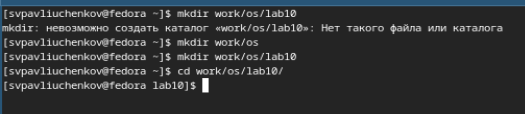
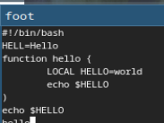
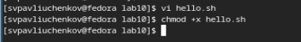
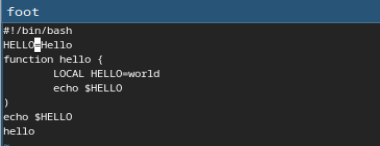
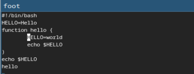
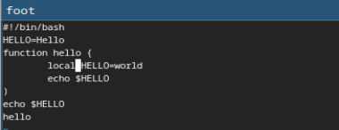
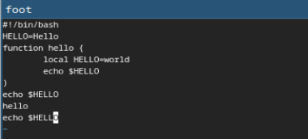
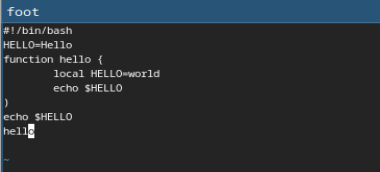
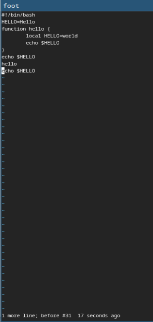

---
## Front matter
title: "Отчёт по лабораторной работе №10"
subtitle: "Текстовой редактор vi"
author: "Сергей Витальевич Павлюченков"

## Generic otions
lang: ru-RU
toc-title: "Содержание"

## Bibliography
bibliography: bib/cite.bib
csl: pandoc/csl/gost-r-7-0-5-2008-numeric.csl

## Pdf output format
toc: true # Table of contents
toc-depth: 2
lof: true # List of figures
lot: true # List of tables
fontsize: 12pt
linestretch: 1.5
papersize: a4
documentclass: scrreprt
## I18n polyglossia
polyglossia-lang:
  name: russian
  options:
	- spelling=modern
	- babelshorthands=true
polyglossia-otherlangs:
  name: english
## I18n babel
babel-lang: russian
babel-otherlangs: english
## Fonts
mainfont: PT Serif
romanfont: PT Serif
sansfont: PT Sans
monofont: PT Mono
mainfontoptions: Ligatures=TeX
romanfontoptions: Ligatures=TeX
sansfontoptions: Ligatures=TeX,Scale=MatchLowercase
monofontoptions: Scale=MatchLowercase,Scale=0.9
## Biblatex
biblatex: true
biblio-style: "gost-numeric"
biblatexoptions:
  - parentracker=true
  - backend=biber
  - hyperref=auto
  - language=auto
  - autolang=other*
  - citestyle=gost-numeric
## Pandoc-crossref LaTeX customization
figureTitle: "Рис."
tableTitle: "Таблица"
listingTitle: "Листинг"
lofTitle: "Список иллюстраций"
lotTitle: "Список таблиц"
lolTitle: "Листинги"
## Misc options
indent: true
header-includes:
  - \usepackage{indentfirst}
  - \usepackage{float} # keep figures where there are in the text
  - \floatplacement{figure}{H} # keep figures where there are in the text
---

# Цель работы

Познакомиться с операционной системой Linux. Получить практические навыки работы с редактором vi, установленным по умолчанию практически во всех дистрибутивах.

# Задание

1. Ознакомиться с теоретическим материалом.
2. Ознакомиться с редактором vi.
3. Выполнить упражнения, используя команды vi

# Выполнение лабораторной работы

Создаю каталог с именем ~/work/os/lab06.

{#fig:001 width=70%}

Вызвал vi и создал файл hello.sh, после чего нажал клавишу i и ввел нужный текст(рис. 2).

{#fig:002 width=70%}

После закрытия vi делаю файл исполняемым.

{#fig:003 width=70%}

Вызываю vi на редактирование файла и устанавливаю курсор в конец слова HELL второй строки. Перехожу в режим вставки и заменяю на HELLO. Нажимаю Esc для возврата в командный режим.

{#fig:004 width=70%}

Устанавливаю курсор на четвертую строку и стираю слово LOCAL

{#fig:005 width=70%}

Перехожу в режим вставки и набераю следующий текст: local, нажимаю Esc для
возврата в командный режим.

{#fig:006 width=70%}

Устанавливаю курсор на последней строке файла. Вставляю после неё строку, содержащую
следующий текст: echo $HELLO.

{#fig:007 width=70%}

Нажимаю Esc для перехода в командный режим.
Удаляю последнюю строку.

{#fig:008 width=70%}

Ввожу команду отмены изменений u для отмены последней команды.

{#fig:009 width=70%}

# Выводы

Я научился работать с текстовым редактором vi. Повторил знания по работе в терминале линукс.

# Контрольные вопросы

1. Дайте краткую характеристику режимам работы редактора vi.

Редактор vi имеет три режима работы:
– командный режим — предназначен для ввода команд редактирования и навигации по
редактируемому файлу;
– режим вставки — предназначен для ввода содержания редактируемого файла;
– режим последней (или командной) строки — используется для записи изменений в файл
и выхода из редактора.

2. Как выйти из редактора, не сохраняя произведённые изменения?

- набрать символ q (или q!), если требуется выйти из редактора без сохранения.

3. Назовите и дайте краткую характеристику командам позиционирования.

- Команды позиционирования
– 0 (ноль) — переход в начало строки;
– $ — переход в конец строки;
– G — переход в конец файла;
– 𝑛 G — переход на строку с номером �

4. Что для редактора vi является словом?

- Пробелы, знаки препинания и другие непечатные символы разделяют слова в vi. Таким образом, слово в vi - это любая непрерывная последовательность символов

5. Каким образом из любого места редактируемого файла перейти в начало (конец) файла?

- – G — переход в конец файла;
– 𝑛 G — переход на строку с номером 𝑛. - переход на первую строку - начало

6. Назовите и дайте краткую характеристику основным группам команд редактирования.

8.2.2.1. Вставка текста
– а — вставить текст после курсора;
– А — вставить текст в конец строки;
– i — вставить текст перед курсором;
– 𝑛 i — вставить текст 𝑛 раз;
– I — вставить текст в начало строки.
8.2.2.2. Вставка строки
– о — вставить строку под курсором;
– О — вставить строку над курсором.
8.2.2.3. Удаление текста
– x — удалить один символ в буфер;
– d w — удалить одно слово в буфер;
– d $ — удалить в буфер текст от курсора до конца строки;
– d 0 — удалить в буфер текст от начала строки до позиции курсора;
– d d — удалить в буфер одну строку;
– 𝑛 d d — удалить в буфер 𝑛 строк.
8.2.2.4. Отмена и повтор произведённых изменений
– u — отменить последнее изменение;
– . — повторить последнее изменение.
8.2.2.5. Копирование текста в буфер
– Y — скопировать строку в буфер;
– 𝑛 Y — скопировать 𝑛 строк в буфер;
– y w — скопировать слово в буфер.
8.2.2.6. Вставка текста из буфера
– p — вставить текст из буфера после курсора;
– P — вставить текст из буфера перед курсором.
8.2.2.7. Замена текста
– c w — заменить слово;
– 𝑛 c w — заменить 𝑛 слов;
– c $ — заменить текст от курсора до конца строки;
– r — заменить слово;
– R — заменить текст.
8.2.2.8. Поиск текста
– / текст — произвести поиск вперёд по тексту указанной строки символов текст;
– ? текст — произвести поиск назад по тексту указанной строки символов текст.

7. Необходимо заполнить строку символами $. Каковы ваши действия?

– 𝑛 i — вставить текст 𝑛 раз, где i - $

8. Как отменить некорректное действие, связанное с процессом редактирования?

Перейти в командный режим и ввести команду для отмены изменений - u

9. Назовите и дайте характеристику основным группам команд режима последней строки.

Команды редактирования в режиме командной строки
8.2.3.1. Копирование и перемещение текста
– : 𝑛,𝑚 d — удалить строки с 𝑛 по 𝑚;
– : 𝑖,𝑗 m 𝑘 — переместить строки с 𝑖 по 𝑗, начиная со строки 𝑘;
– : 𝑖,𝑗 t 𝑘 — копировать строки с 𝑖 по 𝑗 в строку 𝑘;
– : 𝑖,𝑗 w имя-файла — записать строки с 𝑖 по 𝑗 в файл с именем имя-файла.
8.2.3.2. Запись в файл и выход из редактора
– : w — записать изменённый текст в файл, не выходя из vi;
– : w имя-файла — записать изменённый текст в новый файл с именем имя-файла;
– : w ! имя-файла — записать изменённый текст в файл с именем имя-файла;
– : w q — записать изменения в файл и выйти из vi;
– : q — выйти из редактора vi;
– : q ! — выйти из редактора без записи;

10. Как определить, не перемещая курсора, позицию, в которой заканчивается строка?

- с помощью команды $ — переход в конец строки;

11. Выполните анализ опций редактора vi (сколько их, как узнать их назначение и т.д.).

Опции редактора vi позволяют настроить рабочую среду. Для задания опций используется команда set (в режиме последней строки):
– : set all — вывести полный список опций;
– : set nu — вывести номера строк;
– : set list — вывести невидимые символы;
– : set ic — не учитывать при поиске, является ли символ прописным или строчным.
Если вы хотите отказаться от использования опции, то в команде set перед именем
опции надо поставить no.

12. Как определить режим работы редактора vi?

Если последняя строка начинается с ":", то вы в режиме командной строки, если внизу строка отсутсвует, то вы в режиме вставки, и иначе в режиме последней строки

13. Постройте граф взаимосвязи режимов работы редактора vi.

командный режим -> режим вставки -> режим последней  строки
