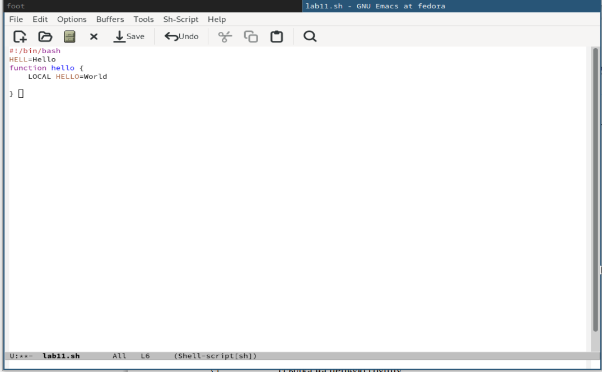
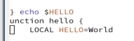
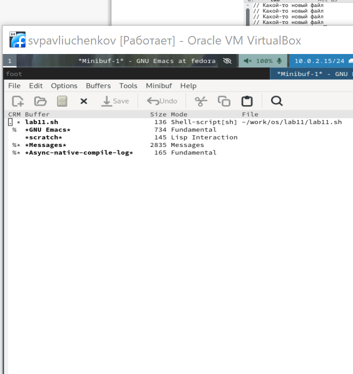
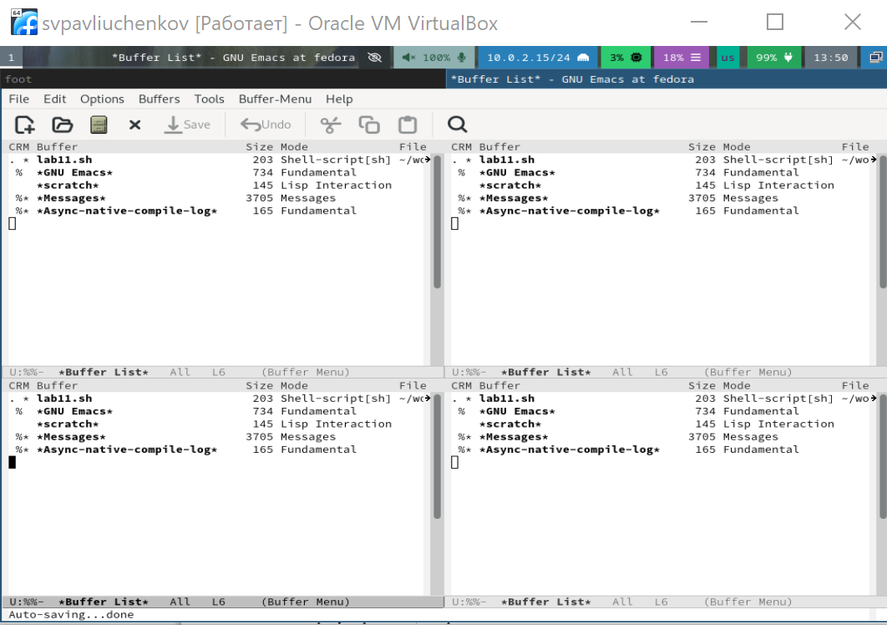
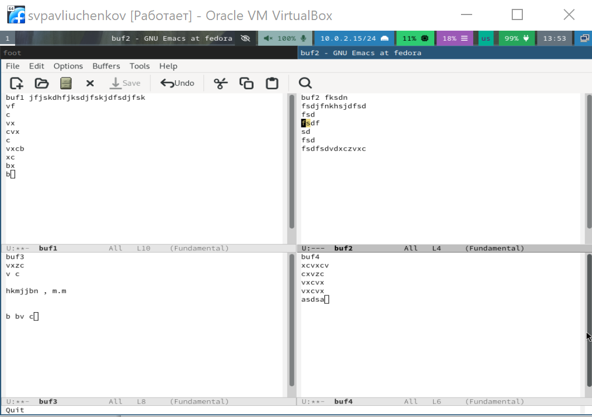

---
## Front matter
lang: ru-RU
title: Выполнение 11 лабораторной работы
subtitle: Текстовой редактор emacs
author:
  - Павлюченков С.В.
institute:
  - Российский университет дружбы народов, Москва, Россия
date: 07 сентября 2024

## i18n babel
babel-lang: russian
babel-otherlangs: english

## Formatting pdf
toc: false
toc-title: Содержание
slide_level: 2
aspectratio: 169
section-titles: true
theme: metropolis
header-includes:
 - \metroset{progressbar=frametitle,sectionpage=progressbar,numbering=fraction}
---

## Докладчик

:::::::::::::: {.columns align=center}
::: {.column width="70%"}

  * Павлюченков Сергей Витальевич
  * Студент ФФМиЕН
  * Российский университет дружбы народов
  * [1132237372@pfur.ru](mailto:1132237372@pfur.ru)
  * <https://serapshi.github.io/svpavliuchenkov.github.io/>

:::
::: {.column width="30%"}

:::
::::::::::::::

## Цель работы

Познакомиться с операционной системой Linux. Получить практические навыки работы с редактором Emacs.

## Задание

1. Ознакомиться с теоретическим материалом.
2. Ознакомиться с редактором emacs.
3. Выполнить упражнения.
4. Ответить на контрольные вопросы.

# Выполнение лабораторной работы

## Запуск emacs.

{#fig:001 width=70%}

## Создание файла 

Создаю файл lab07.sh с помощью комбинации Ctrl-x Ctrl-f (C-x C-f)

{#fig:002 width=70%}

## Работа со строками
После того, как наберал текст вырезаю одной командой целую строку (С-k).

{#fig:004 width=70%}

##  Работа со строками 

Вставить эту строку в конец файла (C-y).

{#fig:005 width=70%}

##  Выделение области текста (C-space).

{#fig:006 width=70%}

## Скопирование области в буфер обмена (M-w).

 Вставил область в конец файла.

{#fig:007 width=70%}

## Выделение области и вырезание её (C-w).

{#fig:008 width=70%}

## Отмена последнего действия (C-/).

{#fig:009 width=70%}

## Перемещение курсора в конец строки (C-e).

{#fig:010 width=70%}

## Перемещение курсора в начало строки (C-a).

{#fig:011 width=70%}

## Перемещение курсора в начало буфера (M-<).

{#fig:012 width=70%}

## Перемещение курсора в конец буфера (M->).

{#fig:013 width=70%}

## Вывод списка активных буферов на экран (C-x C-b).

{#fig:014 width=70%}

## Перемещение в открытое окно (C-x) o со списком открытых буферов и переключение на другой буфер.

{#fig:015 width=70%}

## Закрытие окна (C-x 0). Переключаение между буферами, но уже без вывода их списка на экран (C-x b).

{#fig:016 width=70%}

## Деление фрейма на 4 части: 

Разделил фрейм на два окна по вертикали (C-x 3), а затем каждое из этих окон на две части по горизонтали (C-x 2)

{#fig:017 width=70%}

## Работа с фреймами
В каждом из четырёх созданных окон открыл новый буфер (файл) и ввел несколько строк текста.

{#fig:018 width=70%}

## Режим поиска 

Переключился в режим поиска (C-s) и нашел несколько слов, присутствующих в тексте.

{#fig:019 width=70%}

## Режим поиска 

Переключаюсь между результатами поиска, нажимая C-s.

{#fig:020 width=70%}

## Режим поиска 
Перешел в режим поиска и замены (M-%), ввел текст, который следует найти и заменить, нажал Enter , затем ввел текст для замены. 

{#fig:021 width=70%}

## Режим замены

После того как результаты поиска подсвечены, нажал ! для подтверждения замены

{#fig:022 width=70%}

## Режим поиска

Другой способ выводит результат поиска подробнее.

{#fig:023 width=70%}

## Выводы

Я научился работать с emacs, буфером и встроенным режимом поиска и замены.