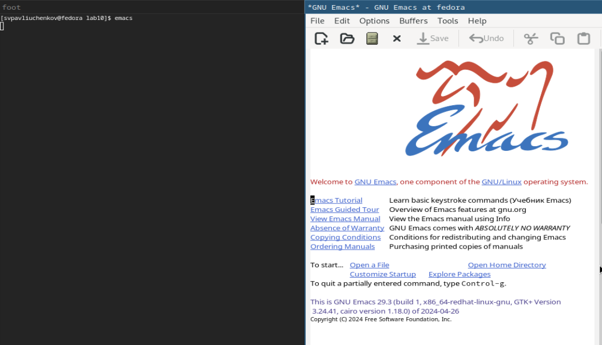
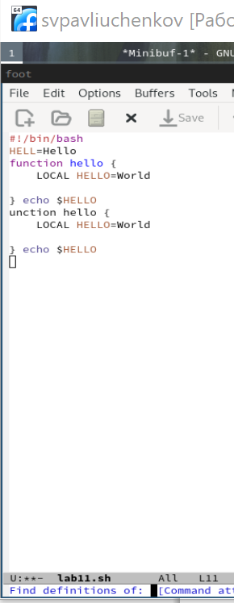
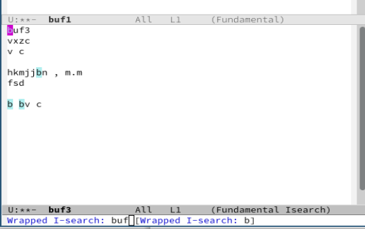

---
## Front matter
title: "Отчёт по лабораторной работе №11"
subtitle: "Текстовой редактор emacs"
author: "Сергей Витальевич Павлюченков"

## Generic otions
lang: ru-RU
toc-title: "Содержание"

## Bibliography
bibliography: bib/cite.bib
csl: pandoc/csl/gost-r-7-0-5-2008-numeric.csl

## Pdf output format
toc: true # Table of contents
toc-depth: 2
lof: true # List of figures
lot: true # List of tables
fontsize: 12pt
linestretch: 1.5
papersize: a4
documentclass: scrreprt
## I18n polyglossia
polyglossia-lang:
  name: russian
  options:
	- spelling=modern
	- babelshorthands=true
polyglossia-otherlangs:
  name: english
## I18n babel
babel-lang: russian
babel-otherlangs: english
## Fonts
mainfont: PT Serif
romanfont: PT Serif
sansfont: PT Sans
monofont: PT Mono
mainfontoptions: Ligatures=TeX
romanfontoptions: Ligatures=TeX
sansfontoptions: Ligatures=TeX,Scale=MatchLowercase
monofontoptions: Scale=MatchLowercase,Scale=0.9
## Biblatex
biblatex: true
biblio-style: "gost-numeric"
biblatexoptions:
  - parentracker=true
  - backend=biber
  - hyperref=auto
  - language=auto
  - autolang=other*
  - citestyle=gost-numeric
## Pandoc-crossref LaTeX customization
figureTitle: "Рис."
tableTitle: "Таблица"
listingTitle: "Листинг"
lofTitle: "Список иллюстраций"
lotTitle: "Список таблиц"
lolTitle: "Листинги"
## Misc options
indent: true
header-includes:
  - \usepackage{indentfirst}
  - \usepackage{float} # keep figures where there are in the text
  - \floatplacement{figure}{H} # keep figures where there are in the text
---

# Цель работы

Познакомиться с операционной системой Linux. Получить практические навыки работы с редактором Emacs.

# Задание

1. Ознакомиться с теоретическим материалом.
2. Ознакомиться с редактором emacs.
3. Выполнить упражнения.
4. Ответить на контрольные вопросы.

# Выполнение лабораторной работы

Открываю emacs.

{#fig:001 width=70%}

Создаю файл lab07.sh с помощью комбинации Ctrl-x Ctrl-f (C-x C-f)

{#fig:002 width=70%}

Набераю текст

{#fig:003 width=70%}

Вырезаю одной командой целую строку (С-k).

{#fig:004 width=70%}

 Вставить эту строку в конец файла (C-y).

{#fig:005 width=70%}

Выделить область текста (C-space).

{#fig:006 width=70%}

Скопировать область в буфер обмена (M-w). Вставить область в конец файла.

{#fig:007 width=70%}

Вновь выделить эту область и на этот раз вырезать её (C-w).

{#fig:008 width=70%}

5.7. Отмените последнее действие (C-/).

{#fig:009 width=70%}

Переместите курсор в конец строки (C-e).

{#fig:010 width=70%}

Переместите курсор в начало строки (C-a).

{#fig:011 width=70%}

Переместите курсор в начало буфера (M-<).

{#fig:012 width=70%}

Переместите курсор в конец буфера (M->).

{#fig:013 width=70%}

Вывести список активных буферов на экран (C-x C-b).

{#fig:014 width=70%}

Переместитесь во вновь открытое окно (C-x) o со списком открытых буферов
и переключитесь на другой буфер.

{#fig:015 width=70%}

Закройте это окно (C-x 0). Теперь вновь переключайтесь между буферами, но уже без вывода их списка на
экран (C-x b).

{#fig:016 width=70%}

Поделите фрейм на 4 части: разделите фрейм на два окна по вертикали (C-x 3),
а затем каждое из этих окон на две части по горизонтали (C-x 2)

{#fig:017 width=70%}

В каждом из четырёх созданных окон откройте новый буфер (файл) и введите
несколько строк текста.

{#fig:018 width=70%}

Переключитесь в режим поиска (C-s) и найдите несколько слов, присутствующих
в тексте.

{#fig:019 width=70%}

Переключайтесь между результатами поиска, нажимая C-s.

{#fig:020 width=70%}

Перейдите в режим поиска и замены (M-%), введите текст, который следует найти
и заменить, нажмите Enter , затем введите текст для замены. После того как будут
подсвечены результаты поиска, нажмите ! для подтверждения замены

{#fig:021 width=70%}

Выполняю замену.

{#fig:022 width=70%}

Другой способ выводит более подробно, где нашел подходящую строку.

{#fig:023 width=70%}

# Выводы

Я научился работать с emacs, буфером и встроенным режимом поиска и замены.

# Контрольные вопросы

1. Кратко охарактеризуйте редактор emacs.
Редактор emacs является удобным и  высоко функциональным текстовым редактором.
2. Какие особенности данного редактора могут сделать его сложным для освоения новичком?
Слишком много настроек из-за чего трудно собрать все воедино.
3. Своими словами опишите, что такое буфер и окно в терминологии emacs’а.
- окно это область, которая отображает содержимое буфера, а буфер это место хранения разных строк и данных.
4. Можно ли открыть больше 10 буферов в одном окне?
- да, можно
5. Какие буферы создаются по умолчанию при запуске emacs?
При запуске создается буфер scratch
6. Какие клавиши вы нажмёте, чтобы ввести следующую комбинацию C-c | и C-c C-|?
надо, удерживая клавишу Ctrl , нажать на
клавишу c , затем отпустить обе клавиши и нажать на
клавишу |. (надо, удерживая клавишу Ctrl , нажать на
клавишу с , затем отпустить обе клавиши и снова, удерживая клавишу Ctrl , нажать на
клавишу | )
7. Как поделить текущее окно на две части?
- C-x 2
8. В каком файле хранятся настройки редактора emacs?
- init.el
9. Какую функцию выполняет клавиша и можно ли её переназначить?
Клавиша может выполнять любые команды так как ее всегда можно переназначить.
10. Какой редактор вам показался удобнее в работе vi или emacs? Поясните почему
- vi мой фаворит, так как он имеет более приятный интерфейс, и работь у меня с ним получается быстрее.