---
## Front matter
lang: ru-RU
title: Выполнение 12 лабораторной работы
subtitle: Программирование в командном процессоре ОС UNIX. Командные файлы
author:
  - Павлюченков С.В.
institute:
  - Российский университет дружбы народов, Москва, Россия
date: 07 сентября 2024

## i18n babel
babel-lang: russian
babel-otherlangs: english

## Formatting pdf
toc: false
toc-title: Содержание
slide_level: 2
aspectratio: 169
section-titles: true
theme: metropolis
header-includes:
 - \metroset{progressbar=frametitle,sectionpage=progressbar,numbering=fraction}
---

## Докладчик

:::::::::::::: {.columns align=center}
::: {.column width="70%"}

  * Павлюченков Сергей Витальевич
  * Студент ФФМиЕН
  * Российский университет дружбы народов
  * [1132237372@pfur.ru](mailto:1132237372@pfur.ru)
  * <https://serapshi.github.io/svpavliuchenkov.github.io/>

:::
::: {.column width="30%"}

:::
::::::::::::::

## Цель работы

Изучить основы программирования в оболочке ОС UNIX/Linux. Научиться писать
небольшие командные файлы.

## Задание

1. Написать скрипт, который при запуске будет делать резервную копию самого себя (то
есть файла, в котором содержится его исходный код) в другую директорию backup
в вашем домашнем каталоге. При этом файл должен архивироваться одним из архиваторов на выбор zip, bzip2 или tar. Способ использования команд архивации
необходимо узнать, изучив справку.
2. Написать пример командного файла, обрабатывающего любое произвольное число
аргументов командной строки, в том числе превышающее десять. Например, скрипт
может последовательно распечатывать значения всех переданных аргументов.
3. Написать командный файл — аналог команды ls (без использования самой этой команды и команды dir). Требуется, чтобы он выдавал информацию о нужном каталоге
и выводил информацию о возможностях доступа к файлам этого каталога.
4. Написать командный файл, который получает в качестве аргумента командной строки
формат файла (.txt, .doc, .jpg, .pdf и т.д.) и вычисляет количество таких файлов
в указанной директории. Путь к директории также передаётся в виде аргумента командной строки.

# Выполнение лабораторной работы

## Создание рабочей среды и файла для первого задания

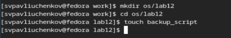{#fig:001 width=70%}

## Код первой программы 

Написал скрипт, который при запуске будет делать резервную копию самого себя (то
есть файла, в котором содержится его исходный код) в другую директорию backup
в вашем домашнем каталоге. При этом файл архивируется архиватором tar.

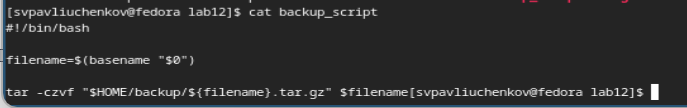{#fig:002 width=70%}

## Сделал файл исполняемым

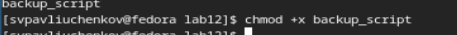{#fig:003 width=70%}

## Запуск программы

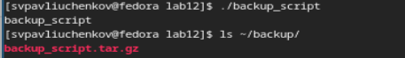{#fig:004 width=70%}

## Создание файла для второго задания

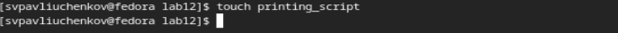{#fig:005 width=70%}

## Код программы 

Написал командного файла, обрабатывающего любое произвольное число
аргументов командной строки, в том числе превышающее десять. Скрипт
может последовательно распечатывать значения всех переданных аргументов.

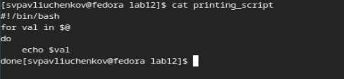{#fig:006 width=70%}

## Сделал файл исполняемым

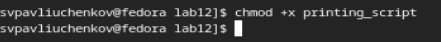{#fig:007 width=70%}

## Запуск второй программы

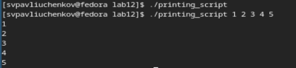{#fig:008 width=70%}

## Создание файла для третьего задания

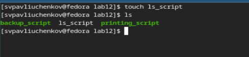{#fig:009 width=70%}

## Код программы - аналог команды ls (без использования самой этой команды и команды dir). 

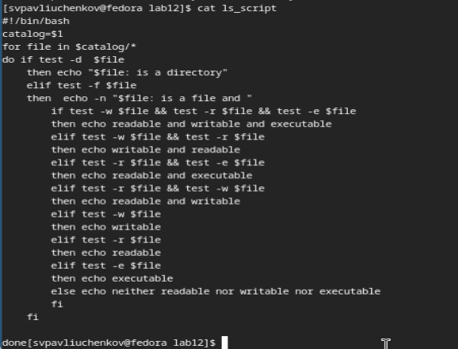{#fig:010 width=70%}

## Сделал файл исполняемым

{#fig:011 width=70%}

## Запуск третьей программы

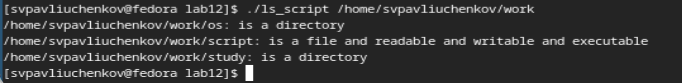{#fig:012 width=70%}

## Создание файла для четвертого задания

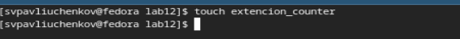{#fig:013 width=70%}

## Код четвертой программы

Написал командный файл, который получает в качестве аргумента командной строки
формат файла (.txt, .doc, .jpg, .pdf и т.д.) и вычисляет количество таких файлов
в указанной директории. Путь к директории также передаётся в виде аргумента командной строки.

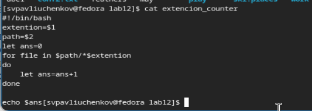{#fig:014 width=70%}

## Сделал файл исполняемым

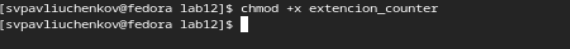{#fig:015 width=70%}

## Запуск третьей программы

## 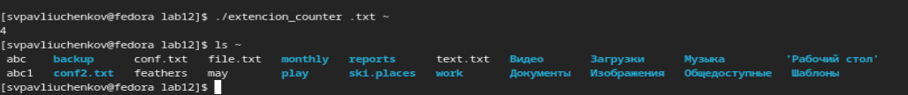{#fig:016 width=70%}

## Выводы

Я узнал много нового о bash и программирование в командной строке. Научился создавать командные файлы