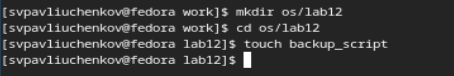
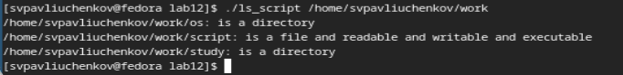

---
## Front matter
title: "Отчёт по лабораторной работе №12"
subtitle: "Программирование в командном процессоре ОС UNIX. Командные файлы"
author: "Сергей Витальевич Павлюченков"

## Generic otions
lang: ru-RU
toc-title: "Содержание"

## Bibliography
bibliography: bib/cite.bib
csl: pandoc/csl/gost-r-7-0-5-2008-numeric.csl

## Pdf output format
toc: true # Table of contents
toc-depth: 2
lof: true # List of figures
lot: true # List of tables
fontsize: 12pt
linestretch: 1.5
papersize: a4
documentclass: scrreprt
## I18n polyglossia
polyglossia-lang:
  name: russian
  options:
	- spelling=modern
	- babelshorthands=true
polyglossia-otherlangs:
  name: english
## I18n babel
babel-lang: russian
babel-otherlangs: english
## Fonts
mainfont: PT Serif
romanfont: PT Serif
sansfont: PT Sans
monofont: PT Mono
mainfontoptions: Ligatures=TeX
romanfontoptions: Ligatures=TeX
sansfontoptions: Ligatures=TeX,Scale=MatchLowercase
monofontoptions: Scale=MatchLowercase,Scale=0.9
## Biblatex
biblatex: true
biblio-style: "gost-numeric"
biblatexoptions:
  - parentracker=true
  - backend=biber
  - hyperref=auto
  - language=auto
  - autolang=other*
  - citestyle=gost-numeric
## Pandoc-crossref LaTeX customization
figureTitle: "Рис."
tableTitle: "Таблица"
listingTitle: "Листинг"
lofTitle: "Список иллюстраций"
lotTitle: "Список таблиц"
lolTitle: "Листинги"
## Misc options
indent: true
header-includes:
  - \usepackage{indentfirst}
  - \usepackage{float} # keep figures where there are in the text
  - \floatplacement{figure}{H} # keep figures where there are in the text
---

# Цель работы

Изучить основы программирования в оболочке ОС UNIX/Linux. Научиться писать
небольшие командные файлы.

# Задание

1. Написать скрипт, который при запуске будет делать резервную копию самого себя (то
есть файла, в котором содержится его исходный код) в другую директорию backup
в вашем домашнем каталоге. При этом файл должен архивироваться одним из архиваторов на выбор zip, bzip2 или tar. Способ использования команд архивации
необходимо узнать, изучив справку.
2. Написать пример командного файла, обрабатывающего любое произвольное число
аргументов командной строки, в том числе превышающее десять. Например, скрипт
может последовательно распечатывать значения всех переданных аргументов.
3. Написать командный файл — аналог команды ls (без использования самой этой команды и команды dir). Требуется, чтобы он выдавал информацию о нужном каталоге
и выводил информацию о возможностях доступа к файлам этого каталога.
4. Написать командный файл, который получает в качестве аргумента командной строки
формат файла (.txt, .doc, .jpg, .pdf и т.д.) и вычисляет количество таких файлов
в указанной директории. Путь к директории также передаётся в виде аргумента командной строки.

# Выполнение лабораторной работы

Создаю директорию для лабораторной работы и файл для первого задания

{#fig:001 width=70%}

Написал скрипт, который при запуске будет делать резервную копию самого себя (то
есть файла, в котором содержится его исходный код) в другую директорию backup
в вашем домашнем каталоге. При этом файл архивируется архиватором tar.

{#fig:002 width=70%}

Делаю файл исполняемым

{#fig:003 width=70%}

Проверяю правильность выполнения программы

{#fig:004 width=70%}

Создаю файл для второго задания

{#fig:005 width=70%}

Написал командного файла, обрабатывающего любое произвольное число
аргументов командной строки, в том числе превышающее десять. Скрипт
может последовательно распечатывать значения всех переданных аргументов.

{#fig:006 width=70%}

Делаю файл исполняемым

{#fig:007 width=70%}

Проверяю правильность выполнения программы

{#fig:008 width=70%}

Создаю файл для третьего задания

{#fig:009 width=70%}

Написал командный файл — аналог команды ls (без использования самой этой команды и команды dir). 

{#fig:010 width=70%}

Делаю файл исполняемым

{#fig:011 width=70%}

Проверяю правильность выполнения программы

{#fig:012 width=70%}

Создаю файл для четвертого задания

{#fig:013 width=70%}

Написал командный файл, который получает в качестве аргумента командной строки
формат файла (.txt, .doc, .jpg, .pdf и т.д.) и вычисляет количество таких файлов
в указанной директории. Путь к директории также передаётся в виде аргумента командной строки.

{#fig:014 width=70%}

Делаю файл исполняемым

{#fig:015 width=70%}

Проверяю правильность выполнения программы

{#fig:016 width=70%}

# Выводы

Я узнал много нового о bash и программирование в командной строке. Научился создавать командные файлы

# Контрольные вопросы

1. Объясните понятие командной оболочки. Приведите примеры командных оболочек.
Чем они отличаются?

Командный процессор (командная оболочка, интерпретатор команд shell) — это программа, позволяющая пользователю взаимодействовать с операционной системой
компьютера. В операционных системах типа UNIX/Linux наиболее часто используются
следующие реализации командных оболочек:
– оболочка Борна (Bourne shell или sh) — стандартная командная оболочка UNIX/Linux,
содержащая базовый, но при этом полный набор функций;
– С-оболочка (или csh) — надстройка на оболочкой Борна, использующая С-подобный
синтаксис команд с возможностью сохранения истории выполнения команд;
Главное отличие состоит в разном, но похожем синтаксисом.

2. Что такое POSIX?

POSIX (Portable Operating System Interface for Computer Environments) — набор стандартов
описания интерфейсов взаимодействия операционной системы и прикладных программ

3. Как определяются переменные и массивы в языке программирования bash?
Для создания массива используется
команда set с флагом -A.
А переменные создаются простым присваиванием - а="g"

4. Каково назначение операторов let и read?
let указывает что указанная переменая это число, а read позволяет записывать данные в переменную с прямого ввода (input).

5. Какие арифметические операции можно применять в языке программирования bash?

Доступно сложение, деление, вычитание, умножение, взятие остатка от деления, побитовое сложение и вычитание тоже доступны.

6. Что означает операция (( ))?

Что внутри скобок происходит арифметические вычисления

7. Какие стандартные имена переменных Вам известны?

8. Что такое метасимволы?

Такие символы, как ' < > * ? | \ " &, являются метасимволами и имеют для командного процессора специальный смысл

9. Как экранировать метасимволы?
Поставить перед метасимволом обратный слеш - \\
10. Как создавать и запускать командные файлы?

Для создание командного файла нужно указать внутри файла для какой оболочки написан текст внутри файла, а для запуска файл нужно сделать исполнительным.

11. Как определяются функции в языке программирования bash?

Группу команд можно объединить в функцию. Для этого существует ключевое слово
function, после которого следует имя функции и список команд, заключённых в фигурные скобки. Удалить функцию можно с помощью команды unset c флагом -f.

12. Каким образом можно выяснить, является файл каталогом или обычным файлом?
test -f/-d название файла/каталога
13. Каково назначение команд set, typeset и unset?
Первая команда используется для создания массивов
Команда typeset имеет четыре опции для работы с функциями:
– -f — перечисляет определённые на текущий момент функции;
– -ft — при последующем вызове функции инициирует её трассировку;
– -fx — экспортирует все перечисленные функции в любые дочерние программы оболочек;
– -fu — обозначает указанные функции как автоматически загружаемые. Автоматически загружаемые функции хранятся в командных файлах, а при их вызове оболочка
просматривает переменную FPATH, отыскивая файл с одноимёнными именами функций, загружает его и вызывает эти функции.
Изъять переменную из программы можно с помощью команды unset.
14. Как передаются параметры в командные файлы?

Они записываются в память и их можно достать оттуда с помощью  $номер параметра, или достать все сразу $*

15. Назовите специальные переменные языка bash и их назначение.
– $* — отображается вся командная строка или параметры оболочки;
– $! — номер процесса, в рамках которого выполняется последняя вызванная на выполнение в командном режиме команда;
– $$ — уникальный идентификатор процесса, в рамках которого выполняется командный процессор;
