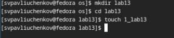
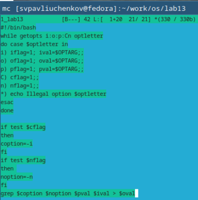
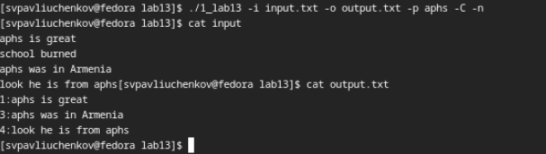
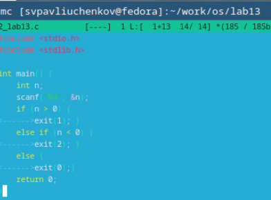
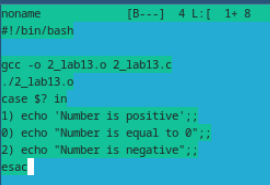
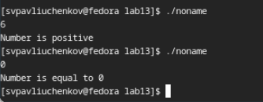
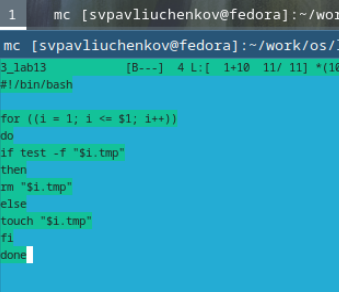
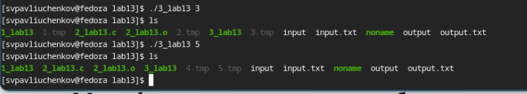
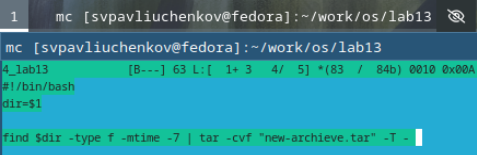
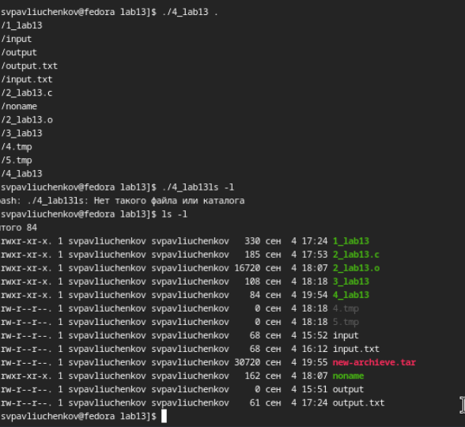

---
## Front matter
lang: ru-RU
title: Выполнение 13 лабораторной работы
subtitle: Программирование в командном процессоре ОС UNIX. Ветвления и циклы
author:
  - Павлюченков С.В.
institute:
  - Российский университет дружбы народов, Москва, Россия
date: 07 сентября 2024

## i18n babel
babel-lang: russian
babel-otherlangs: english

## Formatting pdf
toc: false
toc-title: Содержание
slide_level: 2
aspectratio: 169
section-titles: true
theme: metropolis
header-includes:
 - \metroset{progressbar=frametitle,sectionpage=progressbar,numbering=fraction}
---

## Докладчик

:::::::::::::: {.columns align=center}
::: {.column width="70%"}

  * Павлюченков Сергей Витальевич
  * Студент ФФМиЕН
  * Российский университет дружбы народов
  * [1132237372@pfur.ru](mailto:1132237372@pfur.ru)
  * <https://serapshi.github.io/svpavliuchenkov.github.io/>

:::
::: {.column width="30%"}

:::
::::::::::::::

## Цель работы

Изучить основы программирования в оболочке ОС UNIX. Научится писать более
сложные командные файлы с использованием логических управляющих конструкций
и циклов.

## Задание

1. Используя команды getopts grep, написать командный файл, который анализирует
командную строку с ключами:
– -iinputfile — прочитать данные из указанного файла;
– -ooutputfile — вывести данные в указанный файл;
– -pшаблон — указать шаблон для поиска;
– -C — различать большие и малые буквы;
– -n — выдавать номера строк.
а затем ищет в указанном файле нужные строки, определяемые ключом -p.
2. Написать на языке Си программу, которая вводит число и определяет, является ли оно
больше нуля, меньше нуля или равно нулю. Затем программа завершается с помощью
функции exit(n), передавая информацию в о коде завершения в оболочку. Командный файл должен вызывать эту программу и, проанализировав с помощью команды
$?, выдать сообщение о том, какое число было введено.
3. Написать командный файл, создающий указанное число файлов, пронумерованных
последовательно от 1 до 𝑁 (например 1.tmp, 2.tmp, 3.tmp,4.tmp и т.д.). Число файлов,
которые необходимо создать, передаётся в аргументы командной строки. Этот же командный файл должен уметь удалять все созданные им файлы (если они существуют).
4. Написать командный файл, который с помощью команды tar запаковывает в архив
все файлы в указанной директории. Модифицировать его так, чтобы запаковывались
только те файлы, которые были изменены менее недели тому назад (использовать
команду find).

# Выполнение лабораторной работы

## Создание рабочей среды

{#fig:001 width=70%}

## Код первой программы  

Используя команду getopts grep, написал командный файл, который анализирует
командную строку с ключами:
– -iinputfile — прочитать данные из указанного файла;
– -ooutputfile — вывести данные в указанный файл;
– -pшаблон — указать шаблон для поиска;
– -C — различать большие и малые буквы;
– -n — выдавать номера строк.
а затем ищет в указанном файле нужные строки, определяемые ключом -p. и Записывает все в файл заданный -o.

{#fig:002 width=70%}

## Запуск первой программы

 Для вида сначала вывожу содержимое файла, после чего запускаю программу и утверждаюсь в правильности ее работы. Код нашел все строки в которых встретилось слово apsh.

{#fig:003 width=70%}

## Код программы на C 

Приступаю к выполнению 2-го задания. Написал на языке Си программу, которая вводит число и определяет, является ли оно
больше нуля, меньше нуля или равно нулю. Затем программа завершается с помощью
функции exit(n), передавая информацию в о коде завершения в оболочку. 

{#fig:004 width=70%}

## Код на Bash

Написал командный файл который должен вызывать эту программу и, проанализировав с помощью команды
$?, выдавать сообщение о том, какое число было введено.

{#fig:005 width=70%}

## Запуск второй программы 

 Запускаю код пару раз, все сработало правильно. тк 6>0 и 0=0.

{#fig:006 width=70%}

## Код третьей программы 

 Приступаю к 3 заданию. Написал командный файл, создающий указанное число файлов, пронумерованных
последовательно от 1 до 𝑁 (например 1.tmp, 2.tmp, 3.tmp,4.tmp и т.д.). Число файлов,
которые необходимо создать, передаётся в аргументы командной строки. Этот же командный файл умеет удалять все созданные им файлы (если они существуют).

{#fig:007 width=70%}

## Запуск третьей программы

 Сначала код создал файлы от 1 до 3, после чего удалил 1-3 и создал 4-5.

{#fig:008 width=70%}

## Код четвертой программы

Приступаю к последнему заданию. Написал командный файл, который с помощью команды tar запаковывает в архив
все файлы в указанной директории. Модифицировал его так, чтобы запаковывались
только те файлы, которые были изменены менее недели тому назад (использовал
команду find).

{#fig:009 width=70%}

## Запуск последней программы

Проверяю, что программа запаковала только файлы которые были изменены менее недели назад.

{#fig:010 width=70%}

## Выводы

Я попрактиковался в создании разных алгоритмов на bash. Поработал в getopts, grep и find.