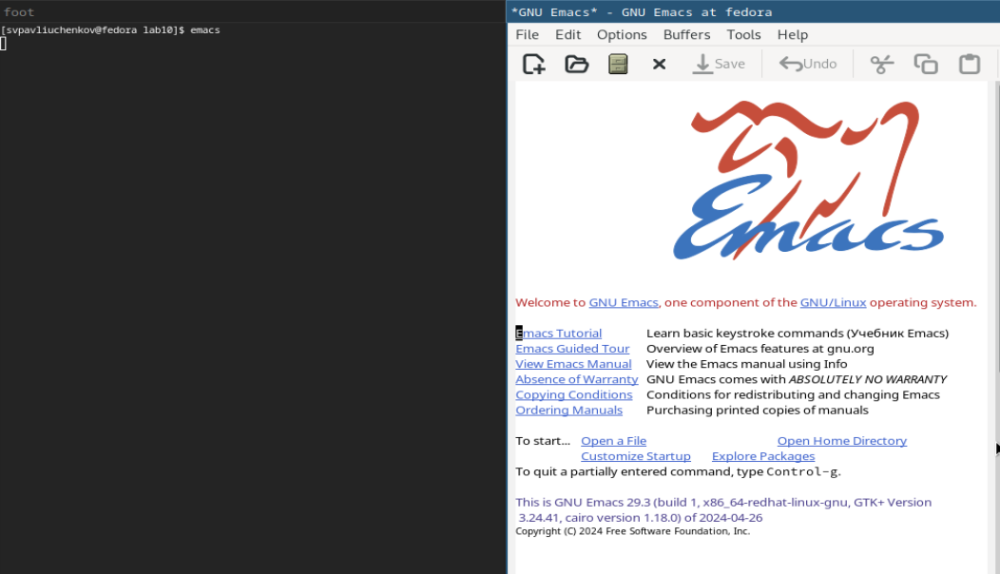
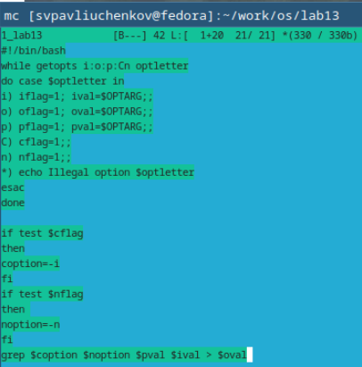
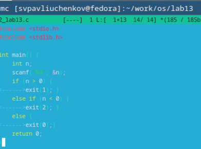
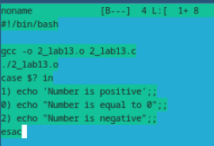
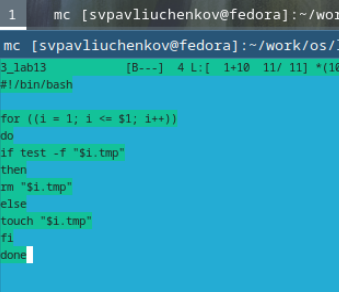
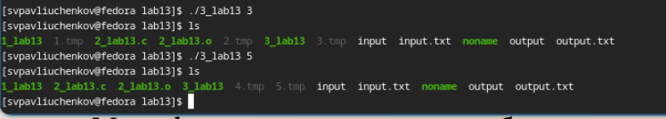
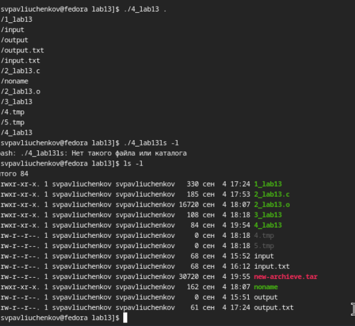

---
## Front matter
title: "Отчёт по лабораторной работе №13"
subtitle: " Программирование в командном процессоре ОС UNIX. Ветвления и циклы"
author: "Сергей Витальевич Павлюченков"

## Generic otions
lang: ru-RU
toc-title: "Содержание"

## Bibliography
bibliography: bib/cite.bib
csl: pandoc/csl/gost-r-7-0-5-2008-numeric.csl

## Pdf output format
toc: true # Table of contents
toc-depth: 2
lof: true # List of figures
lot: true # List of tables
fontsize: 12pt
linestretch: 1.5
papersize: a4
documentclass: scrreprt
## I18n polyglossia
polyglossia-lang:
  name: russian
  options:
	- spelling=modern
	- babelshorthands=true
polyglossia-otherlangs:
  name: english
## I18n babel
babel-lang: russian
babel-otherlangs: english
## Fonts
mainfont: PT Serif
romanfont: PT Serif
sansfont: PT Sans
monofont: PT Mono
mainfontoptions: Ligatures=TeX
romanfontoptions: Ligatures=TeX
sansfontoptions: Ligatures=TeX,Scale=MatchLowercase
monofontoptions: Scale=MatchLowercase,Scale=0.9
## Biblatex
biblatex: true
biblio-style: "gost-numeric"
biblatexoptions:
  - parentracker=true
  - backend=biber
  - hyperref=auto
  - language=auto
  - autolang=other*
  - citestyle=gost-numeric
## Pandoc-crossref LaTeX customization
figureTitle: "Рис."
tableTitle: "Таблица"
listingTitle: "Листинг"
lofTitle: "Список иллюстраций"
lotTitle: "Список таблиц"
lolTitle: "Листинги"
## Misc options
indent: true
header-includes:
  - \usepackage{indentfirst}
  - \usepackage{float} # keep figures where there are in the text
  - \floatplacement{figure}{H} # keep figures where there are in the text
---

# Цель работы

Изучить основы программирования в оболочке ОС UNIX. Научится писать более
сложные командные файлы с использованием логических управляющих конструкций
и циклов.

# Задание

1. Используя команды getopts grep, написать командный файл, который анализирует
командную строку с ключами:
– -iinputfile — прочитать данные из указанного файла;
– -ooutputfile — вывести данные в указанный файл;
– -pшаблон — указать шаблон для поиска;
– -C — различать большие и малые буквы;
– -n — выдавать номера строк.
а затем ищет в указанном файле нужные строки, определяемые ключом -p.
2. Написать на языке Си программу, которая вводит число и определяет, является ли оно
больше нуля, меньше нуля или равно нулю. Затем программа завершается с помощью
функции exit(n), передавая информацию в о коде завершения в оболочку. Командный файл должен вызывать эту программу и, проанализировав с помощью команды
$?, выдать сообщение о том, какое число было введено.
3. Написать командный файл, создающий указанное число файлов, пронумерованных
последовательно от 1 до 𝑁 (например 1.tmp, 2.tmp, 3.tmp,4.tmp и т.д.). Число файлов,
которые необходимо создать, передаётся в аргументы командной строки. Этот же командный файл должен уметь удалять все созданные им файлы (если они существуют).
4. Написать командный файл, который с помощью команды tar запаковывает в архив
все файлы в указанной директории. Модифицировать его так, чтобы запаковывались
только те файлы, которые были изменены менее недели тому назад (использовать
команду find).

# Выполнение лабораторной работы

Создаю директорию для работы и файл для первого задания

{#fig:001 width=70%}

Используя команду getopts grep, написал командный файл, который анализирует
командную строку с ключами:
– -iinputfile — прочитать данные из указанного файла;
– -ooutputfile — вывести данные в указанный файл;
– -pшаблон — указать шаблон для поиска;
– -C — различать большие и малые буквы;
– -n — выдавать номера строк.
а затем ищет в указанном файле нужные строки, определяемые ключом -p. и Записывает все в файл заданный -o.

{#fig:002 width=70%}

Для вида сначала вывожу содержимое файла, после чего запускаю программу и утверждаюсь в правильности ее работы. Код нашел все строки в которых встретилось слово apsh.

{#fig:003 width=70%}

Приступаю к выполнению 2-го задания. Написал на языке Си программу, которая вводит число и определяет, является ли оно
больше нуля, меньше нуля или равно нулю. Затем программа завершается с помощью
функции exit(n), передавая информацию в о коде завершения в оболочку. 

{#fig:004 width=70%}

Написал командный файл который должен вызывать эту программу и, проанализировав с помощью команды
$?, выдавать сообщение о том, какое число было введено.

{#fig:005 width=70%}

Запускаю код пару раз, все сработало правильно. тк 6>0 и 0=0.

{#fig:006 width=70%}

Приступаю к 3 заданию. Написал командный файл, создающий указанное число файлов, пронумерованных
последовательно от 1 до 𝑁 (например 1.tmp, 2.tmp, 3.tmp,4.tmp и т.д.). Число файлов,
которые необходимо создать, передаётся в аргументы командной строки. Этот же командный файл умеет удалять все созданные им файлы (если они существуют).

{#fig:007 width=70%}

Демострирую правильную работу программы. Сначала код создал файлы от 1 до 3, после чего удалил 1-3 и создал 4-5.

{#fig:008 width=70%}

Приступаю к последнему заданию. Написал командный файл, который с помощью команды tar запаковывает в архив
все файлы в указанной директории. Модифицировал его так, чтобы запаковывались
только те файлы, которые были изменены менее недели тому назад (использовал
команду find).

{#fig:009 width=70%}

Проверяю, что программа запаковала только файлы которые были изменены менее недели назад.

{#fig:010 width=70%}

# Выводы

Я попрактиковался в создании разных алгоритмов на bash. Поработал в getopts, grep и find.

# Контрольные вопросы
1. Каково предназначение команды getopts?
getopts осуществляет синтаксический анализ командной строки, выделяя флаги, и используется
для объявления переменных.
2. Какое отношение метасимволы имеют к генерации имён файлов?
имя файла содержится в $0 .
3. Какие операторы управления действиями вы знаете?
for, case, if и while
4. Какие операторы используются для прерывания цикла?
break и continue
5. Для чего нужны команды false и true?
Для циклов и условных конструкций.
6. Что означает строка if test -f man$s/$i.$s, встреченная в командном файле?
Данная строка проверяет является ли man$1/$1.$s файлом.
7. Объясните различия между конструкциями while и until.
При замене в операторе цикла while служебного слова while на until условие, при
выполнении которого осуществляется выход из цикла, меняется на противоположное

