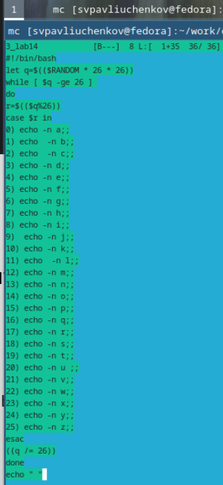

---
## Front matter
title: "Отчёт по лабораторной работе №14"
subtitle: "Программирование в командном процессоре ОС UNIX. Расширенное программирование"
author: "Сергей Витальевич Павлюченков"

## Generic otions
lang: ru-RU
toc-title: "Содержание"

## Bibliography
bibliography: bib/cite.bib
csl: pandoc/csl/gost-r-7-0-5-2008-numeric.csl

## Pdf output format
toc: true # Table of contents
toc-depth: 2
lof: true # List of figures
lot: true # List of tables
fontsize: 12pt
linestretch: 1.5
papersize: a4
documentclass: scrreprt
## I18n polyglossia
polyglossia-lang:
  name: russian
  options:
	- spelling=modern
	- babelshorthands=true
polyglossia-otherlangs:
  name: english
## I18n babel
babel-lang: russian
babel-otherlangs: english
## Fonts
mainfont: PT Serif
romanfont: PT Serif
sansfont: PT Sans
monofont: PT Mono
mainfontoptions: Ligatures=TeX
romanfontoptions: Ligatures=TeX
sansfontoptions: Ligatures=TeX,Scale=MatchLowercase
monofontoptions: Scale=MatchLowercase,Scale=0.9
## Biblatex
biblatex: true
biblio-style: "gost-numeric"
biblatexoptions:
  - parentracker=true
  - backend=biber
  - hyperref=auto
  - language=auto
  - autolang=other*
  - citestyle=gost-numeric
## Pandoc-crossref LaTeX customization
figureTitle: "Рис."
tableTitle: "Таблица"
listingTitle: "Листинг"
lofTitle: "Список иллюстраций"
lotTitle: "Список таблиц"
lolTitle: "Листинги"
## Misc options
indent: true
header-includes:
  - \usepackage{indentfirst}
  - \usepackage{float} # keep figures where there are in the text
  - \floatplacement{figure}{H} # keep figures where there are in the text
---

# Цель работы

Изучить основы программирования в оболочке ОС UNIX. Научиться писать более
сложные командные файлы с использованием логических управляющих конструкций
и циклов.

# Задание

1. Написать командный файл, реализующий упрощённый механизм семафоров. Командный файл должен в течение некоторого времени t1 дожидаться освобождения
ресурса, выдавая об этом сообщение, а дождавшись его освобождения, использовать
его в течение некоторого времени t2<>t1, также выдавая информацию о том, что
ресурс используется соответствующим командным файлом (процессом). Запустить
командный файл в одном виртуальном терминале в фоновом режиме, перенаправив
его вывод в другой (> /dev/tty#, где # — номер терминала куда перенаправляется
вывод), в котором также запущен этот файл, но не фоновом, а в привилегированном
режиме. Доработать программу так, чтобы имелась возможность взаимодействия трёх
и более процессов.
2. Реализовать команду man с помощью командного файла. Изучите содержимое каталога /usr/share/man/man1. В нем находятся архивы текстовых файлов, содержащих
справку по большинству установленных в системе программ и команд. Каждый архив
можно открыть командой less сразу же просмотрев содержимое справки. Командный
файл должен получать в виде аргумента командной строки название команды и в виде
результата выдавать справку об этой команде или сообщение об отсутствии справки,
если соответствующего файла нет в каталоге man1.
3. Используя встроенную переменную $RANDOM, напишите командный файл, генерирующий случайную последовательность букв латинского алфавита. Учтите, что $RANDOM
выдаёт псевдослучайные числа в диапазоне от 0 до 32767.

# Выполнение лабораторной работы

Написал командный файл, реализующий упрощённый механизм семафоров. Командный файл в течение некоторого времени t1 дожидаться освобождения
ресурса, выдавая об этом сообщение, а дождавшись его освобождения, использует
его в течение некоторого времени t2<>t1, также выдавая информацию о том, что
ресурс используется соответствующим командным файлом (процессом)

{#fig:001 width=70%}

Написал командный файл,который будет запускать код в одном виртуальном терминале в фоновом режиме и перенаправит
его вывод в другой (> /dev/tty#, где # — номер терминала куда перенаправляется
вывод), в котором также запущен этот файл, но не фоновом, а в привилегированном
режиме.

{#fig:002 width=70%}

Запускаю программу, как видно вывод программы семафора переенаправляется в другой терминал.

{#fig:003 width=70%}

Приступаю к выполнению 2-го задания. Изучаю структуру папки man1.

{#fig:004 width=70%}

Реализовал команду man с помощью командного файла.  Командный
файл получает в виде аргумента командной строки название команды и в виде
результата выдавать справку об этой команде или сообщение об отсутствии справки,
если соответствующего файла нет в каталоге man1.

{#fig:005 width=70%}

Открывается командой less сразу же просмотр содержимое справки о команде.

{#fig:006 width=70%}

Приступаю к 3 задаче. Используя встроенную переменную $RANDOM, написал командный файл, генерирующий случайную последовательность букв латинского алфавита. 

{#fig:007 width=70%}

Как видно, код генерирует случайную строку из латинских букв.

{#fig:008 width=70%}
# Выводы

Я улучшил свои навыки работы с bash. Изучил команду less, использовал перенаправление в виртуальный терминал и научился пользоваться командой exit().

# Контрольные вопросы
1. Найдите синтаксическую ошибку в следующей строке:
while [$1 != "exit"]
в том, что данная конструкция скорее всего никогда не закончится, так как $1 не меняется. Еще не хватает пробелов после [ и перед ].
2. Как объединить (конкатенация) несколько строк в одну?
a=$\{\$A+\$B\}
3. Найдите информацию об утилите seq. Какими иными способами можно реализовать
её функционал при программировании на bash?
например for (( a=1; a<80; a++ )) a будет иметь теже значения, что и seq.

4. Какой результат даст вычисление выражения $((10/3))?
Выдаст 3
5. Укажите кратко основные отличия командной оболочки zsh от bash.

ZSH является расширенным аналогом BASH и имеет с ним обратную совместимость, добавляя ему большое количество улучшений. Ключевые особенности ZSH: Встроенное автозаполнение с расширенным функционалом.

6. Проверьте, верен ли синтаксис данной конструкции
1 for ((a=1; a <= LIMIT; a++))

Не хватает пробелов после (( и перед ))

7. Сравните язык bash с какими-либо языками программирования. Какие преимущества
у bash по сравнению с ними? Какие недостатки?
Bash позволяет напрямую взаимодействовать с консолью, что не позволяет python. Из недостатков

